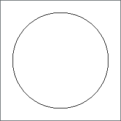

# お絵描きしがならHaskell入門 2018年夏

# 導入

* xxx 入門のきっかけ
* xxx Haskellの簡単な説明

と、ここまでHaskell言語を紹介してみて「採用事例はあるのだろうか？」と思われるかもしれません。
しかし現在ではHaskellを使った実用的なアプリケーションも実は豊富にあります:

* Attoparsec - 高速パーサコンビネータ
* Gitit - VCSバックエンドWiki
* Gtk2hs - Haskellから使えるGtkラッパ
* Hakyll - 静的Webサイト生成
* Haskell Relational Record - 安全なSQLクエリ生成器
* House - Haskell製OS
* Mighttpd - nginxぐらい速いWebサーバ
* Monadius - グラディウスっぽいゲーム
* Pandoc - ドキュメントフォーマット変換
* Yesod - RailsっぽいWebフレームワーク

また、Haskellを使っている会社も数多く存在します:

* ASAHIネット: プロバイダのインフラ
* AT&T: ネットワークセキュリティ
* Bluespec: SystemVerilogとSystemCのツール実装に使ってる
* Bump Technologies: モバイル向け連絡先交換のサーバサイド
* Facebook: PHPコードの加工
* Intel: 独自のHaskellコンパイラ
* NICTA: L4マイクロカーネルの検証
* NVIDIA: 用途非公開
* Qualcomm: LuaのBREWバインディングジェネレータ
* Standard Chartered Bank: デリバティブリスク分析
* Tsuru Capital: 高頻度取引
* 株式会社新川: 社内マクロ言語のトランスレータ
* その他: http://www.haskell.org/haskellwiki/Haskell_in_industry

Haskellは実用的な使用に耐え、しかも高品質な製品を作るのに効果的な言語なのです。

# 開発環境構築

GHCはHaskell言語のコンパイラの1つで、現時点でもっとも多くのHaskellプログラマが日常的に使っています。「HaskellコンパイラならGHCで決まり」と思ってしまって問題ありません。

GHC単体でもプログラミングはできますが、近年Stack https://www.haskellstack.org/ と呼ばれるクロスプラットフォームな管理ツールが普及しました。先のGHCコンパイラも開発に必要なライブラリ群もこのツールで一括管理できます。

「さっそく使ってみるでゲソ!」

## Windows

インストーラである `stack-1.6.5-windows-x86_64-installer.exe` を https://www.stackage.org/stack/windows-x86_64-installer からダウンロードして、インストーラを起動してください。
インストールが完了したらコマンドプロンプトを開いて以下のようにstackコマンドがインストールされていることを確認してください。

```
C:\Users\user>stack --version
Version 1.6.5, Git revision 24ab0d6ff07f28276e082c3ce74dfdeb1a2ca9e9 (5514 commits) x86_64 hpack-0.20.0
```

さらに本記事ではGLUTという3D描画ライブラリを使うので、MinGW版のものをホームディレクトリに配置してください。

具体的には http://files.transmissionzero.co.uk/software/development/GLUT/freeglut-MinGW.zip をダウンロードした後、解凍すると`freeglut\bin\x64`というディレクトリができると思います。この中にある`freeglut.dll`をホームディレクトリ(ここでは`C:\Users\user`としています)にコピーしましょう。さらにそのファイル名を`glut32.dll`に変更してください。

WindowsにおけるGLUTライブラリについて、詳しくは https://stackoverflow.com/questions/42072958/haskell-with-opengl-unknown-glut-entry-glutinit を参照してください。

## macOSもしくはLinux

curlでインストールスクリプトをダウンロードして実行してください。その後`$HOME/.local/bin`にPATHを通してから、以下のようにstackコマンドがインストールされていることを確認してください。

```
$ curl -sSL https://get.haskellstack.org/ | sh
$ export PATH=$HOME/.local/bin:$PATH
$ stack --version
Version 1.6.5, Git revision 24ab0d6ff07f28276e082c3ce74dfdeb1a2ca9e9 (5514 commits) x86_64 hpack-0.20.0
```

# 対話環境を使ってみる

最初に告白します。さきほど嘘をついてしまいました。「GHCはコンパイラだ」と書きましたがそれは嘘です。厳密にはghcというコマンドはコンパイラとして振舞い、ghciという別のコマンドは対話環境として振舞います。Stackが既にインストールされていれば、すぐにghciを使って対話的にプログラミングできます。

まずは一旦ghciを起動してみましょう:

```
$ stack ghci
Writing implicit global project config file to: /home/user/.stack/global-project/stack.yaml
Note: You can change the snapshot via the resolver field there.
Using latest snapshot resolver: lts-11.5
Downloaded lts-11.5 build plan.    
Preparing to install GHC (nopie) to an isolated location.
This will not interfere with any system-level installation.
Downloaded ghc-nopie-8.2.2.                                      
Installed GHC.                                                                          
Selected mirror https://s3.amazonaws.com/hackage.fpcomplete.com/                                 
Downloading root                                                                                 
Selected mirror https://s3.amazonaws.com/hackage.fpcomplete.com/                                 
Downloading timestamp                                                                            
Downloading snapshot                                                                             
Downloading mirrors                                                                              
Cannot update index (no local copy)                                                              
Downloading index                                                                                
Updated package index downloaded                                                                 
Update complete                                                                                  
Populated index cache.    

Warning: No local targets specified, so ghci will not use any options from your package.yaml / *.cabal files.
         
         Potential ways to resolve this:
         * If you want to use the package.yaml / *.cabal package in the current directory, use stack init to create a new stack.yaml.
         * Add to the 'packages' field of /home/user/.stack/global-project/stack.yaml
         
Configuring GHCi with the following packages: 
GHCi, version 8.2.2: http://www.haskell.org/ghc/  :? for help
Loaded GHCi configuration from /tmp/ghci20981/ghci-script
Prelude> 
```

なにやら色々ダウンロードされましたがghciのプロンプトが無事表示されました。

このままとりあえず簡単な計算でもしてみましょう:

```
Prelude> 1 + 1
2
Prelude>
```

なるほど簡単な計算はできるようです。

少しここで飛躍してGlossというパッケージをインストールしてみましょう:

```
Prelude> :q
Leaving GHCi.
$ stack install gloss
[1 of 2] Compiling Main             ( /home/user/.stack/setup-exe-src/setup-mPHDZzAJ.hs, /home/user/.stack/setup-exe-src/setup-mPHDZzAJ.o )
[2 of 2] Compiling StackSetupShim   ( /home/user/.stack/setup-exe-src/setup-shim-mPHDZzAJ.hs, /home/user/.stack/setup-exe-src/setup-shim-mPHDZzAJ.o )
Linking /home/user/.stack/setup-exe-cache/x86_64-linux-nopie/tmp-Cabal-simple_mPHDZzAJ_2.0.1.0_ghc-8.2.2 ...
bmp-1.2.6.3: download
fixed-0.2.1.1: download
fixed-0.2.1.1: configure
half-0.2.2.3: download
ObjectName-1.1.0.1: download
fixed-0.2.1.1: build
bmp-1.2.6.3: configure
bmp-1.2.6.3: build
half-0.2.2.3: configure
half-0.2.2.3: build
ObjectName-1.1.0.1: configure
fixed-0.2.1.1: copy/register
ObjectName-1.1.0.1: build
ObjectName-1.1.0.1: copy/register
half-0.2.2.3: copy/register
stm-2.4.5.0: download
stm-2.4.5.0: configure
stm-2.4.5.0: build
bmp-1.2.6.3: copy/register
text-1.2.3.0: download
text-1.2.3.0: configure
stm-2.4.5.0: copy/register
text-1.2.3.0: build
StateVar-1.1.0.4: download
StateVar-1.1.0.4: configure
StateVar-1.1.0.4: build
StateVar-1.1.0.4: copy/register
text-1.2.3.0: copy/register
OpenGLRaw-3.2.7.0: download
OpenGLRaw-3.2.7.0: configure
OpenGLRaw-3.2.7.0: build
OpenGLRaw-3.2.7.0: copy/register
GLURaw-2.0.0.4: download
GLURaw-2.0.0.4: configure
GLURaw-2.0.0.4: build
GLURaw-2.0.0.4: copy/register
OpenGL-3.0.2.1: download
OpenGL-3.0.2.1: configure
OpenGL-3.0.2.1: build
OpenGL-3.0.2.1: copy/register
GLUT-2.7.0.13: download
GLUT-2.7.0.13: configure
GLUT-2.7.0.13: build
GLUT-2.7.0.13: copy/register
gloss-rendering-1.11.1.1: download
gloss-rendering-1.11.1.1: configure
gloss-rendering-1.11.1.1: build
gloss-rendering-1.11.1.1: copy/register
gloss-1.11.1.1: download
gloss-1.11.1.1: configure
gloss-1.11.1.1: build
gloss-1.11.1.1: copy/register
Completed 13 action(s).
```

インストールは無事終わったようです。

再度ghciを起動して、少し高度な処理をさせてみましょう:

```
$ stack ghci
Prelude> import Graphics.Gloss
Prelude Graphics.Gloss> display (InWindow "Hoge" (200, 200) (10, 10)) white (Circle 80)
```

新しいウィンドウが開いて、以下のような円が表示されたでしょうか:



これでウィンドウにお絵描きすることを身に付けました。最初の一歩としては上出来でしょう!

っとここでおそらくmacOSユーザの方は憤慨していることだと思います。実はこのGlossライブラリはmacOSのOpenGLの制約のためにghciからは使えません。
次にGHCコンパイラを使ったアプリケーションを作るので、対話環境での試行錯誤はあきらめて次の章に進みましょう。

# 最初のアプリケーション

対話的環境を使っていてもHaskellの学習には役に立ちますが、実際のアプリケーションはコンパイラでコンパイルして実行バイナリ形式にして配布したいものです。
そこで、本章ではghciを使わずにGHCコンパイラを使って、先の円を表示するアプリケーションを作ってみます。

(この記事で作成するソースコード全体は https://github.com/master-q/practice-gloss で公開されています。)

まずはStackを使ってアプリケーションの雛形を作りましょう:

```
$ stack new practice-gloss
Downloading template "new-template" to create project "practice-gloss" in practice-gloss/ ...

The following parameters were needed by the template but not provided: author-email, author-name, category, copyright, github-username
You can provide them in /home/user/.stack/config.yaml, like this:
templates:
  params:
    author-email: value
    author-name: value
    category: value
    copyright: value
    github-username: value
Or you can pass each one as parameters like this:
stack new practice-gloss new-template -p "author-email:value" -p "author-name:value" -p "category:value" -p "copyright:value" -p "github-username:value"

Looking for .cabal or package.yaml files to use to init the project.
Using cabal packages:
- practice-gloss/

Selecting the best among 13 snapshots...

* Matches lts-11.5

Selected resolver: lts-11.5
Initialising configuration using resolver: lts-11.5
Total number of user packages considered: 1
Writing configuration to file: practice-gloss/stack.yaml
All done.
```

これだけで、最小のHaskellアプリケーションの雛形ができました。ビルドしてみましょう:

```
$ cd practice-gloss
$ stack build
Building all executables for `practice-gloss' once. After a successful build of all of them, only specified executables will be rebuilt.
practice-gloss-0.1.0.0: configure (lib + exe)
Configuring practice-gloss-0.1.0.0...
practice-gloss-0.1.0.0: build (lib + exe)
Preprocessing library for practice-gloss-0.1.0.0..
Building library for practice-gloss-0.1.0.0..
[1 of 2] Compiling Lib              ( src/Lib.hs, .stack-work/dist/x86_64-linux-nopie/Cabal-2.0.1.0/build/Lib.o )
[2 of 2] Compiling Paths_practice_gloss ( .stack-work/dist/x86_64-linux-nopie/Cabal-2.0.1.0/build/autogen/Paths_practice_gloss.hs, .stack-work/dist/x86_64-linux-nopie/Cabal-2.0.1.0/build/Paths_practice_gloss.o )
Preprocessing executable 'practice-gloss-exe' for practice-gloss-0.1.0.0..
Building executable 'practice-gloss-exe' for practice-gloss-0.1.0.0..
[1 of 2] Compiling Main             ( app/Main.hs, .stack-work/dist/x86_64-linux-nopie/Cabal-2.0.1.0/build/practice-gloss-exe/practice-gloss-exe-tmp/Main.o )
[2 of 2] Compiling Paths_practice_gloss ( .stack-work/dist/x86_64-linux-nopie/Cabal-2.0.1.0/build/practice-gloss-exe/autogen/Paths_practice_gloss.hs, .stack-work/dist/x86_64-linux-nopie/Cabal-2.0.1.0/build/practice-gloss-exe/practice-gloss-exe-tmp/Paths_practice_gloss.o )
Linking .stack-work/dist/x86_64-linux-nopie/Cabal-2.0.1.0/build/practice-gloss-exe/practice-gloss-exe ...
practice-gloss-0.1.0.0: copy/register
Installing library in /home/user/tmp/practice-gloss/.stack-work/install/x86_64-linux-nopie/lts-11.5/8.2.2/lib/x86_64-linux-ghc-8.2.2/practice-gloss-0.1.0.0-7Uibrp4CT9NGChYUGqQasz
Installing executable practice-gloss-exe in /home/user/tmp/practice-gloss/.stack-work/install/x86_64-linux-nopie/lts-11.5/8.2.2/bin
Registering library for practice-gloss-0.1.0.0..
```

さっそくできた実行バイナリを起動してみましょう:

```
$ stack exec practice-gloss-exe
someFunc
```

なにやら文字列が表示されました。せっかくなのでこの文字列を`Hello, World!`に変えるためてみましょう。
まずは`src/Lib.hs`をエディタで開きます、すると以下の内容が確認できます:

```haskell
module Lib
    ( someFunc
    ) where

someFunc :: IO ()
someFunc = putStrLn "someFunc"
```

そこで、この`someFunc`を`Hello, World!`に書き換えて、ファイルに上書き保存してみましょう:

```haskell
module Lib
    ( someFunc
    ) where

someFunc :: IO ()
someFunc = putStrLn "Hello, World!"
```

再度ビルドして実行してみるとどんな文字列が表示されるでしょうか:

```
$ stack build
$ stack exec practice-gloss-exe
Hello, World!
```

さて、アプリケーションを作ることができたので、ghciで描画した円をこのアプリケーションでも同様に表示してみましょうやはり`src/Lib.hs`をエディタで以下のように編集します:

```haskell
module Lib
    ( someFunc
    ) where

someFunc :: IO ()
someFunc = display (InWindow "Hoge" (200, 200) (10, 10)) white (Circle 80)
```

もしWindowsを使っていたら開発環境構築で設定した`glut32.dll`ファイルを`practice-gloss`ディレクトリにコピーしてください。

さて、それでは再度ビルドして実行してみましょう:

```
$ stack build
$ stack exec practice-gloss-exe
```

ghciの時と同様に円を表示できたら成功です。やりましたウィンドウを表示するアプリケーションをたった一行で描けました!

# Glossライブラリ

ここまでウィンドウを表示し円を描画するライブラリであるGloss説明してきませんでした。Glossの表現力の豊かさを体感した今がその説明にふさわしい時でしょう。

Gloss http://hackage.haskell.org/package/gloss は...

* xxx

# 型を調べる

* xxx 型とは

## GHCiを使う
## Haddockを使う

* Prelude http://hackage.haskell.org/packages/archive/base/latest/doc/html/Prelude.html
* Gloss http://hackage.haskell.org/packages/archive/gloss/latest/doc/html/Graphics-Gloss.html


# 最初のアプリケーションの構造


* xxx 図をStackアプリケーション構造に合わせる
* xxx ディレクトリ構造
* xxx ソース解説

# HoogleでAPIを探してみよう

* https://www.haskell.org/hoogle/

# より凝ったアプリケーション

* xxx Hoogleを使って好みのAPIを発見する
* xxx Glossアニメーション

# 遅延評価

* xxx マウスクリックで遅延評価を一歩一歩進める

# その先へ

* xxx すごいH
* xxx Preludeを読む
* xxx Preludeを自作する
* xxx 栄光のグラスゴー
* xxx 論文
* xxx コミュニティ
    * https://haskell.jp/
    * https://www.meetup.com/Tokyo-Haskell-Meetup/
    * 参照透明な海を守る会

# 製品品質のコードを書くには

* xxx 依存関係地獄
* xxx 枯れたライブラリの見分け方
* xxx 凝ったAPIを使うときは慎重に
* xxx 優れたアプリケーションがエレガントなコードな訳ではない(gitit,pandoc,ghc)

# 宿題

* xxx 黄金比とアニメーションスピードの相関
* http://ja.wikipedia.org/wiki/黄金長方形
