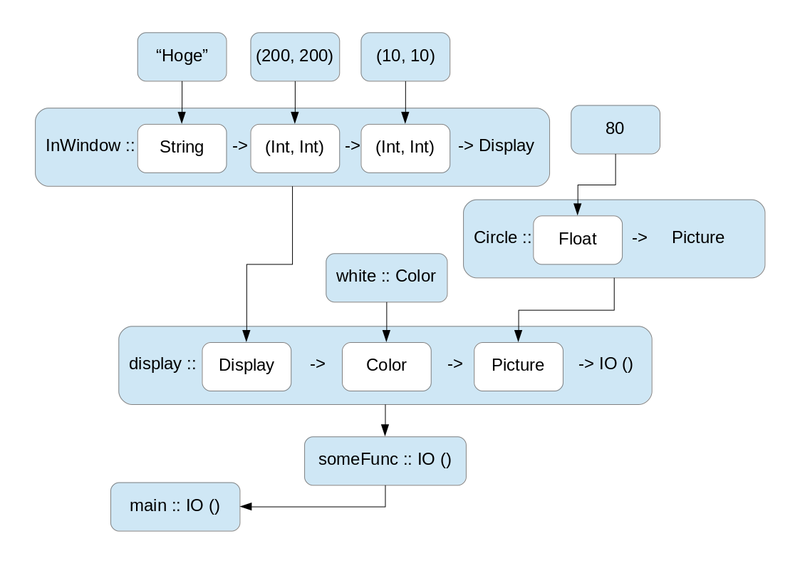

# お絵描きしがならHaskell入門 2018年夏

# 導入

* 入門のきっかけ
* Haskellの簡単な説明
* Haskellアプリケーションの例
* Haskellを使っている会社の例

# 開発環境構築

* GHCの簡単な説明
* stackの簡単な説明

## Windows
## macOS
## Linux

# 対話環境を使ってみる

* GHCiの簡単な説明
* Glossのインストール
* 説明なしにいきなりウィンドウを出す

# 最初のアプリケーション

* スケルトンの生成
* ディレクトリ構造
* ビルド手順
* 実行手順
* REPLと同じことをアプリケーションにまとめる

# Glossライブラリ

* Glossとは

# 型を調べる

* 型とは

## GHCiを使う
## Haddockを使う

# 最初のアプリケーションの構造

* ソース解説

# HoogleでAPIを探してみよう

# より凝ったアプリケーション

* Hoogleを使って好みのAPIを発見する
* Glossアニメーション

# その先へ

* すごいH
* 栄光のグラスゴー
* Preludeを読む
* Preludeを自作する
* 論文
* コミュニティ

# 製品品質のコードを書くには

* 依存関係地獄
* 枯れたライブラリの見分け方
* 凝ったAPIを使うときは慎重に
* 優れたアプリケーションがエレガントなコードな訳ではない(gitit,pandoc,ghc)

# 宿題

* 黄金比とアニメーションスピードの相関
