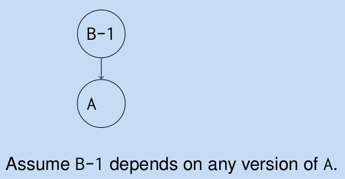
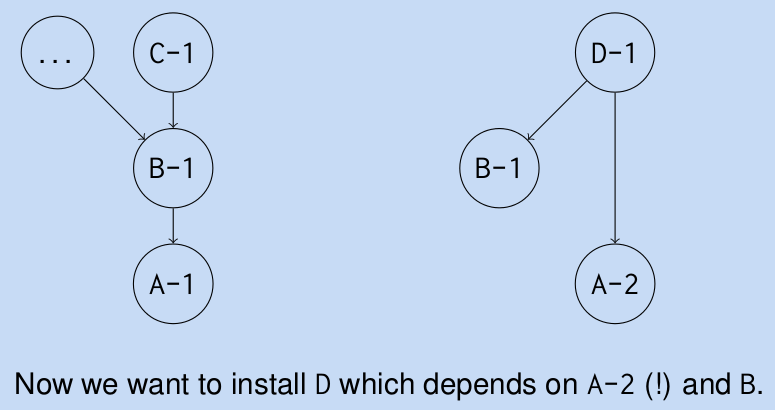
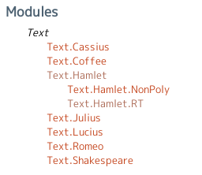
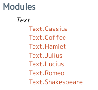
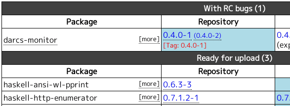

# Debian Loves Haskell

Kiwamu Okabe

# Who am I?

* Name: Kiwamu Okabe
* Twitter ID: @master_q
* Web: http://www.masterq.net/
* I am a Debian Maintainer.
* I am a Haskell NINJA.
* (NINJA:=No Income No Job or Assets)

# Do you like Haskell?

* Do you like Haskell? YES!
* Do you like Haskell packages? YES!
* Do you like Hoogle? YES!
* Do you like Cabal? ............. no...

You know, Cabal has many problems...

# About Cabal

* HackageDB := collection of packages
* Cabal := Haskell package installer
* Cabal is like Perl's CPAN.
* Usage: "cabal install PACKAGE"
* Cabal install a package's dependencies.

# Using Cabal on Debian is easy.

~~~
$ sudo apt-get install cabal-install haskell-platform
$ cabal update
$ cabal install carettah
# ...cabal compiles the packages...
$ ~/.cabal/bin/carettah
carettah version 0.0.4
~~~

Easy!

# Use case: Ruby's gem

If you use Ruby's gem,

~~~
$ sudo gem update
$ sudo gem install earthquake
# ...On a later date...
$ sudo gem update
~~~

You can always get the latest versions.

# Use case: Haskell's Cabal (#1)

~~~
$ cabal update # update the local Hackage database
$ cabal install yesod
# ...On a later date...
$ cabal upgrade
--snip--
The 'cabal upgrade' command has been removed
because people found it confusing and it often
led to broken packages.
--snip--
~~~

...What?!?!

# Use case: Haskell's Cabal (#2)

...OK, I try to upgrade Yesod and dependencies.

~~~
$ cabal install yesod
# Cabal cannot solve dependencies or Yesod has a bug.
# ...OK, let's try again from scratch.
$ rm -rf ~/.ghc ~/.cabal
$ cabal update
$ cabal install yesod
~~~

Upgrading Yesod results in problems.

Installing Yesod from scratch does not.

...Why?!?!

# Doesn't Cabal support 'upgrade'?

Cabal is not a Package Manager.

~~~
"http://ivanmiljenovic.wordpress.com/2010/03/15/
repeat-after-me-cabal-is-not-a-package-manager/"
~~~

However, many people use it as one.

There are two problems:

* Hackage authors' culture
* Cabal implementation

# The Hackage culture problem

~~~
$ cabal info yesod
--snip--
    Versions available: 0.6.7, 0.7.2, 0.7.3, 0.8.0, 0.8.1, 0.8.2,
                        0.8.2.1, 0.9.1, 0.9.1.1 (and 35 others)
--snip--
    Dependencies:  yesod-core >=0.9.1.1 && <0.10,
                   yesod-auth ==0.7.*, yesod-json ==0.2.*,
                   yesod-persistent ==0.2.*, yesod-form ==0.3.*,
                   monad-control ==0.2.*, ...
~~~

It specifies an upper limit.

I do not think we can know the future...

# Package versioning policy

~~~
"http://www.haskell.org/haskellwiki/
Package_versioning_policy"
~~~

Example: 2.1.0.4

* A.B is the major version number (2.1)
* C is the minor version number (0)

Change the major version if you

change the API.

# Implementation Problem (#1)

# Implementation Problem (#2)

# Implementation Problem (#3)

# Implementation Problem (#4)

# Implementation Problem (#5)

# Implementation Problem (#6)

# Cabal only knows Haskell

Example: "hcwiid" Package

* Hcwiid depends on system package
* 'libcwiid-dev'.
* Running "cabal install hcwiid",
* does not install it.
* Should we use auto-apt?

# Cannot use latest Packages

Example: Yesod, Hakyll, Hamlet

* Yesod-0.9.2 depends on hamlet-0.10.*
* Hakyll-3.2.0.8 depends hamlet-0.{7,8}.*

Can't use latest Yesod and Hakyll

at the same time?

Hakyll is orphaned? No. No. No.

# Hakyll uses the old Hamlet API #1

Hakyll uses the Text.Hamlet.RT API.

Hamlet 0.8.2.1 provided it.

# Hakyll uses the old Hamlet API #2

Text.Hamlet.RT is removed

on Hamlet 0.9.0

Hakyll can't use the latest version.

# A dream: @khibino's idea

Upgrade searches installable strings.

# Let's Debianize!

* We can't wait for a better Cabal.
* How about we Debianize packages?
* Debian can maintain non-Haskell libs.

# Debianize Haskell Package (#1)

Setup environment to debianize Haskell

package.

~~~
$ sudo apt-get install \
   haskell-debian-utils haskell-devscripts
~~~

debhelpers will be installed.

# Debianize Haskell Package (#2)

Create "debian" dir with cabal-debian.

~~~
$ wget http://hackage.haskell.org/packages/archive/\
hcwiid/0.0.1/hcwiid-0.0.1.tar.gz
$ tar xfz hcwiid-0.0.1.tar.gz
$ cd hcwiid-0.0.1/
$ cabal-debian --debianize --ghc \
   --maintainer="Kiwamu Okabe <kiwamu@debian.or.jp>"
$ ls debian
changelog compat control copyright rules
~~~

# Debianize Haskell Package (#3)

~~~
$ debuild -rfakeroot -us -uc
$ ls ../*hcwiid*deb
../libghc-hcwiid-dev_0.0.1-1~hackage1_amd64.deb
../libghc-hcwiid-doc_0.0.1-1~hackage1_all.deb
../libghc-hcwiid-prof_0.0.1-1~hackage1_amd64.deb
~~~

* Library in general use
* Document created Haddock
* Library for profiler

3 packages are builded.

# Why is it easy?

It's debhelper's power.

~~~
$ cat debian/rules
#!/usr/bin/make -f
include /usr/share/cdbs/1/rules/debhelper.mk
include /usr/share/cdbs/1/class/hlibrary.mk
$
~~~

Makefile has only 2 lines.

# hlibrary.mk #build

This is the same as Cabal's builder.

# hlibrary.mk #install

# Why don't you upload to Debian?

* Many PC setup/install is messy.
* Use apt-get, if it's uploaded in Debian.
* Perhaps, Ubuntu may pick it up.
* Go ahead! Go ahead!

# Become a Debian Maintainer

http://wiki.debian.org/DebianMaintainer

* DM := Debian Maintainer
* DD := Debian Developer

A DM can upload a Debian package that

is already uploaded by a DD.

~~~
Note: Joachim (pkg-haskell team member) said:
>> [Q] Can someone who is not a DM join the pkg-haskell
>> team, or should they become a DM first?
> No need to be a DM, as there are DDs around that can
> do the sponsoring.
~~~

# Get an alioth account

* Open http://alioth.debian.org/.
* Press "New Account".
* Fill in the form.
* You'll get a guest account.

# Let's join the pkg-haskell team

Our boss is:

* Joachim Breitner
* E-mail: nomeata@debian.org

Live in debian-haskell@lists.debian.org.

He'll accept you into the pkg-haskell team

if you send mail to the debian-haskell ML.

# Debianize the package for upload.

Read http://wiki.debian.org/Haskell.

Send ITP mail.

~~~
Package: wnpp
Severity: wishlist
Owner: Kiwamu Okabe <kiwamu@debian.or.jp>

* Package name    : haskell-ansi-wl-pprint
 Version         : 0.6.3
 Upstream Author : Daan Leijen, Max Bolingbroke
<batterseapower@hotmail.com>
* URL             : http://github.com/batterseapower/ansi-wl-pprint
 Vcs-Browser     :
http://anonscm.debian.org/gitweb/?p=collab-maint/haskell-ansi-wl-pprint.git
* License         : BSD3
~~~

# Debianize with cabal-debian

Write debian/control as below.

~~~
$ vi debian/control
Maintainer: Debian Haskell Group \
<pkg-haskell-maintainers@lists.alioth.debian.org>
Uploaders: Kiwamu Okabe <kiwamu@debian.or.jp>
Vcs-Darcs: \
http://darcs.debian.org/pkg-haskell/haskell-ansi-wl-pprint
Vcs-Browser: http://darcs.debian.org/cgi-bin/\
darcsweb.cgi?r=pkg-haskell/haskell-ansi-wl-pprint
DM-Upload-Allowed: yes
~~~

DM can upload DM-Upload-Allowed deb.

# Write debian/changelog

Mark changelog lines that are not yet

released as "UNRELEASED".

~~~
haskell-ansi-wl-pprint (0.6.3-2) UNRELEASED; urgency=low

  * repo is moved to darcs.
  * change Vcs-* lines on debian/control.

 -- Kiwamu Okabe <kiwamu@debian.or.jp>  Wed, 12 Oct 2011 22:45:11 +0900

haskell-ansi-wl-pprint (0.6.3-1) UNRELEASED; urgency=low

  * Debianization generated by cabal-debian

 -- Kiwamu Okabe <kiwamu@debian.or.jp>  Wed, 05 Oct 2011 11:14:50 +0900
~~~

# Create a darcs repository

~~~
$ sudo apt-get install darcs
$ pwd
/home/kiwamu/deb/haskell-ansi-wl-pprint/debian
$ darcs init --darcs-2
$ darcs record -a -l -m "Initial Check-In"
Finished recording patch 'Initial Check-In'
$ darcs put kiwamu-guest@darcs.debian.org:/darcs\
/pkg-haskell/haskell-ansi-wl-pprint
Finished applying...
Put successful.
~~~

Maintain only the debian directory.

...Gentoo?

# Setup a darcs hook

~~~
$ ssh kiwamu-guest@darcs.debian.org \
  /darcs/pkg-haskell/tools/add-hooks.sh \
  haskell-ansi-wl-pprint
~~~

The commit log is sent automatically to:

~~~
pkg-haskell-commits@lists.alioth.debian.org
~~~

# Prepare for release

Fix version number for release.

Mark latest line as "unstable".

~~~
$ dch -v VERSION_NUM # will be opened with your editor
~~~

Then darcs push it.

~~~
$ darcs record -a
$ darcs push
Sending mail to pkg-haskell-commits@lists.alioth.debian.org...
~~~

The hook sends the mail automatically.

# Package Entropy Tracker

~~~
http://pkg-haskell.alioth.debian.org/cgi-bin/pet.cgi
~~~

Changed to "Ready for upload" state.

# Find a sponsor to upload it

If you send mail to

* debian-haskell@lists.debian.org

...Joachim will reply.

Once it's uploaded by a sponsor,

you will be able to upload it next time.

# Sponsor will upload it

~~~
$ darcs get darcs.debian.org:/darcs/pkg-haskell/tools
$ tools/pkg-haskell-checkout haskell-ansi-wl-pprint
$ cd haskell-ansi-wl-pprint/
$ debuild -i -I
$ debrelease
$ debuild clean
$ cd debian/
$ darcs tag $(dpkg-parsechangelog -lchangelog |\
  grep-dctrl -n -s Version .)
$ darcs push -a
~~~

But is pkg-haskell-checkout broken?

Also, darcs http has bug. Please use ssh.

# Debianize packages in the earth

Let's remove your

* $HOME/.cabal
* $HOME/.ghc

directories.

Then, Debianize all of the haskell

packages in the earth!

# PR: My presentation tool

* http://carettah.masterq.net/
* Made with Haskell
* A clone of http://rabbit-shockers.org/

This presentation was done

using Carettah!

You can "apt-get install carettah" on sid.
