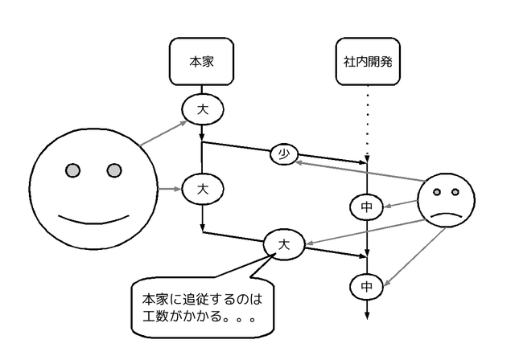
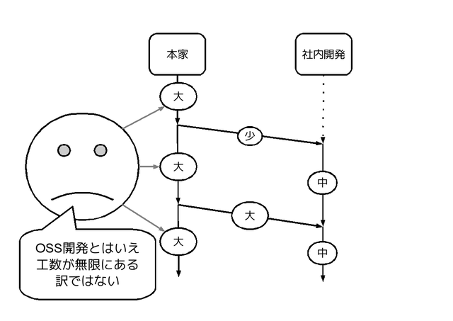

# What is Metasepi?

Kiwamu Okabe

# プロローグ (cont.)

# プロローグ

# Metasepiって何？

* http://metasepi.masterq.net/
* UNIXモドキkernelを型によって設計する
* C言語での記述はできるかぎり小さく
* 設計言語はHaskellでもOCamlでも
* とにかく早くドッグフード可能にしよう!

# 名前の由来

* コウイカの一種 Metasepia pfefferi
* コウイカは大きな骨を持つ (型システム)
* 墨はセピア色の原料 (古いOS領域に光を)
* 威嚇のために体色を変える (最適な設計に)
* λカ娘がイカちゃんだから

http://www.paraiso-lang.org/ikmsm/

# どうしてMetasepiを作るの？

* 既存設計を安全に改造できるようにしたい

# 製品設計あるある: fork

# 製品設計あるある: merge

# 製品設計あるある: 完全fork

# なぜこんなことに？

# でも改造するのは本家も同じ

# 既存コード改造工数を減らさねば

このままではOSS社会は崩壊しまう...

一方MSは着々と手を打っている。

~~~
http://msdn.microsoft.com/ja-jp/library/windows/hardware/gg487498.aspx

"Static Driver Verifier (SDV) は、カーネル モード ドライバー用に設計されている、コンパイル時用の徹底した静的な検証ツールで、 徹底したテストでも発見されない可能性がある重大なエラーを検出します。 SDV は、C および C++ で記述されている Windows ドライバーのソース コードを体系的に分析します。 一連のインターフェイスの規則とオペレーティング システムのモデルを使用して、ドライバーが Windows オペレーティング システムと適切に動作しているかどうかを判断します。"
~~~

デバイスドライバに対する静的検証ツール。

# 改造工数を小さくする方法はある？

それが型システムです!

以下のような言語は強い型をもっている。

* Coq - http://coq.inria.fr/
* Haskell - http://www.haskell.org/
* OCaml - http://caml.inria.fr/
* SML/NJ - http://www.smlnj.org/

などなど

# 技術背景: 型システム

* ランタイムエラーを少なくできる
* 参考:数理科学的バグ撲滅方法論のすすめ

~~~
http://itpro.nikkeibp.co.jp/article/COLUMN/20060915/248230/
~~~

# 技術背景: jhcコンパイラ

http://repetae.net/computer/jhc/

# 技術背景: jhcはポータブル

libc不要バイナリ吐ける

# 技術背景: jhcのRTSは小さい

* RTS = ランタイム = VMみたいなもん
* C言語のみで記述されている
* コメント込み3000行
* これなら改造/自作できそう
* コンパイルパイプラインが賢いという証左

# 技術背景: 過去プロジェクトの失敗

* 同様の試みは他にもある

~~~
* Funk (OCaml製)
  http://home.gna.org/funk/
* snowflake-os (OCaml製)
  http://code.google.com/p/snowflake-os/
* House (Haskell製)
  http://programatica.cs.pdx.edu/House/
* HaLVM (Haskell製)
  http://corp.galois.com/halvm/
~~~

* しかし実用化には至っていない
* スクラッチからkernelを書くのは無謀では？

# 作り方:NetBSD kernelを型で写経

# この作り方のメリット/デメリット

メリット

* 動作可能な状態を保ったまま型づけ可能
* つまりドッグフードできる
* C言語コードと共存可能

デメリット

* 関数型言語を生かした設計にはならない

# 現状

jhcでbootloaderの一部をHaskellで書けた

# デモ

* 動画

http://www.nicovideo.jp/watch/sm19788831

* ソースコード

https://gitorious.org/metasepi/netbsd-arafura

# これからの調査/実装計画

* bootloaderを使った型づけトレーニング
* jhcのソースコード解析
* jhcのGCを組み込み向けに改造
* jhcが吐くコードの再入/並列実行
* kernelの型づけ手法の確立

# Metasepiがもたらす副産物

* Haskellコンパイラ内部詳細理解
* NetBSD kernel理解
* 組み込みHaskell分野開拓

# その他Metasepiプロジェクト近傍

