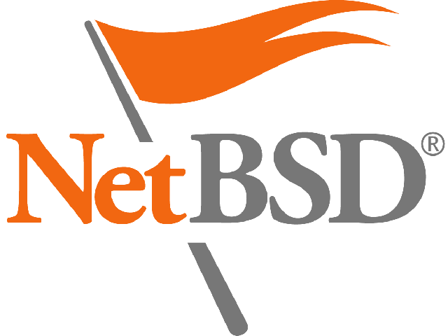
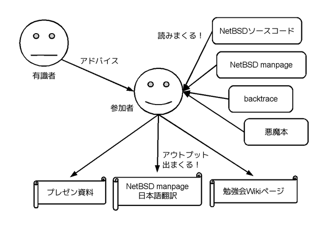
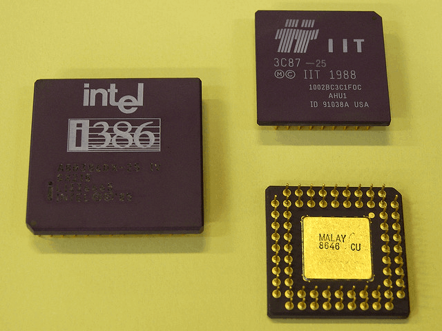
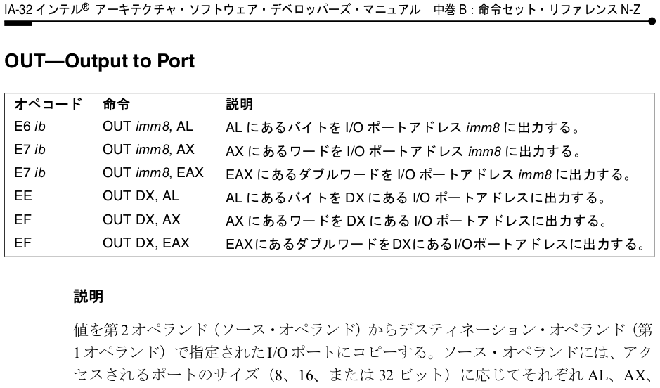
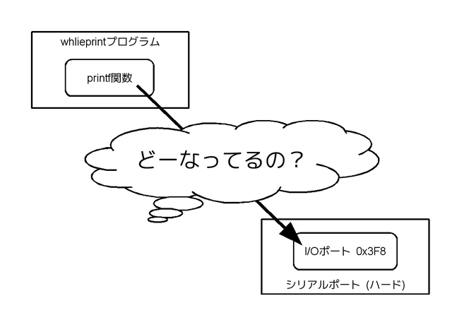
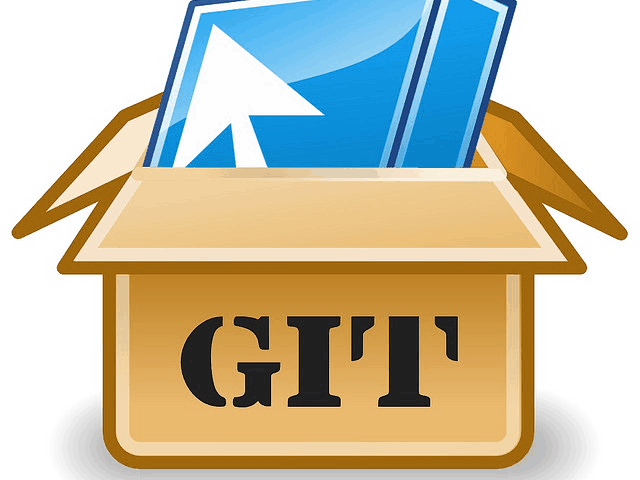
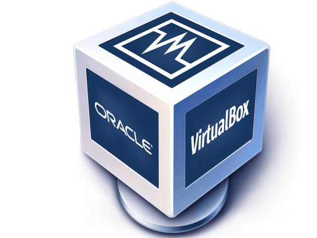
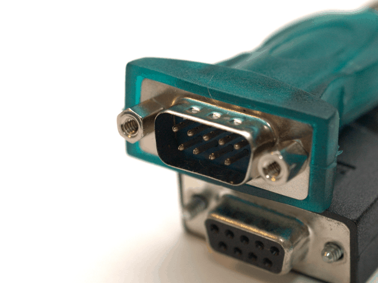
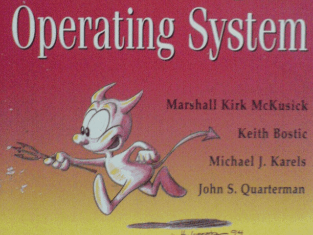

# スタート低レイヤー #0

Kiwamu Okabe

# 私は誰？

* Twitter: @master_q
* ミラクル・リナックス勤務
* 前はコピー機のOSをNetBSDで作ってた
* デジタルサイネージのソフト開発してます
* OSSに興味のある{エンジニア,インターン}募集中です!

# この勉強会は何？

* UNIXモドキのOSを理解するために
* printf関数の動作を題材にして
* NetBSDソースコードを読んだり
* NetBSD manpageを読んだり

する勉強会です

# この勉強会の進め方

* backtraceを見て
* 興味のある箇所を参加者が調べて発表
* 調べる方法を有識者がフォロー
* printfの動作完全理解で勉強会卒業!

# つまり打ち出の小槌ですヨ!

# でもまたなんでprintfなの？

* OSの学び方とか聞いたことありますか？
* ぼくのケース := 会社入っていきなり仕事
* 独学でした... #orz
* 10年ぐらいNetBSDのお守り
* 皆さんには近道を通ってほしい!

# ダメな例1: UNIX本読む

* 各部品については理解できる
* 部品と部品の繋がりがイメージできない
* よってkernel全体感も掴めない
* 細かい部品についてはコード読まないと
* 本読むのは良いけどそれだけじゃぁ...

# ダメな例2: 自作OS

* 楽しいけど...
* x86セグメントとかイキナリ
* デバイス周りやVMなど下側ばかり
* バスドライバなど抽象まで辿りつけない
* 上に複雑なアプリケーションはいない
* 結果: 単なるデバドラ屋になりさがる...

# ダメな例3: 起動プロセスを調べる

* プロセスの生成、光あれ!
* 過渡と定常
* 過渡ばかり覚える
* 定常 := 機器が動いている時
* アプリ結合で思考停止する人間になる

# じゃあ何が近道なのさ!？

* フリーUNIXのソース全部読めってか？
* 無理だぽー
* シナリオが必要です
* 最も簡単そうなシナリオは？
* printf関数の動作じゃね

# 簡単なプログラムを作りました

~~~ {.c}
/* whileprint.c */
#include <stdio.h>

int main()
{
        while(1) {
                printf(".");
        }
}
~~~

このプログラムをシリアルコンソールから実行すれば、
PCのシリアルポートに"."をひたすら書くだけのはず。

# x86のシリアルポートのしくみ

~~~
http://community.osdev.info/index.php?%28serial%29PC16550
~~~

I/Oポート0x3F8にASCIIコードを書けばOK

# printf => I/Oポート の間は？

# backtrace取ってみたよ

# ソースコードの取得

CVS

~~~
$ cat ~/.cvsrc
diff -cu
update -dP
checkout -P
cvs -z3 -q
$ cvs -d :pserver:anoncvs@anoncvs.jp.netbsd.org:/cvs/cvsroot login
Logging in to :pserver:anoncvs@anoncvs.jp.netbsd.org:2401/cvs/cvsroot
CVS password: anoncvs
$ cvs -d :pserver:anoncvs@anoncvs.jp.netbsd.org:/cvs/cvsroot co -r netbsd-6-0-1-RELEASE src
~~~

Git

~~~
$ git clone git://github.com/jsonn/src.git
$ git checkout -b netbsd_6_0 remotes/origin/netbsd_6_0
~~~

# 読むべきソースコードの在処

~~~
src/lib/libc          := libc
src/libexec/ld.elf_so := 動的リンカ
src/sys               := kernel全体
src/sys/sys           := kernel内APIヘッダ
src/sys/arch/x86      := i386/amd64共通機種依存コード
src/sys/arch/i386     := i386アーキティクチャ機種依存コード
src/sys/dev           := デバイスドライバ
src/sys/kern          := kernelコアルーチン
src/sys/uvm           := バーチャルメモリ
~~~

他のディレクトリはおいおい説明します

# ドキュメントはmanpage

http://netbsd.gw.com/cgi-bin/man-cgi

http://netbsdman.masterq.net/

翻訳環境構築中

# 開発環境: build.sh

以下の手順でkernelをコンパイルできます

~~~
$ cd src/
$ ./build.sh -T obj/tooldir -m i386 tools
$ cd sys/arch/i386/conf/
$ ../../../../obj/tooldir/bin/nbconfig GENERIC
$ cd ../compile/GENERIC/
$ ../../../../../obj/tooldir/bin/nbmake-i386 depend
$ ../../../../../obj/tooldir/bin/nbmake-i386
$ file netbsd
netbsd: ELF 32-bit LSB executable, Intel 80386, version 1 (SYSV), statically linked, for NetBSD 6.0, not stripped
~~~

コードをちょっと変えて動作を見たいときどうぞ

# 実行環境: NetBSD + virtualbox

isoでvirtualboxにNetBSDをインストール

~~~
ftp://iso.jp.netbsd.org/pub/NetBSD/iso/6.0.1/NetBSD-6.0.1-i386.iso
~~~

さっきコンパイルしたkernelを/netbsd.testの名前でvirtualboxインスタンスに置く

以下のように/boot.cfgを設定

~~~
menu=Boot normally:rndseed /var/db/entropy-file;boot netbsd
menu=Boot ddb:rndseed /var/db/entropy-file;boot netbsd.test -d
menu=Boot single user:rndseed /var/db/entropy-file;boot netbsd -s
menu=Drop to boot prompt:prompt
default=1
timeout=5
clear=1
~~~

# virtualboxでシリアルコンソール

~~~
http://www.reactos.org/wiki/VirtualBox
~~~

virtualboxのシリアルを名前付きpipeに設定

~~~
http://www.cetus-net.org/bsd/i386/serial.html
~~~

NetBSD側でシリアルコンソールを有効に

~~~
# diff /etc/ttys.back /etc/ttys
13c13
< tty00 "/usr/libexec/getty std.9600"   unknown off secure
---
> tty00 "/usr/libexec/getty std.9600"   vt100   on secure local
~~~

ホストOSから名前付きpipeを開く

~~~
$ socat unix-client:/hogehoge/com0.pipe stdio
NetBSD/i386 (Amnesiac) (tty00)

login:
~~~

# 何もかも解らない時どうすれば...

~~~ {.c}
static int
vn_write(file_t *fp, off_t *offset, struct uio *uio, kauth_cred_t cred, int flags)
{
	struct vnode *vp = (struct vnode *)fp->f_data;
	int count, error, ioflag, fflag;

	ioflag = IO_ADV_ENCODE(fp->f_advice) | IO_UNIT;
	fflag = fp->f_flag;
	if (vp->v_type == VREG && (fflag & O_APPEND))
		ioflag |= IO_APPEND;
	if (fflag & FNONBLOCK)
		ioflag |= IO_NDELAY;
	if (fflag & FFSYNC ||
	    (vp->v_mount && (vp->v_mount->mnt_flag & MNT_SYNCHRONOUS)))
		ioflag |= IO_SYNC;
	else if (fflag & FDSYNC)
		ioflag |= IO_DSYNC;
	if (fflag & FALTIO)
		ioflag |= IO_ALTSEMANTICS;
	if (fflag & FDIRECT)
		ioflag |= IO_DIRECT;
	vn_lock(vp, LK_EXCLUSIVE | LK_RETRY);
	uio->uio_offset = *offset;
	count = uio->uio_resid;
~~~

# 1. タグジャンプ

以下どれかを使うとソースコード追いやすい

* GNU GLOBAL

http://www.gnu.org/software/global/

* Exuberant Ctags

http://ctags.sourceforge.net/

# 2. NetBSDドキュメント

* NetBSD Guide

~~~
http://netbsd.org/docs/guide/en/
~~~

* Other FAQs and HOWTOs

~~~
http://netbsd.org/docs/misc/index.html
~~~

* NetBSD Developer Documentation

~~~
http://netbsd.org/developers/
~~~

* NetBSD source code style guide

~~~
http://cvsweb.netbsd.org/bsdweb.cgi/src/share/misc/style?rev=1.49&content-type=text/x-cvsweb-markup&only_with_tag=MAIN
~~~

# 3. 本

* 4.4BSDの設計と実装

~~~
http://www.amazon.co.jp/dp/4756143466
~~~

* BSDカーネルの設計と実装

~~~
http://www.amazon.co.jp/dp/4756146791
~~~

* 386BSDカーネルソースコードの秘密

~~~
http://www.amazon.co.jp/dp/4756120423
~~~

# みなさんへのお願い

勉強会の運営には皆さんの協力が必要です!

* 好きな箇所を読んで発表
* NetBSD manの翻訳

~~~
http://netbsdman.masterq.net/
~~~

* Metasepiプロジェクトへの参加

~~~
http://metasepi.masterq.net/
~~~

# ということでソース読みましょう!

* printf関数から読む
* I/Oポートアクセスから読む

あなたはどっち？

# 参考資料

* 本勉強会まとめサイト

~~~
http://start_printf.masterq.net/
~~~
