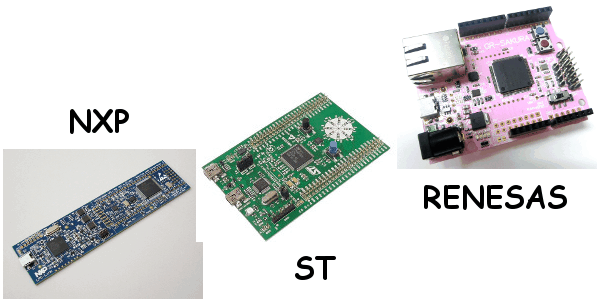
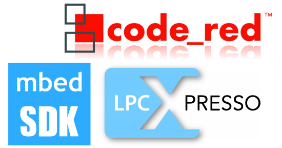
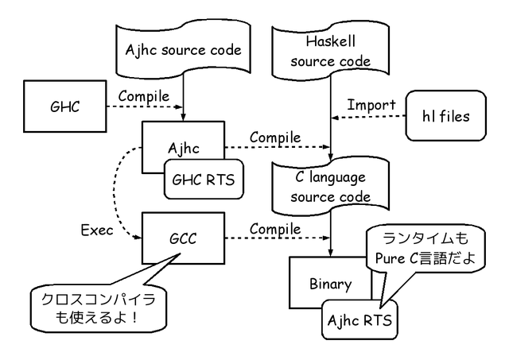

# Debianを用いたCortex-M3マイコン開発事例の紹介

Kiwamu Okabe

# 私は誰？

* Twitter: @master_q
* ミラクル・リナックス勤務
* 前はコピー機のOSをNetBSDで作ってた
* デジタルサイネージのソフト開発してます
* OSSに興味のある{エンジニア,インターン}募集中です!

# Cortex-M3マイコン知ってますか？

* ARMが開発した32bitマイコン
* 各社から数千円で開発ボードが出てる

# メーカー製のツールが使いにくい

* eclipseよくわからない
* プログラムサイズに制限があったり
* 素直なgccとgdbが使いたい...

# Debianでもマイコン開発したい!

* 今回はSTマイクロ社に焦点をしぼります
* ボード: STM32F3DISCOVERY
* ROM: 256kB
* RAM: 48kB
* 価格: 950円 <= 殺人的安さ
* 備考: デバッガ用のST-LINKチップ搭載

# 開発全体の流れ

# ソースコードテンプレート

* テンプレを使えば楽にスタートできる

~~~
$ git clone https://github.com/mblythe86/stm32f3-discovery-basic-template.git
$ cd stm32f3-discovery-basic-template
$ vi src/main.c
~~~

~~~ {.c}
int main(void)
{
// --snip--
  while (1)
  {
    STM_EVAL_LEDOff(LED3);
    STM_EVAL_LEDOff(LED6);
// --snip--
    Delay(50); /*500ms - half second*/
    
    STM_EVAL_LEDOn(LED3);
    STM_EVAL_LEDOn(LED6);
// --snip--
    Delay(50); /*500ms - half second*/
  }
}
~~~

# クロスコンパイル

* クロスコンパイラのインストール

~~~
$ sudo apt-get install flex bison libgmp3-dev libmpfr-dev libncurses5-dev libmpc-dev autoconf texinfo build-essential libftdi-dev zlib1g-dev git zlib1g-dev python-yaml
$ git clone git://github.com/esden/summon-arm-toolchain.git
$ cd summon-arm-toolchain
$ ./summon-arm-toolchain
$ export PATH=$HOME/sat/bin:$PATH
~~~

* さっきのテンプレをクロスコンパイル

~~~
$ cd stm32f3-discovery-basic-template
$ make
$ file main.elf
main.elf: ELF 32-bit LSB  executable, ARM, EABI5 version 1 (SYSV), statically linked, not stripped
~~~

# ファーム書き込みの準備

* st-utilコマンドが便利

~~~
$ sudo apt-get install libsgutils2-dev libusb-1.0-0-dev
$ git clone git://github.com/texane/stlink.git
$ cd stlink
$ ./autogen.sh && ./configure && make
$ sudo make install
~~~

* テンプレのMakefileを修正

~~~
$ cd stm32f3-discovery-basic-template
$ cat > gdbwrite.boot
tar ext localhost:4242
load main.elf
$ cat >>  Makefile
gdbwrite: all
	$(GDB) -x gdbwrite.boot $(PROJ_NAME).elf
~~~

# ファーム書き込み/デバッグ

* まずst-utilを起動しておく

~~~
$ sudo st-util
~~~

* 別のコンソールを開いてgdbを起動する

~~~
$ cd stm32f3-discovery-basic-template
$ make gdbwrite
--snip--
Start address 0x8000db5, load size 3744
Transfer rate: 7 KB/sec, 1248 bytes/write.
(gdb) c
### プログラム実行開始 / C-cを押下するとプロンプトに戻る ###
(gdb) bt
#0  Delay (nTime=nTime@entry=50) at src/main.c:82
#1  0x08000bdc in main () at src/main.c:58
~~~

これで思うぞんぶんデバッグできるよ!

# Haskellマイコンプログラミング

* Ajhc - http://ajhc.metasepi.org/

# 宣伝: コミケに同人誌を出します

* コミックマーケット84
* 3日目 東地区 ペ-06a
* サークル名: 参照透明な海を守る会
* http://www.paraiso-lang.org/ikmsm/
