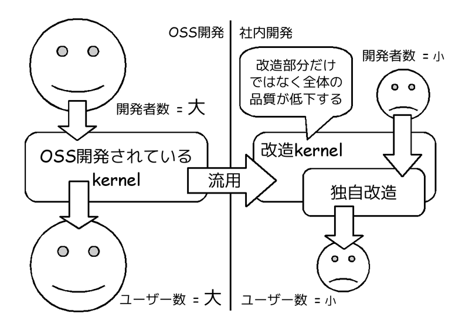

# 組込向けHaskellコンパイラAjhc　OSC 2013 Kansai@Kyoto版

Kiwamu Okabe

# 私は誰？

* Twitter: @master_q
* Metasepiプロジェクト主催
* Ajhcコンパイラ開発者
* Debianメンテナ
* 前はデジタルサイネージの開発してました
* 昔はコピー機のOSをNetBSDで作ってた

# おしながき

* [1] Ajhcコンパイラとは
* [2] Metasepi OSとは
* [3] OS開発向けコンパイラとは？
* [4] Ajhcコンパイラのインストール
* [5] POSIXの外でプログラムを動かす
* [6] Ajhcコンパイラの今後

# [1] Ajhcコンパイラとは

http://ajhc.metasepi.org/

* Ajhc := A fork of jhc
* http://repetae.net/computer/jhc/
* jhcはフットプリントが小さく、
* 高速な実行バイナリを吐くらしい
* 組み込みに向いてるかも

# どうしてAjhcコンパイラ作るの？

* HaskellコミュニティではGHCがデファクト
* GHC := Glasgow Haskell Compiler
* http://www.haskell.org/ghc/
* なぜ別のHaskellコンパイラが必要？
* Metasepiというkernelを作るため

# [2] Metasepi OSとは

http://metasepi.org/

* UNIXモドキkernelを強い型によって設計
* ML同等以上に強い型を持つ言語

Haskell http://www.haskell.org/

OCaml http://caml.inria.fr/

MLton http://mlton.org/

# どうしてMetasepi OSが必要？

* LinuxやWindowsが既にあるのでは？
* しかし組込開発は苦しんでいる
* kernelをカスタマイズして使用
* kernelのランタイムエラー
* 再現することでさえ困難

# 既存OSSの品質は高いのでは？

* OSSは品質が高いと言われている
* 伽藍とバザール
* 「目玉の数さえ十分あれば、どんなバグも深刻ではない」

~~~
http://cruel.org/freeware/cathedral.html
~~~

* ところが社内開発は...

# 主開発からそれると品質急降下

# 型安全とは

* ランタイムエラーを少なくできる
* 参考:数理科学的バグ撲滅方法論のすすめ

~~~
http://itpro.nikkeibp.co.jp/article/COLUMN/20060915/248230/
~~~

# kernelにこそ型安全が必要

* ほとんどのkernelはC言語で設計される
* ユーザー空間でエラー → SEGV
* kernel空間でエラー → システム停止
* kernelの設計には細心の注意が必要
* C言語は安全なのか？

# [3] OS開発向けコンパイラとは？

* 強い型が使えてOSを作れるコンパイラは？
* ないみたいなので作りましょう!
* スクラッチから作るのはツライ
* 要求に近いコンパイラはないかな？

# POSIX外で使いやすいコンパイラ

各数値が小さいほどPOSIX APIへの依存度が小さい

# jhcバイナリは未定義シンボル20個

~~~
$ nm hs.out | grep "U "
                 U _IO_putc@@GLIBC_2.2.5
                 U __libc_start_main@@GLIBC_2.2.5
                 U _setjmp@@GLIBC_2.2.5
                 U abort@@GLIBC_2.2.5
                 U ctime@@GLIBC_2.2.5
                 U exit@@GLIBC_2.2.5
                 U fflush@@GLIBC_2.2.5
                 U fprintf@@GLIBC_2.2.5
                 U fputc@@GLIBC_2.2.5
                 U fputs@@GLIBC_2.2.5
                 U free@@GLIBC_2.2.5
                 U fwrite@@GLIBC_2.2.5
                 U getenv@@GLIBC_2.2.5
                 U malloc@@GLIBC_2.2.5
                 U memset@@GLIBC_2.2.5
                 U posix_memalign@@GLIBC_2.2.5
                 U realloc@@GLIBC_2.2.5
                 U setlocale@@GLIBC_2.2.5
                 U sysconf@@GLIBC_2.2.5
                 U times@@GLIBC_2.2.5
~~~

# jhcはC言語への変換器

# クロスコンパイルも簡単

# 実用化に辿りつくために

* ドッグフードを維持しながら開発

# [4] Ajhcコンパイラのインストール

* 想定環境: Ubuntu 12.04 amd64

~~~
$ sudo apt-get install haskell-platform libncurses5-dev libwww-perl gcc m4
$ cabal update
$ cabal install ajhc
$ export PATH=$HOME/.cabal/bin/:$PATH
$ which ajhc
/home/ユーザ名/.cabal/bin/ajhc
$ ajhc --version
ajhc 0.8.0.8 (f6c3f4b070acad8a5012682810f0f4d7b7b9ed44)
compiled by ghc-7.4 on a x86_64 running linux
~~~

* 他のOSの場合は以下に書いてあるかも

https://github.com/ajhc/ajhc

# どうすればPOSIXの外へ行ける？

# PR:"簡約!?λカ娘Go!"に寄稿したよ

http://www.paraiso-lang.org/ikmsm/

# プレゼンで使用した画像について
