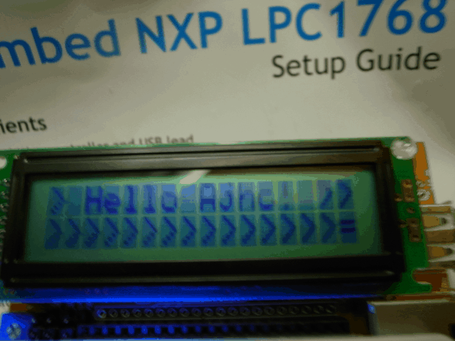
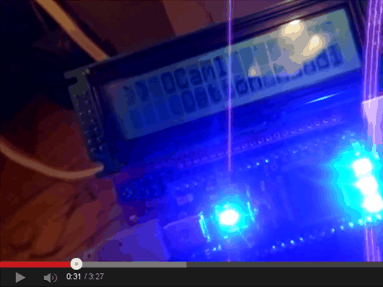
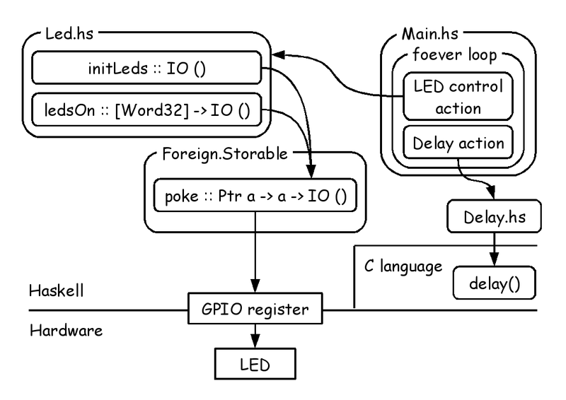

# 組込向けHaskellコンパイラAjhc　mbedマイコンどうでしょう編

Kiwamu Okabe

# 私は誰？

* Twitter: @master_q
* Metasepiプロジェクト主催
* Ajhc Haskellコンパイラ開発者
* Debian Maintainer
* 前はデジタルサイネージの開発してました
* その昔はコピー機のOSをNetBSDで

# ようこそ、ピストルMetasepiへ

* [1] 前菜としてデモでも
* [2] Ajhcコンパイラとは
* [3] Metasepi kernelとは
* [4] OS開発向けコンパイラとは
* [5] Ajhcのインストールと使い方
* [6] mbedマイコン上でのHaskell
* [7] Ajhcコンパイラの過去と未来

# [1] 前菜としてデモでも

~~~
http://www.youtube.com/watch?v=C9JsJXWyajQ
~~~

* mbedでRSSリーダーを作ってみました
* redditのRSSをLCDにヘッドライン表示

　

　

このスライドは以下のURLでご覧になれます

http://bit.ly/mbedhask

# デモのハードウェア構成

アーキティクチャ: ARM Cortex-M3

デバイス: Ethernet, LED, LCD, SDカード, USBホスト/デバイス, シリアル

# デモのソフトウェア構成

# デモのソースコードツリー

~~~
demo-cortex-m3
`-- mbed-nxp-lpc1768
    |-- BuildShell                 <= コンパイル環境設定
    |-- build
    |   `-- mbed.ld                <= リンカスクリプト
    |-- external
    |   `-- mbed
    |       `-- LPC1768
    |           `-- GCC_ARM
    |               `-- libmbed.a  <= コンパイル済みmbedライブラリ
    |-- linux_install              <= コンパイル環境構築スクリプト
    |-- samples
    |   `-- Haskell_Http
    |       |-- EthernetInterface  <= TCP/IPプロトコルスタック
    |       |-- c_extern.h
    |       |-- dummy4jhc.c        <= Haskell用C言語スタブ
    |       |-- hs_src
    |       |   `-- *.hs           <= Haskellソースコード
    |       |-- main.c             <= C言語main関数
    |       `-- mbed-rtos          <= mbed-rtos OS
    `-- src
        `-- gcc4mbed.c
~~~

# [2] Ajhcコンパイラとは

http://ajhc.metasepi.org/

* Ajhc := A fork of jhc
* jhc := John's Haskell Compiler
* http://repetae.net/computer/jhc/
* jhcはフットプリントが小さく、
* 高速な実行バイナリを吐くらしい
* 組み込みに向いてるかも

# どうしてAjhcコンパイラ作るの？

* HaskellコミュニティではGHCがデファクト
* GHC := Glasgow Haskell Compiler
* http://www.haskell.org/ghc/
* なぜ別のHaskellコンパイラが必要？
* Metasepiというkernelを作るため

# [3] Metasepi kernelとは

http://metasepi.org/

* UNIXモドキkernelを強い型によって設計
* ML同等以上に強い型を持つ言語を使う

Haskell http://www.haskell.org/

OCaml http://caml.inria.fr/

MLton http://mlton.org/

などなど

# どうしてMetasepiが必要？

* LinuxやWindowsが既にあるのでは？
* しかし組込開発は苦しんでいる
* kernelをカスタマイズして使用
* kernelのランタイムエラー
* 再現することでさえ困難

# 既存OSSの品質は高いのでは？

* OSSは品質が高いと言われている
* 伽藍とバザール
* 「目玉の数さえ十分あれば、どんなバグも深刻ではない」

~~~
http://cruel.org/freeware/cathedral.html
~~~

* ところが社内開発は...

# 主開発からそれると品質急降下

# 型安全とは

* ランタイムエラーを少なくできる
* 参考:数理科学的バグ撲滅方法論のすすめ

~~~
http://itpro.nikkeibp.co.jp/article/COLUMN/20060915/248230/
~~~

# kernelにこそ型安全が必要

* ほとんどのkernelはC言語で設計される
* ユーザー空間でエラー → SEGV
* kernel空間でエラー → システム停止
* kernelの設計には細心の注意が必要
* C言語は安全なのか？

# [4] OS開発向けコンパイラとは

* 強い型が使えてOSを作れるコンパイラは？
* C言語のような使い勝手が必要
* ないみたいなので作りましょう!
* スクラッチから作るのはツライ
* 要求に近いコンパイラはないかな？

# POSIX外で使いやすいコンパイラ

各数値が小さいほどPOSIX APIへの依存度が小さい

# jhcバイナリは未定義シンボル20個

~~~
$ nm hs.out | grep "U "
                 U _IO_putc@@GLIBC_2.2.5
                 U __libc_start_main@@GLIBC_2.2.5
                 U _setjmp@@GLIBC_2.2.5
                 U abort@@GLIBC_2.2.5
                 U ctime@@GLIBC_2.2.5
                 U exit@@GLIBC_2.2.5
                 U fflush@@GLIBC_2.2.5
                 U fprintf@@GLIBC_2.2.5
                 U fputc@@GLIBC_2.2.5
                 U fputs@@GLIBC_2.2.5
                 U free@@GLIBC_2.2.5
                 U fwrite@@GLIBC_2.2.5
                 U getenv@@GLIBC_2.2.5
                 U malloc@@GLIBC_2.2.5
                 U memset@@GLIBC_2.2.5
                 U posix_memalign@@GLIBC_2.2.5
                 U realloc@@GLIBC_2.2.5
                 U setlocale@@GLIBC_2.2.5
                 U sysconf@@GLIBC_2.2.5
                 U times@@GLIBC_2.2.5
~~~

# jhcはC言語への変換器

# クロスコンパイルも簡単

# 実用化に辿りつくために

実行可能状態を維持しながら開発 (スナッチ)

# [5] Ajhcのインストールと使い方

* インストールしてみましょう

Ubuntu 12.04 amd64 の場合

~~~
$ sudo apt-get install haskell-platform libncurses5-dev gcc m4
$ cabal update
$ export PATH=$HOME/.cabal/bin/:$PATH
$ cabal install ajhc
$ which ajhc
/home/ユーザ名/.cabal/bin/ajhc
$ echo 'main = print "hoge"' > Hoge.hs
$ ajhc Hoge.hs
$ ./hs.out
"hoge"
~~~

バージョン0.8.0.9からはWindowsとOS Xでもインストール可能になる予定です

# 使い方詳細

「Ajhcユーザーズマニュアル」

ajhc.metasepi.org/manual_ja.html

を読んでみてください!

# [6] mbedマイコン上でのHaskell

mbedマイコン上でHaskellコードを動かす手順をステップ毎に説明します

* 前半: C言語の開発環境構築
* 後半: Haskellの開発環境構築

の大きく二つに分かれています

# ベースとなるソースコードを入手

~~~
https://github.com/adamgreen/gcc4mbed
~~~

githubにmbedのC言語プロジェクトがあったので、これをベースに開発をはじめます

~~~
$ git clone https://github.com/adamgreen/gcc4mbed.git
~~~

# ビルド手順を確認

クロスコンパイル環境構築

~~~
$ cd gcc4mbed
$ ./linux_install
~~~

設定したクロスコンパイラを使うには...

~~~
$ cd gcc4mbed
$ ./BuildShell
$ cd samples/Blink
$ ls
main.c  makefile
$ make
$ ls
Blink.bin  Blink.elf  Blink.hex  LPC176x  main.c  makefile
~~~

Blink.elfがコンパイル結果です

# mbedにプログラムを書き込む #1

* mbedファームウェアをrev.141212以降に

~~~
http://mbed.org/handbook/Firmware-LPC1768-LPC11U24
~~~

* pyOCDのインストール

~~~
$ sudo apt-get install python libusb-1.0-0-dev
$ git clone git@github.com:walac/pyusb.git
$ cd pyusb && sudo python setup.py install
$ git clone git@github.com:mbedmicro/mbed.git
$ cd mbed/workspace_tools/debugger
$ sudo python setup.py install
$ cp test/gdb_test.py ~/gcc4mbed/gdbserver.py
~~~

* gdbスクリプト設置

~~~
$ vi gcc4mbed/gdbwrite.boot
target remote localhost:3333
load
~~~

# mbedにプログラムを書き込む #2

* gcc4mbed.mkにgdbターゲット追加

~~~ {.diff}
--- a/build/gcc4mbed.mk
+++ b/build/gcc4mbed.mk
@@ -255,6 +255,14 @@ endif
 
 all:: $(PROJECT).hex $(PROJECT).bin $(OUTDIR)/$(PROJECT).disasm size
 
+GDB = arm-none-eabi-gdb
+
+gdbwrite: all
+       @echo '################################################'
+       @echo '# Use me after running "sudo ./gdbserver4.py". #'
+       @echo '################################################'
+       $(GDB) -x ../../gdbwrite.boot $(PROJECT).elf
+
 $(PROJECT).bin: $(PROJECT).elf
        @echo Extracting $@
        $(Q) $(OBJCOPY) -O binary $(PROJECT).elf $(PROJECT).bin
~~~

# mbedにプログラムを書き込む #3

* mbedとPCをUSBケーブルで接続
* 一つ目のターミナルで以下を実行

~~~
$ cd gcc4mbed
$ sudo python gdbserver.py
~~~

* 別のターミナルを開き以下を実行

~~~
$ cd gcc4mbed
$ ./BuildShell
$ cd samples/Blink
$ make gdbwrite
(gdb) c
~~~

チカチカしました？

# 完成したC言語開発環境

# Haskellプログラミング開始

* Haskellプロジェクトディレクトリを掘る

~~~
$ cd gcc4mbed/samples
$ cp -a Blink Haskell
$ cd Haskell
$ ls
main.c  makefile
~~~

# 旧makefileを新Makefileでラップ

~~~
$ mv makefile forc.mk
$ vi Makefile
HSBUILD = build_haskell
TINI = $(HSBUILD)/targets.ini

all:: $(HSBUILD)/hs_main.c
        make -f forc.mk

include forc.mk

$(HSBUILD)/hs_main.c: $(HSSRC)
        mkdir -p $(HSBUILD)
        ajhc -fffi -p containers --tdir=$(HSBUILD) -C --include=hs_src -o $@ $<
        rm -f $(HSBUILD)/rts/gc_none.c $(HSBUILD)/rts/profile.c $(HSBUILD)/rts/slub.c
~~~

# forc.mkにAjhc用オプション追加

~~~
$ vi forc.mk # <= 以下を追加
HS_ENABLE = 1
GCFLAGS += -std=gnu99 -ffreestanding -nostdlib -falign-functions=4
GCFLAGS += -Wno-unused-parameter -fno-strict-aliasing -D_GNU_SOURCE
GCFLAGS += -DNDEBUG -D_JHC_GC=_JHC_GC_JGC -D_JHC_STANDALONE=0
GCFLAGS += -D_LITTLE_ENDIAN -D_JHC_USE_OWN_STDIO
GCFLAGS += -D_JHC_ARM_STAY_IN_THUMB_MODE -D_JHC_JGC_STACKGROW=16
GCFLAGS += -D_JHC_JGC_LIMITED_NUM_MEGABLOCK=2
GCFLAGS += -D_JHC_JGC_MEGABLOCK_SHIFT=13 -D_JHC_JGC_BLOCK_SHIFT=8
GCFLAGS += -D_JHC_JGC_GC_STACK_SHIFT=8
GCFLAGS += -D_JHC_JGC_LIMITED_NUM_GC_STACK=1
GCFLAGS += -D_JHC_JGC_NAIVEGC -D_JHC_JGC_SAVING_MALLOC_HEAP
GCFLAGS += -D_JHC_CONC=_JHC_CONC_NONE
~~~

普段はajhcがgcc呼び出し時に自動的につけてくれるものもある

GCのチューニングにもオプションが必要

# gcc4mbed.mkを修正 #1

~~~ {.diff}
--- gcc4mbed/build/gcc4mbed.mk.back
+++ gcc4mbed/build/gcc4mbed.mk
@@ -100,6 +100,11 @@
 GCC4MBED_TYPE ?= Release
 MRI_BREAK_ON_INIT ?= 1
 MRI_UART ?= MRI_UART_MBED_USB
+HS_ENABLE ?= 0
+HSDIR ?= hs_src
+HSBUILD ?= build_haskell
+HSSRC ?= $(wildcard $(HSDIR)/*.hs $(HSDIR)/*/*.hs $(HSDIR)/*/*/*.hs $(HSDIR)/*/*/*/*.hs $(HSDIR)/*/*/*/*/*.hs)
+HSMAIN ?= $(HSDIR)/Main.hs
 
 
 # Configure MRI variables based on GCC4MBED_TYPE build type variable.
~~~

# gcc4mbed.mkを修正 #2

~~~ {.diff}
@@ -212,13 +217,14 @@
 ifneq "$(NO_FLOAT_PRINTF)" "1"
 LDFLAGS += -u _printf_float
 endif
+LDFLAGS += -Wl,--defsym,jhc_zeroAddress=0
 
 
 #  Compiler/Assembler/Linker Paths
 GCC = arm-none-eabi-gcc
 GPP = arm-none-eabi-g++
 AS = arm-none-eabi-as
-LD = arm-none-eabi-g++
+LD = arm-none-eabi-gcc
 OBJCOPY = arm-none-eabi-objcopy
 OBJDUMP = arm-none-eabi-objdump
 SIZE = arm-none-eabi-size
~~~

# gcc4mbed.mkを修正 #3

~~~ {.diff}
@@ -279,7 +285,7 @@
        @echo Cleaning up all build generated files
        $(Q) $(REMOVE) -f $(call convert-slash,$(OBJECTS)) $(QUIET)
        $(Q) $(REMOVE) -f $(call convert-slash,$(DEPFILES)) $(QUIET)
-       $(Q) $(REMOVE_DIR) $(OUTDIR) $(QUIET)
+       $(Q) $(REMOVE_DIR) $(OUTDIR) $(HSBUILD) $(QUIET)
        $(Q) $(REMOVE) -f $(call convert-slash,$(OUTDIR)/$(PROJECT).map) $(QUIET)
        $(Q) $(REMOVE) -f $(call convert-slash,$(OUTDIR)/$(PROJECT).disasm) $(QUIET)
        $(Q) $(REMOVE) -f $(PROJECT).bin $(QUIET)
~~~

ぜぇぜぇ。これでpatchあておわりました

# C言語main関数修正(main.c)

~~~ {.c}
#include "LPC17xx.h"
#include "jhc_rts_header.h"
#include "c_extern.h"

volatile int g_LoopDummy;

void delay(int times)
{
        int i;
        for (i = 0 ; i < times && !g_LoopDummy ; i++) {}
}

int main() 
{
        int hsargc = 1;
        char *hsargv = "q";
        char **hsargvp = &hsargv;
        hs_init(&hsargc, &hsargvp); // Ajhcランタイム初期化
        _amain();                   // Haskellコード呼び出し
        hs_exit();
        for (;;) {}
        return 0;
}
~~~

# 雑多なAjhc向け設定

* 標準入出力を無力化

~~~ {.c}
// File: dummy4jhc.c
#include "jhc_rts_header.h"

int jhc_printf_stderr(const char *format, ...) { return 0; }
int jhc_fputs_stderr(const char *s) { return 0; }
int jhc_fflush_stdout() { return 0; }
void jhc_print_profile(void) {}
int jhc_utf8_getchar(void) { return 0; }
int jhc_utf8_getc(FILE *f)  { return 0; }
int jhc_utf8_putchar(int ch)  { return 0; }
int jhc_utf8_putc(int ch, FILE *f)  { return 0; }
~~~

* Haskellから使うC言語API

~~~ {.c}
// File: c_extern.h
extern volatile void jhc_zeroAddress;
void delay();
~~~

# 独自のmalloc関数(alloc.c)

ソースコードが大きいのでwget

~~~
$ wget https://raw.github.com/ajhc/demo-cortex-m3/master/mbed-nxp-lpc1768/samples/Haskell/alloc.c
$ grep MALLOC_HEAPSIZE alloc.c 
#define MALLOC_HEAPSIZE _JHC_MALLOC_HEAP_SIZE
#define MALLOC_HEAPSIZE (2*1024)
char malloc_heapstart[MALLOC_HEAPSIZE];
char *malloc_heaplimit = (char *) (malloc_heapstart + MALLOC_HEAPSIZE);
~~~

malloc用ヒープは2kBに設定してみました

通常用途ならたぶん十分です

# 何もしないHaskellコードでお試し

~~~
$ mkdir hs_src
$ vi hs_src/Main.hs
main :: IO ()
main = return ()
$ ls
Makefile  c_extern.h   forc.mk  main.c
alloc.c   dummy4jhc.c  hs_src/
$ make
$ ls
Blink.bin  LPC176x   build_haskell  forc.mk
Blink.elf  Makefile  c_extern.h     hs_src
Blink.hex  alloc.c   dummy4jhc.c    main.c
~~~

うんコンパイルできました

# 完成したHaskell開発環境

# HaskellからLEDチカチカ

* まず時間待ちを作りましょう
* C言語のdelay関数をHaskellから呼出

~~~ {.haskell}
-- File: hs_src/Delay.hs
module Delay where

foreign import ccall "c_extern.h delay" delay :: Int -> IO ()
~~~

# LED操作 #1

~~~ {.haskell}
-- File: hs_src/Led.hs (つづく)
module Led where
import Data.Word
import Data.Bits
import Foreign.Ptr
import Foreign.Storable

foreign import ccall "c_extern.h &jhc_zeroAddress" c_jhc_zeroAddress32 :: Ptr Word32

addr_LPC_GPIO_BASE, addr_LPC_GPIO1_BASE, addr_FIODIR, addr_FIOPIN :: Ptr Word32
addr_LPC_GPIO_BASE = c_jhc_zeroAddress32 `plusPtr` 0x2009C000
addr_LPC_GPIO1_BASE = addr_LPC_GPIO_BASE `plusPtr` 0x00020
addr_FIODIR = addr_LPC_GPIO1_BASE
addr_FIOPIN = addr_LPC_GPIO1_BASE `plusPtr` (4 + 4 * 3 + 4)
~~~

# LED操作 #2

~~~ {.haskell}
-- File: hs_src/Led.hs (つづき)
led1, led2, led3, led4, ledAll :: Word32
led1 = 1 `shiftL` 18
led2 = 1 `shiftL` 20
led3 = 1 `shiftL` 21
led4 = 1 `shiftL` 23
ledAll = foldl (.|.) 0 [led1, led2, led3, led4]

initLeds :: IO ()
initLeds = poke addr_FIODIR ledAll

ledsOn :: [Word32] -> IO ()
ledsOn ls = poke addr_FIOPIN $ foldl (.|.) 0 ls
~~~

長いです。。。

あとで概要を説明します!

# Haskellのmain関数

~~~ {.haskell}
-- File: hs_src/Main.hs
import Control.Monad
import Data.Word
import Led
import Delay

main :: IO ()
main = do
  initLeds
  realmain

ledList :: [Word32]
ledList = [led1, led2, led3, led4]

realmain :: IO ()
realmain = forever $ do
  ledsOn []               >> mydelay
  ledsOn (take 1 ledList) >> mydelay
  ledsOn (take 2 ledList) >> mydelay
  ledsOn (take 3 ledList) >> mydelay
  ledsOn (take 4 ledList) >> mydelay
  where mydelay = delay 1000000
~~~

# このHaskellコードはどう動く？

# [7] Ajhcコンパイラの過去と未来

* Ajhcの開発をはじめて9ヶ月
* いろいろありました...
* 振り返りと今後の展望をざっくりと

# これまでのAjhcコンパイラ

* ユーザーズマニュアルの翻訳

~~~
http://ajhc.metasepi.org/manual_ja.html
~~~

* Cortex-M3マイコンへの移植

~~~
https://github.com/ajhc/demo-cortex-m3
~~~

* 省メモリGC
* 再入可能とスレッドの実現
* ChibiOS/RT上でのHaskellスレッド
* mbed-rtos上でのTCP/IPプログラミング

# Ajhcにまつわる発表資料

~~~
* "How do you like jhc?"
  http://www.slideshare.net/master_q/20121216-jhc
* "What is Metasepi?"
  http://www.slideshare.net/master_q/what-is-metasepi
* "HaskellではじめるCortex-M3組込みプログラミング"
  http://www.slideshare.net/master_q/20130222-jhc-stm32
* "Ajhcコンパイラの押売りに来ました"
  http://www.slideshare.net/master_q/20130422-ajhc-igarashi
* "Debianを用いたCortex-M3マイコン開発事例のご紹介"
  http://www.slideshare.net/master_q/20130629-deb-cortexm3
* "組込向けHaskellコンパイラAjhc / POSIX依存から脱出しよう編"
  http://www.slideshare.net/master_q/20130802-osc-kyotoajhc
* "組込Haskellとλカ娘本の紹介"
  http://www.slideshare.net/master_q/20130825-nagoya-festival
* "組込向けHaskellコンパイラAjhc / mbedマイコンどうでしょう編"
  http://www.slideshare.net/master_q/haskellajhc-mbed
~~~

# Ajhcコンパイラの未来

* 内部仕様ドキュメント作成中

~~~
https://github.com/ajhc/ajhc-hacking-guide
~~~

* 型によるスレッド間状態共有
* GHCのライブラリを移植
* さらなる応用例の提案
* NetBSD kernelを型によって再設計
* Metasepi上でMetasepi開発を可能に

# 宣伝:λカ娘に記事を書きませんか？

* http://www.paraiso-lang.org/ikmsm/
* 関数型言語の同人誌
* HaskellとかOCamlとか圏論とか
* C84にはAjhcの解説記事を投稿しました
* 立ち読みしたい方は声かけて!
* Call For Articlesはイカ

~~~
http://www.paraiso-lang.org/ikmsm/books/c85.html
~~~
