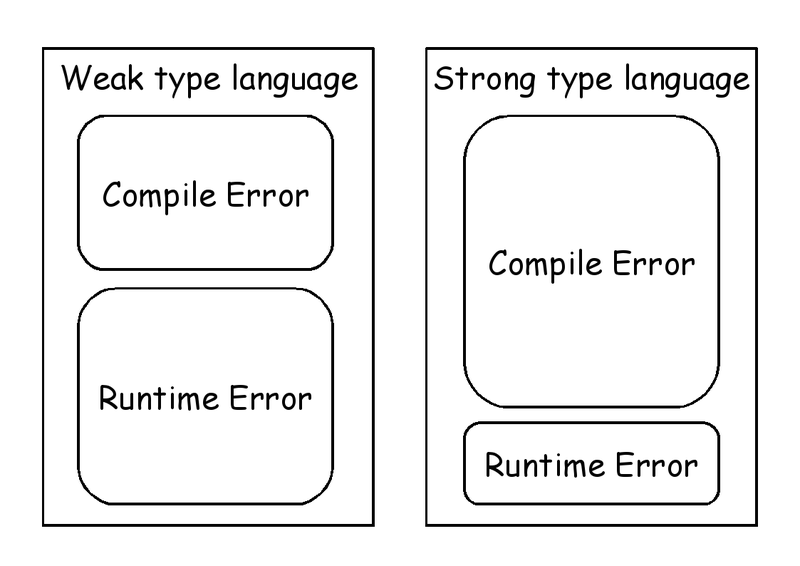
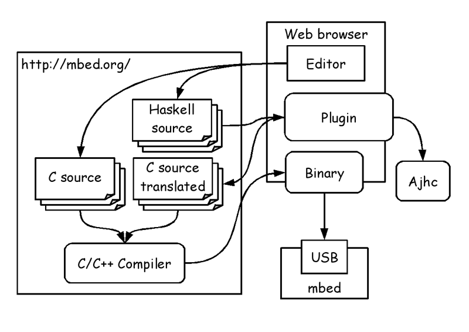
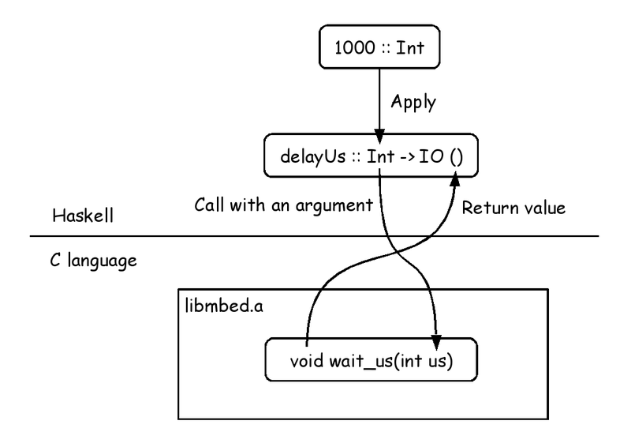
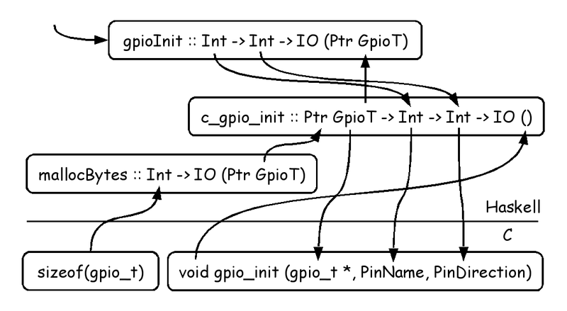
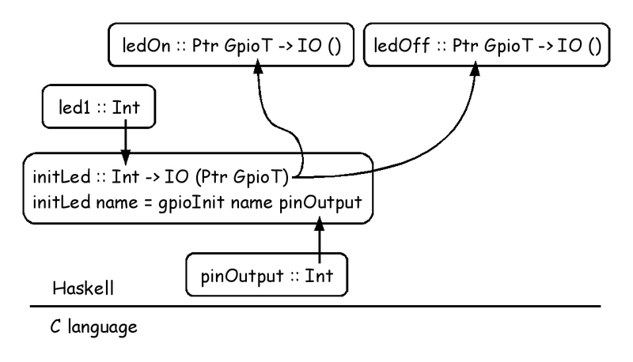
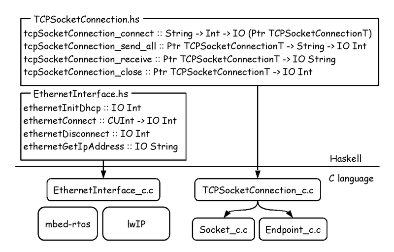
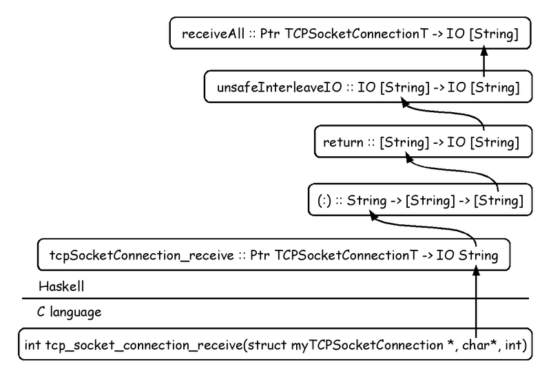
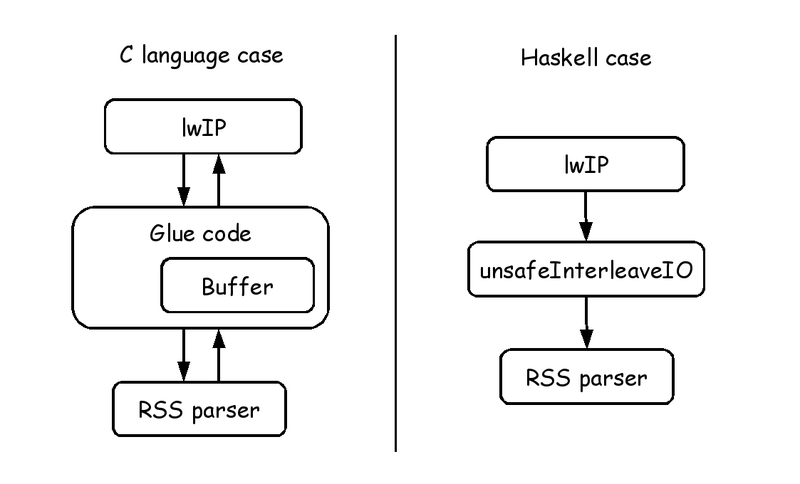

# mbed ではじめる組み込み Haskell プログラミング

Kiwamu Okabe

# わたしはだれ？

* Twitter: @master_q
* Metasepiプロジェクト主催
* Ajhc Haskellコンパイラ開発者
* Debian Maintainer
* 参照透明な海を守る会会員
* 前はデジタルサイネージの開発してました
* その昔はコピー機のOSをNetBSDで

# 今日はHaskellよりmbedに焦点

* 一昨日OSC Hokkaidoが開催されました
* Haskellの話はその時の資料をどうぞ!

http://bit.ly/mbedhask

* 今日はmbed側の話をさせてください

# おしながき

* [1] Haskell言語とは
* [2] mbedにおけるHaskell開発環境
* [3] mbed+Haskellデモ
* [4] デモの実装概要
* [5] デモの実装詳細
* [6] これからの課題

# [1] Haskell言語とは

* 強い型を使えるプログラミング言語
* コンパイルエラー↑ / 実行時エラー↓

~~~
参考:「数理科学的バグ撲滅方法論のすすめ」
     http://itpro.nikkeibp.co.jp/article/COLUMN/20060915/248230/
~~~

# なんでまたHaskell組み込み？

* アプリでエラー → SEGV → 再起動できる
* 低レイヤーでエラー → システム停止
* 低レイヤーを強い型で安全に設計したい!
* Ajhc Haskellコンパイラを開発中
* http://ajhc.metasepi.org/

# このプレゼンで前提とする環境

* Debian GNU/Linux sid amd64
* 他のディストリでも大丈夫だと思います
* WindowsとMacもひょっとしたら同じ？

# [2] mbedにおけるHaskell開発環境

詳細: http://bit.ly/mbedhask

# ファームウェア書き込み

~~~
http://mbed.org/blog/entry/Debugging-from-GDB-using-pyOCD/
https://github.com/mbedmicro/mbed/tree/master/workspace_tools/debugger
~~~

ぼくは"make gdbwrite"一発でビルド+ファーム書込ができるように設定しています

# クラウドコンパイラは使えないの？

いくつか課題があって実現していません

* AjhcコンパイラがGCCに依存している
* クラウドコンパイラがコマンドを呼べない

# 妄想: クラウドコンパイラ+Ajhc

mbed.org側修正が必要になってしまいます...

# [3] mbed+Haskellデモ

* mbedでRSSリーダーを作ってみました
* redditのRSSをLCDにヘッドライン表示
* 動画は以下のURLから観れます

http://bit.ly/mbedmov

# [4] デモの実装概要

# [5] デモの実装詳細

ソースコードはこちら

~~~
https://github.com/ajhc/demo-cortex-m3/tree/master/mbed-nxp-lpc1768/samples/Haskell_Http
~~~

# Haskell→C言語 呼び出し

~~~ {.haskell}
foreign import ccall "c_extern.h wait_us" delayUs :: Int -> IO ()
~~~

# C言語の構造体を型として扱う

~~~ {.haskell}
newtype {-# CTYPE "gpio_t" #-} GpioT = GpioT ()
foreign import primitive "const.sizeof(gpio_t)" gpio_t_size  :: Int
foreign import ccall "c_extern.h gpio_init" c_gpio_init :: Ptr GpioT -> Int -> Int -> IO ()
gpioInit :: Int -> Int -> IO (Ptr GpioT)
gpioInit name direction = do tag <- mallocBytes gpio_t_size
                              c_gpio_init tag name direction
                              return tag

~~~

# C言語ヘッダのアドレス設定を参照

~~~ {.haskell}
foreign import primitive "const.LPC_GPIO0_BASE" addr_LPC_GPIO0_BASE :: Int
pinName :: Int -> Int -> Int
pinName major minor = addr_LPC_GPIO0_BASE + major * 32 + minor
led1 :: Int
led1 = pinName 1 18 -- P1.18
~~~

# LEDのON/OFF

~~~ {.haskell}
pinOutput :: Int
pinOutput = 1
initLed :: Int -> IO (Ptr GpioT)
initLed name = gpioInit name pinOutput
ledOn, ledOff :: Ptr GpioT -> IO ()
ledOn  l = gpioWrite l 1
ledOff l = gpioWrite l 0
~~~

# lwIPをHaskellでラップ

# ストリーム処理

~~~ {.haskell}
receiveAll :: Ptr TCPSocketConnectionT -> IO [String]
receiveAll tcp = unsafeInterleaveIO receiveAll' where
  receiveAll' = do
    s <- tcpSocketConnection_receive tcp
    if s == "" then return [] else do
      s' <- unsafeInterleaveIO receiveAll'
      return $ s:s'
~~~

# えっと何がうれしいの？

~~~ {.haskell}
main = do
  ethernetInitDhcp
  ethernetConnect 12000
  ethernetGetIpAddress
  tcp <- tcpSocketConnection_connect host 80
  tcpSocketConnection_send_all tcp $ "GET /hoge.txt HTTP/1.0\n\n"
  r <- receiveAll tcp
~~~

* この時"r"には単なるリストが返ってくる
* このリストを単に読むと
* lwIPが自動的にパケットを読んでくれる!
* このリストをRSSパーサに直接突っ込める

# パケット読みとパーサを直結合

# [6] これからの課題

* mbedのAPIはC++
* Haskellから直接C++を呼べない
* 今はmbed APIをCで書き直したり (涙
* 簡単にmbed APIをHaskellラップしたい
* クラウドコンパイラ使いたいなぁ...

# 同人誌にコンパイラの記事書きました

http://www.paraiso-lang.org/ikmsm/

* Lensライブラリの解説
* パーサの解説
* 圏論とモナド
* 囲碁AI
* Ajhcコンパイラの開発秘話 <= コレ書いた

立ち読み/購入したい方は声かけてください!
