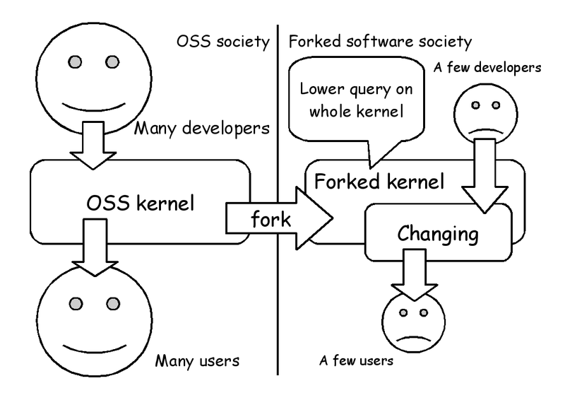

# Metasepi team meeting:　　　Ajhc Project Overview

Kiwamu Okabe

# Who am I?

* http://www.masterq.net/
* Twitter: @master_q
* Organizer of Metasepi project
* A developer of Ajhc Haskell compiler
* A Debian Maintainer
* 10 years' experience in developing OS using NetBSD.

# Agenda

* [1] Demo
* [2] What is Ajhc?
* [3] What is Metasepi?
* [4] What is compiler to build OS
* [5] How to use Ajhc

xxx

# [1] Demo

* RSS reader running on mbed (ARM).
* Show reddit articles on LCD display.
* You can watch the movie following.

http://bit.ly/mbedmov

# Demo hardware

Architecture: ARM Cortex-M3

RAM size: 64kB

IO: Ethernet, LED, LCD, SD Card, USB host/device, Serial

# Demo software

github.com/ajhc/demo-cortex-m3

# Demo source code

~~~
demo-cortex-m3
`-- mbed-nxp-lpc1768
    |-- BuildShell                 <= Compile enviroment
    |-- build
    |   `-- mbed.ld                <= Linker Sscript
    |-- external
    |   `-- mbed
    |       `-- LPC1768
    |           `-- GCC_ARM
    |               `-- libmbed.a  <= mbed library (compiled)
    |-- linux_install
    |-- samples
    |   `-- Haskell_Http
    |       |-- EthernetInterface  <= TCP/IP protocol stack
    |       |-- c_extern.h
    |       |-- dummy4jhc.c        <= C lanuage stub for Haskell
    |       |-- hs_src
    |       |   `-- *.hs           <= Haskell source code
    |       |-- main.c             <= C language main function
    |       `-- mbed-rtos          <= mbed-rtos OS
    `-- src
        `-- gcc4mbed.c
~~~

# [2] What is Ajhc?

http://ajhc.metasepi.org/

* Ajhc := A fork of jhc
* jhc := John's Haskell Compiler
* http://repetae.net/computer/jhc/
* Jhc outputs binary that has low-memory-footprint and runs fast.
* Good for embedded software.

# Why need Ajhc?

* GHC is de facto standard on Haskell.
* GHC := Glasgow Haskell Compiler
* http://www.haskell.org/ghc/
* Why need another Haskell compiler?
* To develop kernel named "Metasepi".

# [3] What is Metasepi?

http://metasepi.org/

* Unix-like OS designed by strong type.
* Using ML or more strong type lang.

Haskell http://www.haskell.org/

OCaml http://caml.inria.fr/

MLton http://mlton.org/

. . . and suchlike.

# Why need Metasepi?

* We have already Linux or Windows.
* But the developers are suffering.
* If use the kernel changed by you,
* you will get many runtime error.
* Difficult even to reproduce it.

# Doesn't OSS have good quality?

* "The Cathedral and the Bazaar"
* "Given enough eyeballs, all bugs are shallow."

~~~
http://cruel.org/freeware/cathedral.html
~~~

* But if you develop your own product reusing OSS...

# Low quality out of OSS umbrella

# Type safety

* Less runtime errors.
* "数理科学的バグ撲滅方法論のすすめ"

~~~
http://itpro.nikkeibp.co.jp/article/COLUMN/20060915/248230/
~~~

# Kernel desperately wants type

* Kernels are developed with C lang
* Error on user space => SEGV
* Error on kernel space => halt!
* Should design kernel with the greatest care
* C language is safe?

# [4] What is compiler to build OS

* Need strong type.
* Need flexibility such as C language.
* Create it if there are not!
* From scratch? No thank you...
* Look for our compiler base.

# Want POSIX free compiler

Measurement value is smaller, dependence on POSIX is small.

# Jhc output has only 20 undef

~~~
$ nm hs.out | grep "U "
                 U _IO_putc@@GLIBC_2.2.5
                 U __libc_start_main@@GLIBC_2.2.5
                 U _setjmp@@GLIBC_2.2.5
                 U abort@@GLIBC_2.2.5
                 U ctime@@GLIBC_2.2.5
                 U exit@@GLIBC_2.2.5
                 U fflush@@GLIBC_2.2.5
                 U fprintf@@GLIBC_2.2.5
                 U fputc@@GLIBC_2.2.5
                 U fputs@@GLIBC_2.2.5
                 U free@@GLIBC_2.2.5
                 U fwrite@@GLIBC_2.2.5
                 U getenv@@GLIBC_2.2.5
                 U malloc@@GLIBC_2.2.5
                 U memset@@GLIBC_2.2.5
                 U posix_memalign@@GLIBC_2.2.5
                 U realloc@@GLIBC_2.2.5
                 U setlocale@@GLIBC_2.2.5
                 U sysconf@@GLIBC_2.2.5
                 U times@@GLIBC_2.2.5
~~~

# Jhc is translator to C language

# Easy to cross build

# Survive burning out

Let's develop in dogfooding style. (The method is called "snatch".)

# [5] How to use Ajhc

* Install

Case of Ubuntu 12.04 amd64.

~~~
$ sudo apt-get install haskell-platform libncurses5-dev gcc m4
$ cabal update
$ export PATH=$HOME/.cabal/bin/:$PATH
$ cabal install ajhc
$ which ajhc
/home/ユーザ名/.cabal/bin/ajhc
$ echo 'main = print "hoge"' > Hoge.hs
$ ajhc Hoge.hs
$ ./hs.out
"hoge"
~~~

You can use on WIndows or Mac OS X.

# Detail of usage

Please read "Ajhc User's Manual".

* ajhc.metasepi.org/manual.html

Also you can read in Japanese.

* ajhc.metasepi.org/manual_ja.html

# PR: Call For Articles

* http://www.paraiso-lang.org/ikmsm/
* Fanzine of functional programming.
* About Haskell or OCaml or . . .
* Article about Ajhc in C84 book.
* Call me if you read it!

~~~
http://www.paraiso-lang.org/ikmsm/books/c85.html
~~~
