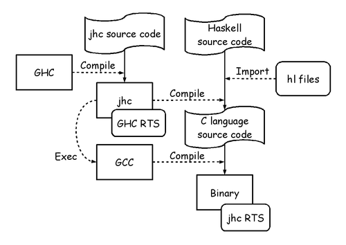
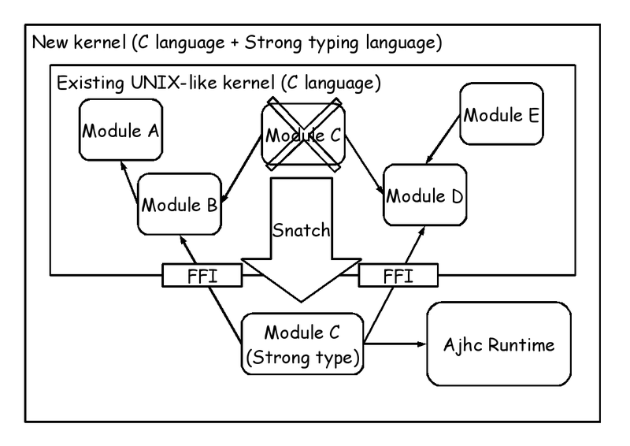
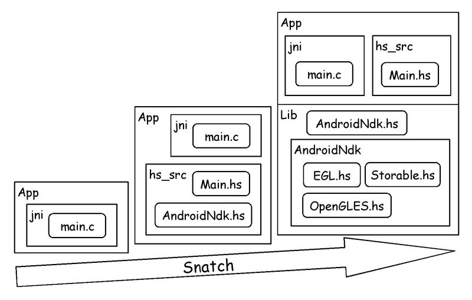

# Metasepi team meeting #6:　"Snatch-driven development"

Kiwamu Okabe

# Who am I?

* http://www.masterq.net/
* Twitter: @master_q
* Organizer of Metasepi project
* A developer of Ajhc Haskell compiler
* A Debian Maintainer
* 10 years' experience in developing OS using NetBSD.

# Agenda

* [1] Demo
* [2] What is Ajhc?
* [3] What is Metasepi?
* [4] What is compiler to build OS
* [5] How to use Ajhc
* [6] Case study: Snatch Android
* [7] Detail of Snatch process

# [1] Demo

* RSS reader running on mbed (ARM).
* Show reddit articles on LCD display.
* You can watch the movie following.

http://bit.ly/mbedmov

# Demo hardware

Architecture: ARM Cortex-M3

RAM size: 64kB

IO: Ethernet, LED, LCD, SD Card, USB host/device, Serial

# Demo software

github.com/ajhc/demo-cortex-m3

# Demo source code

~~~
demo-cortex-m3
`-- mbed-nxp-lpc1768
    |-- BuildShell                 <= Compile enviroment
    |-- build
    |   `-- mbed.ld                <= Linker Sscript
    |-- external
    |   `-- mbed
    |       `-- LPC1768
    |           `-- GCC_ARM
    |               `-- libmbed.a  <= mbed library (compiled)
    |-- linux_install
    |-- samples
    |   `-- Haskell_Http
    |       |-- EthernetInterface  <= TCP/IP protocol stack
    |       |-- c_extern.h
    |       |-- dummy4jhc.c        <= C lanuage stub for Haskell
    |       |-- hs_src
    |       |   `-- *.hs           <= Haskell source code
    |       |-- main.c             <= C language main function
    |       `-- mbed-rtos          <= mbed-rtos OS
    `-- src
        `-- gcc4mbed.c
~~~

# [2] What is Ajhc?

http://ajhc.metasepi.org/

* Ajhc := A fork of jhc
* jhc := John's Haskell Compiler
* http://repetae.net/computer/jhc/
* Jhc outputs binary that has low-memory-footprint and runs fast.
* Good for embedded software.

# Why need Ajhc?

* GHC is de facto standard on Haskell.
* GHC := Glasgow Haskell Compiler
* http://www.haskell.org/ghc/
* Why need another Haskell compiler?
* To develop kernel named "Metasepi".

# [3] What is Metasepi?

http://metasepi.org/

* Unix-like OS designed by strong type.
* Using ML or more strong type lang.

Haskell http://www.haskell.org/

OCaml http://caml.inria.fr/

MLton http://mlton.org/

. . . and suchlike.

# Why need Metasepi?

* We have already Linux or Windows.
* But the developers are suffering.
* If use the kernel changed by you,
* you will get many runtime error.
* Difficult even to reproduce it.

# Doesn't OSS have good quality?

* "The Cathedral and the Bazaar"
* "Given enough eyeballs, all bugs are shallow."

~~~
http://cruel.org/freeware/cathedral.html
~~~

* But if you develop your own product reusing OSS...

# Low quality out of OSS umbrella

# Type safety

* Less runtime errors.
* "数理科学的バグ撲滅方法論のすすめ"

~~~
http://itpro.nikkeibp.co.jp/article/COLUMN/20060915/248230/
~~~

# Kernel desperately wants type

* Kernels are developed with C lang.
* Error on user space => SEGV
* Error on kernel space => halt!
* Should design kernel with the greatest care.
* C language is safe?

# [4] What is compiler to build OS

* Need strong type.
* Need flexibility such as C language.
* Create it if there are not!
* From scratch? No thank you...
* Look for our compiler base.

# Want POSIX free compiler

Programs to print "hoge" on terminal.

Measurement value is smaller, dependence on POSIX is small.

# Jhc output has only 20 undef

~~~
$ nm hs.out | grep "U "
                 U _IO_putc@@GLIBC_2.2.5
                 U __libc_start_main@@GLIBC_2.2.5
                 U _setjmp@@GLIBC_2.2.5
                 U abort@@GLIBC_2.2.5
                 U ctime@@GLIBC_2.2.5
                 U exit@@GLIBC_2.2.5
                 U fflush@@GLIBC_2.2.5
                 U fprintf@@GLIBC_2.2.5
                 U fputc@@GLIBC_2.2.5
                 U fputs@@GLIBC_2.2.5
                 U free@@GLIBC_2.2.5
                 U fwrite@@GLIBC_2.2.5
                 U getenv@@GLIBC_2.2.5
                 U malloc@@GLIBC_2.2.5
                 U memset@@GLIBC_2.2.5
                 U posix_memalign@@GLIBC_2.2.5
                 U realloc@@GLIBC_2.2.5
                 U setlocale@@GLIBC_2.2.5
                 U sysconf@@GLIBC_2.2.5
                 U times@@GLIBC_2.2.5
~~~

# Jhc is translator to C language

# Easy to cross build

# Survive burning out

Let's develop in dogfooding style. (The method is called "Snatch".)

# [5] How to use Ajhc

Case of Ubuntu 12.04 amd64.

~~~
$ sudo apt-get install haskell-platform libncurses5-dev gcc m4
$ cabal update
$ export PATH=$HOME/.cabal/bin/:$PATH
$ cabal install ajhc
$ which ajhc
/home/USER/.cabal/bin/ajhc
$ echo 'main = print "hoge"' > Hoge.hs
$ ajhc Hoge.hs
$ ./hs.out
"hoge"
~~~

You can use on Windows or Mac OS X.

# Detail of usage

Please read "Ajhc User's Manual".

* ajhc.metasepi.org/manual.html

Also you can read in Japanese.

* ajhc.metasepi.org/manual_ja.html

# [6] Case study: Snatch Android

Let's snatch sample app "native-activity".

developer.android.com/tools/sdk/ndk/

# Snatch plan

# [7] Detail of Snatch method

Let's watch Snatch animation on Android NDK Apps. Have popcorn?

If you want to know more detail, try the following.

~~~
$ git clone https://github.com/ajhc/demo-android-ndk.git
$ cd demo-android-ndk
$ git log -p
~~~

# Step0: Before Snatch

~~~ {.c}
// ### native-activity/jni/main.c ###
struct saved_state {
// --snip--
struct engine {
// --snip--
static int engine_init_display(struct engine* engine) {
// --snip--
static void engine_draw_frame(struct engine* engine) {
// --snip--
static void engine_term_display(struct engine* engine) {
// --snip--
static int32_t engine_handle_input(struct android_app* app, AInputEvent* event) {
// --snip--
static void engine_handle_cmd(struct android_app* app, int32_t cmd) {
// --snip--
void android_main(struct android_app* state) {
// --snip--
~~~

# Step1: Call Haskell empty code

~~~ {.haskell}
-- ### native-activity/hs_src/Main.hs ###
main :: IO ()
main = return ()
~~~

~~~ {.c}
// ### native-activity/jni/main.c ###
void android_main(struct android_app* state) {
// --snip--
    { // Run Haskell code.
        int hsargc = 1;
        char *hsargv = "q";
        char **hsargvp = &hsargv;

        hs_init(&hsargc, &hsargvp);
        _amain();
        hs_exit();
    }
// --snip--
~~~

# Step2: struct => Storable (cont.)

~~~ {.haskell}
-- ### native-activity/hs_src/AndroidNdk.hs ###
{-# LANGUAGE ForeignFunctionInterface #-}
module AndroidNdk where
import Foreign.Storable
import Foreign.C.Types
import Foreign.Ptr

foreign import primitive "const.sizeof(struct saved_state)" sizeOf_SavedState :: Int
foreign import primitive "const.offsetof(struct saved_state, angle)" offsetOf_SavedState_angle :: Int
foreign import primitive "const.offsetof(struct saved_state, x)" offsetOf_SavedState_x :: Int
foreign import primitive "const.offsetof(struct saved_state, y)" offsetOf_SavedState_y :: Int

data SavedState = SavedState { sStateAngle :: Float
                             , sStateX     :: Int
                             , sStateY     :: Int }
~~~

# Step2: struct => Storable

~~~ {.haskell}
instance Storable SavedState where
  sizeOf    = const sizeOf_SavedState
  alignment = sizeOf
  poke p sstat = do
    pokeByteOff p offsetOf_SavedState_angle $ sStateAngle sstat
    pokeByteOff p offsetOf_SavedState_x     $ sStateX sstat
    pokeByteOff p offsetOf_SavedState_y     $ sStateY sstat
  peek p = do
    angle <- peekByteOff p offsetOf_SavedState_angle
    x     <- peekByteOff p offsetOf_SavedState_x
    y     <- peekByteOff p offsetOf_SavedState_y
    return $ SavedState { sStateAngle = angle, sStateX = x, sStateY = y }
-- snip --
~~~

~~~ {.c}
// ### native-activity/jni/c_extern.h ###
struct saved_state {
    float angle;
    int32_t x;
    int32_t y;
};
~~~

# Step3: Snatch 1st func (cont.)

~~~ {.haskell}
-- ### native-activity/hs_src/AndroidNdk.hs ###
newtype {-# CTYPE "AInputEvent" #-} AInputEvent = AInputEvent ()
foreign import primitive "const.AINPUT_EVENT_TYPE_MOTION" c_AINPUT_EVENT_TYPE_MOTION :: Int
foreign import ccall "c_extern.h AInputEvent_getType" c_AInputEvent_getType :: Ptr AInputEvent -> IO Int
foreign import ccall "c_extern.h AMotionEvent_getX" c_AMotionEvent_getX :: Ptr AInputEvent -> CSize -> IO Float
foreign import ccall "c_extern.h AMotionEvent_getY" c_AMotionEvent_getY :: Ptr AInputEvent -> CSize -> IO Float

engineHandleInput :: Ptr AndroidEngine -> Ptr AInputEvent -> IO Int
engineHandleInput eng event = do
  t <- c_AInputEvent_getType event
  if t /= c_AINPUT_EVENT_TYPE_MOTION then return 0
    else do enghs <- peek eng
            let stat = engState enghs
            x <- c_AMotionEvent_getX event 0
            y <- c_AMotionEvent_getY event 0
            let enghs' = enghs { engAnimating = 1, engState = stat { sStateX = truncate x,  sStateY = truncate y } }
            poke eng enghs'
            return 1
~~~

# Step3: Snatch 1st func

~~~ {.c}
// ### native-activity/jni/main.c ###
extern int32_t engineHandleInput(struct engine* engine, AInputEvent* event); // Haskell impl

static int32_t engine_handle_input(struct android_app* app, AInputEvent* event) {
    struct engine* engine = (struct engine*)app->userData;
    return engineHandleInput(engine, event);
}
~~~

# Step4: Snatch 2nd func (cont.)

~~~ {.haskell}
-- ### native-activity/hs_src/AndroidNdk.hs ###
foreign import primitive "const.APP_CMD_SAVE_STATE" c_APP_CMD_SAVE_STATE :: Int
-- snip --
foreign import ccall "c_extern.h engine_init_display" c_engine_init_display :: Ptr AndroidEngine -> IO Int
foreign import ccall "c_extern.h engine_draw_frame" c_engine_draw_frame :: Ptr AndroidEngine -> IO ()
-- snip --
foreign import ccall "c_extern.h ASensorEventQueue_disableSensor" c_ASensorEventQueue_disableSensor :: Ptr ASensorEventQueue -> Ptr ASensor -> IO Int

engineHandleCmd :: Ptr AndroidEngine -> Int -> IO ()
engineHandleCmd eng cmd
  | cmd == c_APP_CMD_SAVE_STATE = do enghs <- peek eng
                                     let app = engApp enghs
                                     apphs <- peek app
                                     sstat <- malloc
                                     poke sstat $ engState enghs
-- snip --
~~~

# Step4: Snatch 2nd func

~~~ {.c}
// ### native-activity/jni/c_extern.h ###
int engine_init_display(struct engine* engine);
void engine_draw_frame(struct engine* engine);
void engine_term_display(struct engine* engine);
~~~

~~~ {.c}
// ### native-activity/jni/main.c ###
extern void engineHandleCmd(struct engine* engine, int32_t cmd);

static void engine_handle_cmd(struct android_app* app, int32_t cmd) {
    struct engine* engine = (struct engine*)app->userData;
    engineHandleCmd(engine, cmd);
}
~~~

# Step5: Snatch remaining funcs

Snatch the following functions.

* engine_init_display()
* engine_draw_frame()
* engine_term_display()

# Step6: Snatch main func (cont.)

~~~ {.haskell}
-- ### native-activity/hs_src/Main.hs ###
main :: IO () -- Dummy
main = return ()

foreign export ccall "androidMain" androidMain :: Ptr AndroidApp -> IO ()
androidMain :: Ptr AndroidApp -> IO () -- True main
androidMain app = do
  eng <- malloc
  poke eng defaultAndroidEngine
  apphs <- peek app
  let apphs' = apphs { appUserData = eng, appOnAppCmd = p_engineHandleCmd , appOnInputEvent = p_engineHandleInput }
  poke app apphs'
  enghs <- peek eng
  -- Prepare to monitor accelerometer
  sManage <- c_ASensorManager_getInstance
  accel <- c_ASensorManager_getDefaultSensor sManage c_ASENSOR_TYPE_ACCELEROMETER
  let looper = appLooper apphs'
  when (ss_p /= nullPtr) $ do
    ss <- peek ss_p
-- snip --
~~~

# Step6: Snatch main func

~~~ {.c}
// ### native-activity/jni/main.c ###
void android_main(struct android_app* state) {
	app_dummy(); // Make sure glue isn't stripped.

	// Init & run Haskell code.
	int hsargc = 1;
	char *hsargv = "q";
	char **hsargvp = &hsargv;

	hs_init(&hsargc, &hsargvp);
	androidMain(state);
	hs_exit();
}
~~~

# Step7: Get clean => GOAL

We are in the strong typed world.

Haskell's turn, now!

# PR: Call For Articles

* http://www.paraiso-lang.org/ikmsm/
* Fanzine of functional programming.
* About Haskell or OCaml or . . .
* Article about Ajhc in C84 book.
* Call me if you read it!

~~~
http://www.paraiso-lang.org/ikmsm/books/c85.html
~~~
