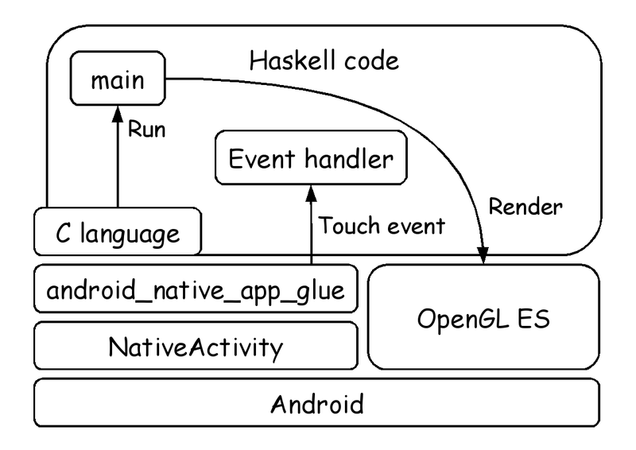
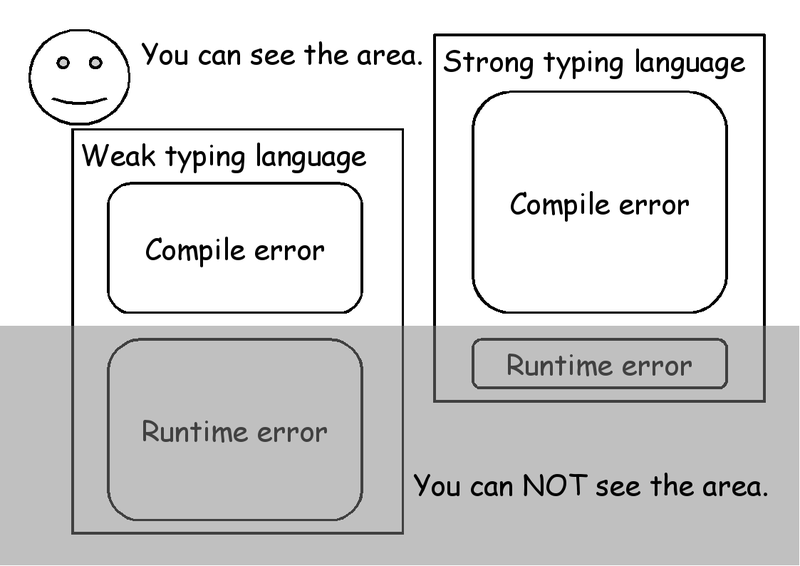
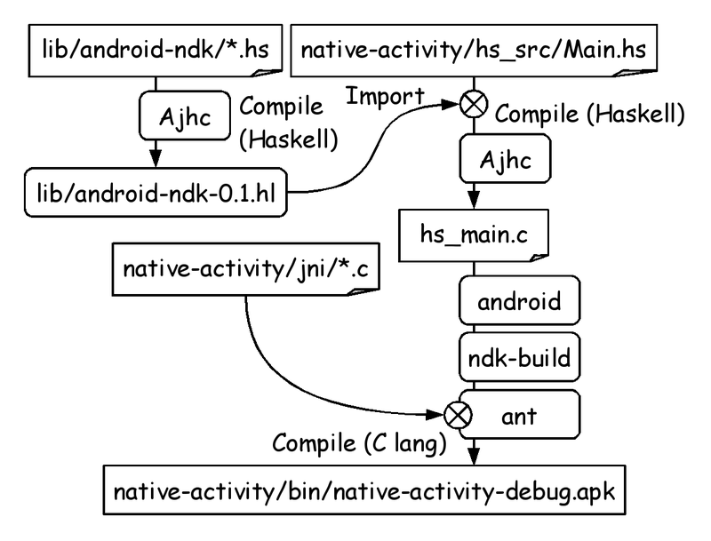
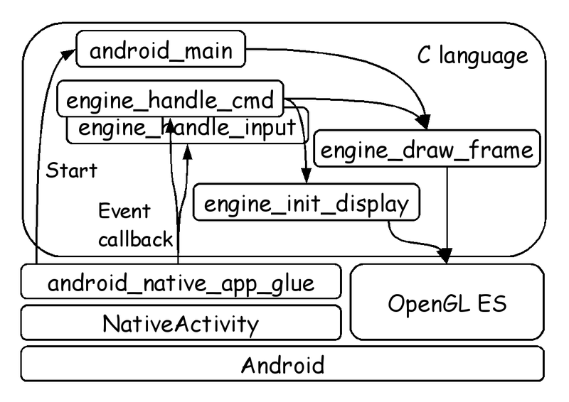
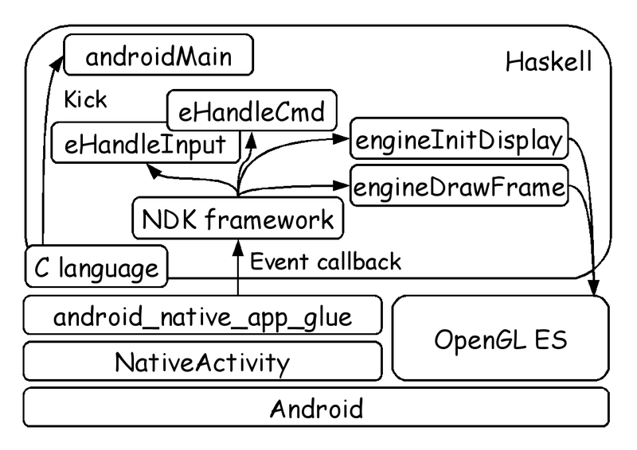
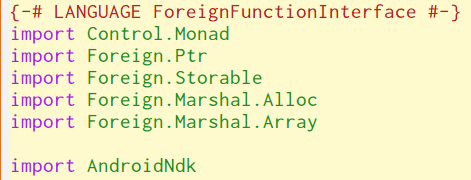
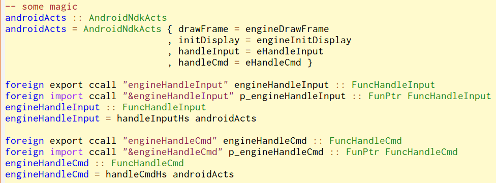
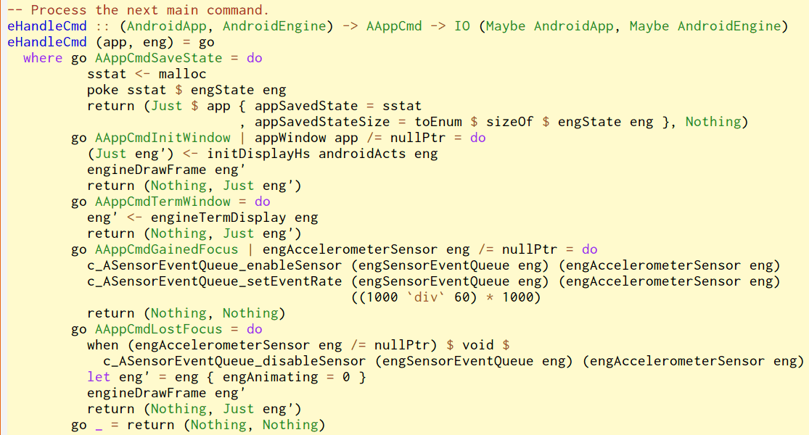
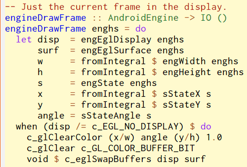

# Metasepi team meeting #8:　Haskell apps on Android NDK

Kiwamu Okabe

# Who am I?

* http://www.masterq.net/
* Twitter: @master_q
* Organizer of Metasepi Project
* A developer of Ajhc Haskell compiler
* A Debian Maintainer
* 10 years' experience in developing OS using NetBSD.

# Agenda

* [1] Demo
* [2] What is Ajhc?
* [3] What is Metasepi?
* [4] What is compiler to build OS
* [5] How to use Ajhc
* [6] Haskell on Android NDK
* [7] Status report of framework

# [1] Demo

* A touchable cube demo.
* Haskell App runs on Android NDK.
* GC is breaked by ndk-gdb debugger.
* You can watch the movie following.

http://bit.ly/jhcdroid

# Demo hardware

Nexus 7 (2012) / NVIDIA Tegra 3

# Demo software

github.com/ajhc/demo-android-ndk

# [2] What is Ajhc?

http://ajhc.metasepi.org/

* Ajhc := A fork of jhc
* jhc := John's Haskell Compiler
* http://repetae.net/computer/jhc/
* Jhc outputs binary that has low-memory-footprint and runs fast.
* Good for embedded software.

# Why need Ajhc?

* GHC is de facto standard on Haskell.
* GHC := Glasgow Haskell Compiler
* http://www.haskell.org/ghc/
* Why need another Haskell compiler?
* To develop kernel named "Metasepi".

# [3] What is Metasepi?

http://metasepi.org/

* Unix-like OS designed by strong type.
* Using ML or more strong type lang.

Haskell http://www.haskell.org/

OCaml http://caml.inria.fr/

MLton http://mlton.org/

. . . and suchlike.

# Why need Metasepi?

* We have already Linux or Windows.
* But the developers are suffering.
* If use the kernel changed by you,
* you will get many runtime error.
* Difficult even to reproduce it.

# Doesn't OSS have good quality?

* "The Cathedral and the Bazaar"
* "Given enough eyeballs, all bugs are shallow."

~~~
http://cruel.org/freeware/cathedral.html
~~~

* But if you develop your own product reusing OSS...

# Low quality out of OSS umbrella

# Type safety

* Less runtime errors.
* "数理科学的バグ撲滅方法論のすすめ"

~~~
http://itpro.nikkeibp.co.jp/article/COLUMN/20060915/248230/
~~~

# Kernel desperately wants type

* Kernels are developed with C lang.
* Error on user space => SEGV
* Error on kernel space => halt!
* Should design kernel with the greatest care.
* C language is safe?

# [4] What is compiler to build OS

* Need strong type.
* Need flexibility such as C language.
* Create it if there are not!
* From scratch? No thank you...
* Look for our compiler base.

# Want POSIX free compiler

Programs to print "hoge" on terminal.

The lesser depends on POSIX, the smaller values.

# Jhc output has only 20 undef

~~~
$ nm hs.out | grep "U "
                 U _IO_putc@@GLIBC_2.2.5
                 U __libc_start_main@@GLIBC_2.2.5
                 U _setjmp@@GLIBC_2.2.5
                 U abort@@GLIBC_2.2.5
                 U ctime@@GLIBC_2.2.5
                 U exit@@GLIBC_2.2.5
                 U fflush@@GLIBC_2.2.5
                 U fprintf@@GLIBC_2.2.5
                 U fputc@@GLIBC_2.2.5
                 U fputs@@GLIBC_2.2.5
                 U free@@GLIBC_2.2.5
                 U fwrite@@GLIBC_2.2.5
                 U getenv@@GLIBC_2.2.5
                 U malloc@@GLIBC_2.2.5
                 U memset@@GLIBC_2.2.5
                 U posix_memalign@@GLIBC_2.2.5
                 U realloc@@GLIBC_2.2.5
                 U setlocale@@GLIBC_2.2.5
                 U sysconf@@GLIBC_2.2.5
                 U times@@GLIBC_2.2.5
~~~

# Jhc is translator to C language

# Easy to cross build

# Survive burning out

Let's develop in dogfooding style. (The method is called "Snatch".)

# [5] How to use Ajhc

Case of Ubuntu 12.04 amd64.

~~~
$ sudo apt-get install haskell-platform libncurses5-dev gcc m4
$ cabal update
$ export PATH=$HOME/.cabal/bin/:$PATH
$ cabal install ajhc
$ which ajhc
/home/USER/.cabal/bin/ajhc
$ echo 'main = print "hoge"' > Hoge.hs
$ ajhc Hoge.hs
$ ./hs.out
"hoge"
~~~

You can use on Windows or Mac OS X.

# Detail of usage

Please read "Ajhc User's Manual".

* ajhc.metasepi.org/manual.html

Also you can read in Japanese.

* ajhc.metasepi.org/manual_ja.html

# [6] Haskell on Android NDK

github.com/ajhc/demo-android-ndk

* First, build the demo apps.
* Then, see more detail of the code.

# Setup Android SDK/NDK

* Download Android SDK/NDK

~~~
* Android SDK (adt-bundle-linux-x86_64-20130917.zip)
  http://developer.android.com/sdk/index.html
* Android NDK (android-ndk-r9-linux-x86_64.tar.bz2)
  http://developer.android.com/tools/sdk/ndk/index.html
~~~

* Install Android SDK/NDK

~~~
$ cd $HOME
$ unzip -x adt-bundle-linux-x86_64-20130917.zip
$ mv adt-bundle-linux-x86_64-20130917/sdk $HOME/android-sdk
$ rm -f adt-bundle-linux-x86_64-20130917
$ export PATH=$PATH:$HOME/android-sdk/tools:$HOME/android-sdk/platform-tools
$ tar xf android-ndk-r9-linux-x86_64.tar.bz2
$ mv android-ndk-r9 android-ndk
$ export PATH=$PATH:$HOME/android-ndk
$ sudo apt-get install openjdk-7-jdk ant lib32z1-dev lib32stdc++6
$ android update sdk --no-ui --force
~~~

# Build sample C application

* Build

~~~
$ cd $HOME/android-ndk/samples/native-activity
$ android update project -p ./ -n native-activity -t android-10
$ ndk-build NDK_DEBUG=1
$ ant debug
$ file bin/native-activity-debug.apk
bin/native-activity-debug.apk: Java Jar file data (zip)
~~~

* Flash to Android device

~~~
$ sudo adb devices
* daemon not running. starting it now on port 5037 *
* daemon started successfully *
List of devices attached
015d4906053c1605        device
$ sudo adb install -r bin/native-activity-debug.apk
1221 KB/s (156823 bytes in 0.125s)
        pkg: /data/local/tmp/native-activity-debug.apk
Success
~~~

# Build Haskell applications

* Checkout the source code.

~~~
$ git clone https://github.com/ajhc/demo-android-ndk.git
$ cd demo-android-ndk
~~~

* Build

~~~
$ make
$ find . -name "*.hl"
./lib/android-ndk-0.1.hl
$ find . -name "*debug.apk"
./cube/bin/cube-debug.apk
./native-activity/bin/native-activity-debug.apk
~~~

* "hl" suffix file: Ajhc library
* "apk" suffix file: Android application

# Source code tree

~~~
demo-android-ndk
|-- lib                      # Framework library
|   `-- android-ndk
|       |-- AndroidNdk
|       |   |-- EGL.hs
|       |   |-- OpenGLES.hs
|       |   `-- Storable.hs
|       |-- AndroidNdk.hs
|       `-- android-ndk.yaml
|-- cube ...                 # Application
`-- native-activity          # Application
    |-- AndroidManifest.xml
    |-- hs_src
    |   `-- Main.hs          # Haskell code on application side
    |-- jni
    |   |-- Android.mk
    |   |-- Application.mk
    |   |-- c_extern.h
    |   |-- dummy4jhc.c      # Stub code for Ajhc runtime
    |   `-- main.c           # C language code to kick Haskell code
    `-- res
        `-- values
            `-- strings.xml
~~~

# Build process on Makefile

# [7] Status report of framework

Let's see "native-activity" demo internal.

But, the framework has no stability yet.

# Architecture: Using C language

# Architecture: Using Haskell

# Code #1: Imports

# Code #2: Some magic

# Code #3: Main entry

# Code #4: Handle inputs

# Code #5: Handle cmds

# Code #6: Draw frame

# Code #7: Init display

# PR: Call For Articles

* http://www.paraiso-lang.org/ikmsm/
* Fanzine of functional programming.
* About Haskell or OCaml or . . .
* Article about Ajhc in C84 book.
* Call me if you read it!

~~~
http://www.paraiso-lang.org/ikmsm/books/c85.html
~~~
