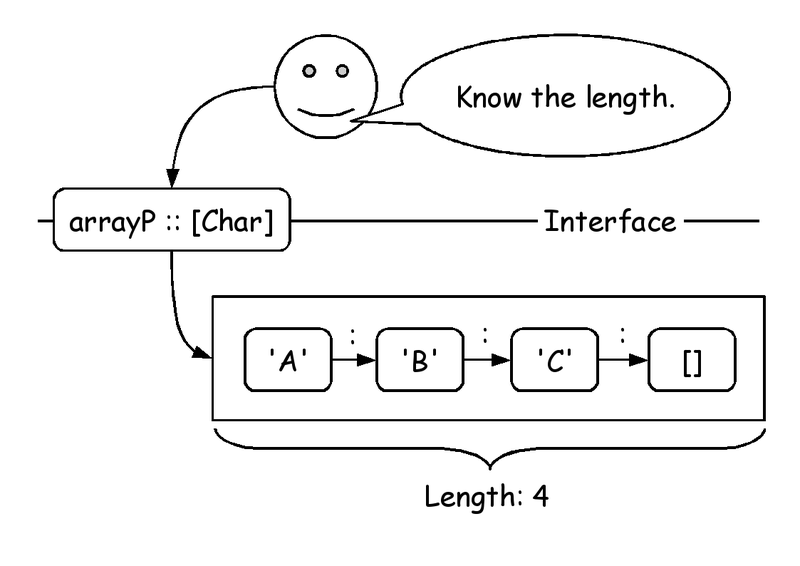
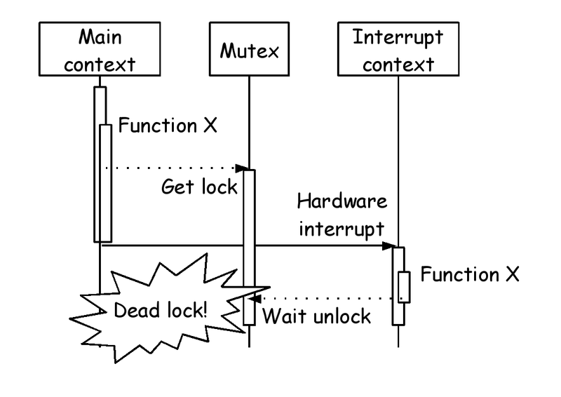
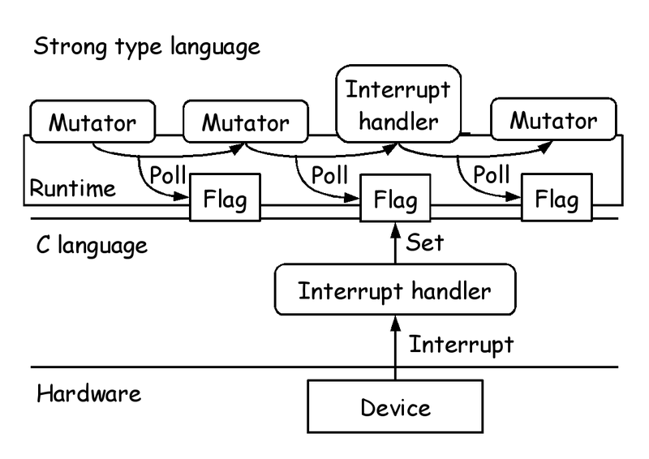
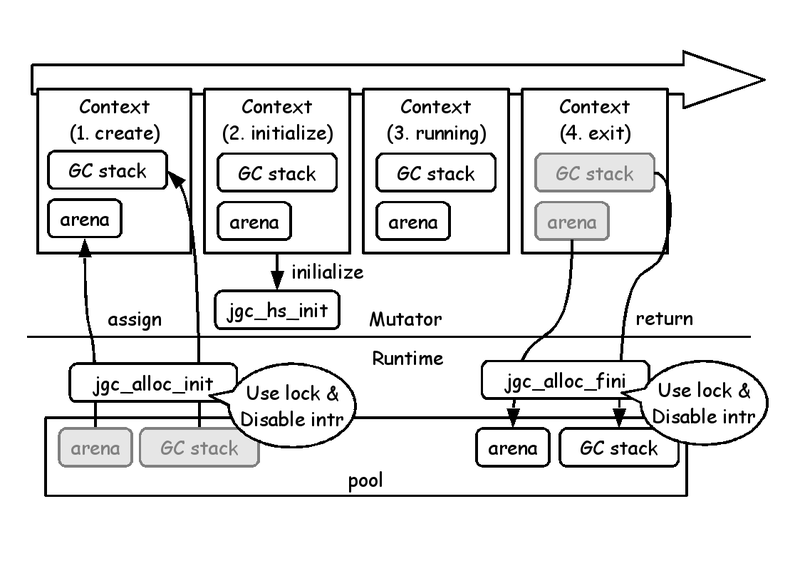

# How to rewrite the OS using C by strong type

Metasepi Project / Kiwamu Okabe

# Who am I?

* http://www.masterq.net/
* Twitter: @master_q
* Organizer of Metasepi Project
* A developer of Ajhc Haskell compiler
* A Debian Maintainer
* 10 years' experience in developing OS using NetBSD

# Agenda

* [1] Problems of OS using C
* [2] Type safety
* [3] Existing OS using strong type
* [4] Snatch-driven development
* [5] Demo
* [6] Case study of Snatch
* [7] It's not yet done

# [1] Problems of OS using C

* Most OS uses C language
* C is good for system programming
* But C occurs many problems

# Buffer overrun

* Pointer to array doesn't know the length

# Page fault in kernel

* Page fault in user space => SEGV
* Page fault in kernel space => Halt!

# Weak type

* Great use of (void *) type
* NetBSD kernel uses 45130 times!

~~~
$ pwd
/home/kiwamu/src/netbsd/sys
$ grep "void \*" `find . -name "*.c"` | wc -l
45130
~~~

* No choice but to use weak type for flexibility

# [2] Type safety

* Get less runtime errors

# Avoid buffer overrun

Strong type avoids buffer overrun.

# Avoid page fault in kernel

Only touch the area constructed.

# Flexibility without weak type

* Algebraic data type

~~~ {.haskell}
data Node = Leaf Integer | Branch Node Node
~~~

* Type class

~~~ { .haskell }
class Functor f  where
    fmap :: (a -> b) -> f a -> f b
instance Functor [] where
    fmap f (x:xs) = f x : fmap f xs
    fmap f [] = []
instance Functor Maybe where
    fmap _ Nothing = Nothing
    fmap f (Just x) = Just (f x)
~~~

* Type inference

# Kernel needs strong type

Strong type is needed by kernel rather than application on user space.

# [3] Existing OS using strong type

Alreadly we have.

* Funk

~~~
http://home.gna.org/funk/
~~~

* snowflake-os

~~~
https://code.google.com/p/snowflake-os/
~~~

* House

~~~
http://programatica.cs.pdx.edu/House/
~~~

Why isn't it for daily use?

# Poor design and less functions

* Design from scratch
* Polling interrupt
* Not have bus driver
* Support less devices
* Only for x86
* Can't run Firefox

# No compatible POSIX

# [4] Snatch-driven development

Rewrite kernel using C with strong type by little and little.

# UNIX like OS needs reentrant

# Strong type OS uses polling intr

# Ajhc Haskell compiler

Context can run without lock.

# [5] Demo

* Microcontroller app without OS
* Microcontroller app with OS

~~~
https://github.com/ajhc/demo-cortex-m3
~~~

* Android Application

~~~
https://github.com/ajhc/demo-android-ndk
~~~

* NetBSD kernel driver

~~~
https://github.com/metasepi/netbsd-arafura-s1
~~~

# [6] Case study of Snatch

xxx

# [7] It's not yet done

* Benchmark
* Pointer combinator
* Share state between contexts
* Porting libraries running on GHC
* Debug method
* Fix many bugs
