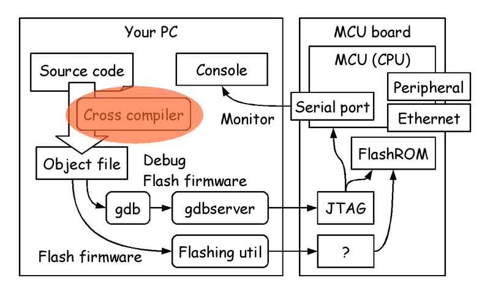
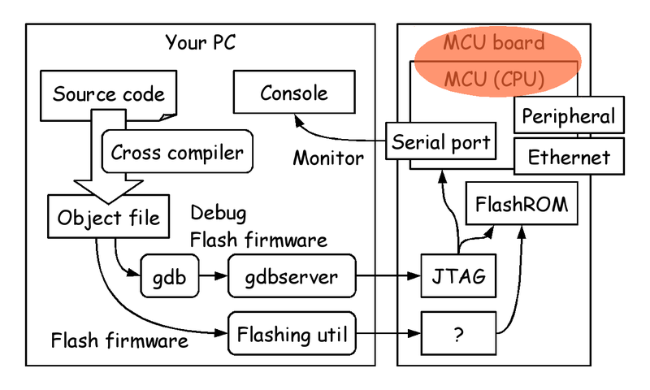
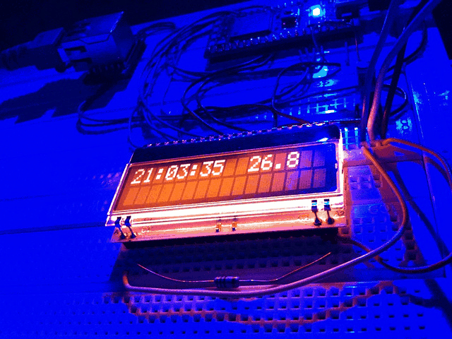
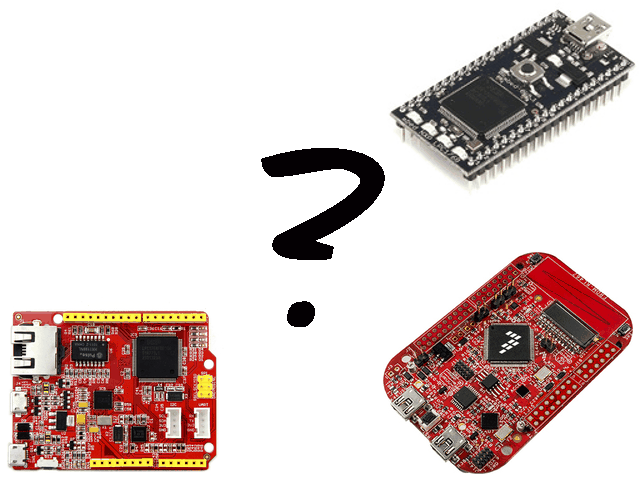
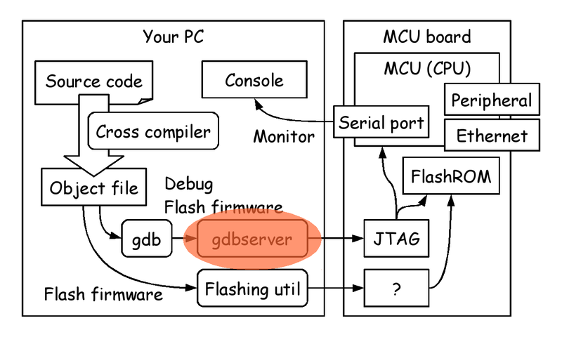

# Functional MCU programming

Metasepi Project / Kiwamu Okabe

# Who am I ?

* http://www.masterq.net/
* Twitter: @master_q
* Organizer of Metasepi Project
* A developer of Ajhc Haskell compiler
* A Debian Maintainer
* 10 years' experience in developing OS using NetBSD

# Kick off workshop at Nagoya !

Functional MCU programing workshop

* At Nagoya
* Meeting minutes

~~~
http://metasepi.org/posts/2014-01-05-mbed_fp_0.html
~~~

* Now planning the next workshop...

# Why functional lang for MCU?

* Internet of Things (IoT)
* We will live in IoT world
* Can't debug IoT device on the field
* Should avoid runtime error
* We need strong type !

# Choice of cross compiler

# Cross compiler: (A)jhc

http://ajhc.metasepi.org/

* Language: Haskell
* Haskell language is major !
* Need GC heap = Need more memory
* Experience running on MCU

~~~
ARM Cortex-M
https://github.com/ajhc/demo-cortex-m3
~~~

# Cross compiler: ATS

http://www.ats-lang.org/

* Language: ML
* Optional GC = Need low memory
* No experience running on MCU
* Document translated into Japanese

http://jats-ug.metasepi.org/

# Cross compiler: Rust

http://www.rust-lang.org/

* Language: Own syntax like C or JS
* Optional GC = Need low memory
* Experience running on MCU

~~~
ARM Cortex-M
https://github.com/neykov/armboot
~~~

* Developing by Mozilla
* @pirapira knows the detail of it

# Choice of MCU board

# Which MCU? Of course mbed!?

Why?

* Major
* 32bit
* Large memory size (> 20kB)
* Debugger
* Ethernet

# Which board is good for us...

* mbed LPC1768 (￥5,200)

~~~
RAM 32kB+32kB
Ethernet
https://mbed.org/platforms/mbed-LPC1768/
~~~

* Seeeduino Arch Pro ($43.41)

~~~
RAM 32kB+32kB
Ethernet
http://www.seeedstudio.com/depot/arch-pro-p-1677.html
~~~

* FRDM-KL46Z (￥1,634)

~~~
RAM 32kB
No Ethernet
http://www.freescale.com/webapp/sps/site/prod_summary.jsp?code=FRDM-KL46Z
~~~

# Choice of debugger

# gdbserver: pyOCD

https://github.com/mbedmicro/pyOCD

* Only for MCU using CMSIS-DAP
* But now support only mbed LPC1768
* In future, support more board ?

# gdbserver: OpenOCD

http://openocd.sourceforge.net/

* Comming CMSIS-DAP support!
* Need HIDAPI library

http://www.signal11.us/oss/hidapi/

# OpenOCD enabling CMSIS-DAP

~~~
$ git clone git://github.com/signal11/hidapi.git
$ cd hidapi
$ ./bootstrap
$ ./configure
$ make
$ sudo make install
~~~

~~~
$ git clone https://github.com/master-q/openocd.git
$ cd openocd
$ git checkout masterq-mbedfest-201401
$ ./bootstrap
$ ./configure --enable-cmsis-dap
--ship--
Olimex ARM-JTAG-EW Programmer           yes (auto)
CMSIS-DAP Compliant Debugger            yes
$ make
~~~

~~~
Some time the following FRDM-KL46Z patch is useful.
http://permalink.gmane.org/gmane.comp.debugging.openocd.devel/24258
~~~

# On mbed LPC1768

~~~
$ sudo ./src/openocd -f tcl/board/mbed-lpc1768.cfg
~~~

~~~
$ arm-none-eabi-gdb Blink.elf
(gdb) target remote localhost:3333
(gdb) monitor reset halt
(gdb) load
(gdb) monitor reset
(gdb) c
~~~

But too slow...

~~~
Transfer rate: 50 bytes/sec, 3818 bytes/write.
~~~

:(

# On Seeeduino Arch Pro

Same as mbed LPC1768.

# On FRDM-KL46Z

~~~
Use project at https://github.com/0xc0170/kinetis_klxx_gcc.
~~~

~~~
$ sudo ./src/openocd -f tcl/board/frdm-kl46z.cfg
--snip--
cortex_m reset_config sysresetreq
Info : CMSIS-DAP: FW Version = 1.0
Info : SWCLK/TCK = 0 SWDIO/TMS = 1 TDI = 0 TDO = 0 nTRST = 0 nRESET = 1
Info : DAP_SWJ Sequence (reset: 50+ '1' followed by 0)
Info : CMSIS-DAP: Interface ready
Info : clock speed 100 kHz
Info : IDCODE 0x0bc11477
Info : MKL46Z256VLL4.cpu: hardware has 2 breakpoints, 2 watchpoints
Info : accepting 'gdb' connection from 3333
Warn : Cannot communicate... target not halted.
Error: auto_probe failed
Error: Connect failed. Consider setting up a gdb-attach event for the target to prepare.
Error: attempted 'gdb' connection rejected
~~~

X(

# Be a hacker such as ねむいさん

http://nemuisan.blog.bai.ne.jp/

* OpenOCD hacker
* There is his patch at following URL

~~~
https://skydrive.live.com/?cid=36f4d1230f8a673c&id=36F4D1230F8A673C%213043
~~~

# Functional programming fanzine

* http://www.paraiso-lang.org/ikmsm/
* About Haskell or OCaml or . . .
* About Ajhc in C84 book
* About Android app with Haskell in C85 book
* Call me if you read it!

~~~
http://www.paraiso-lang.org/ikmsm/books/c85.html
~~~
