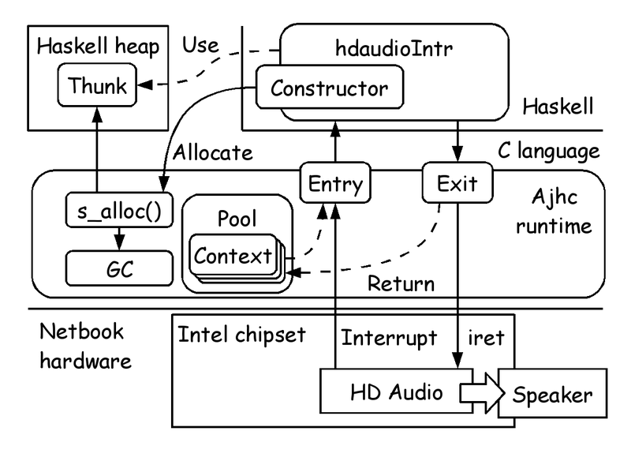
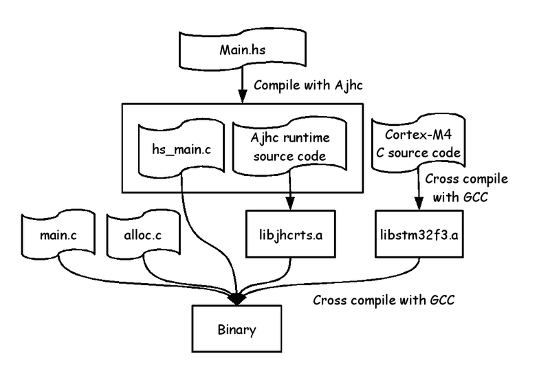
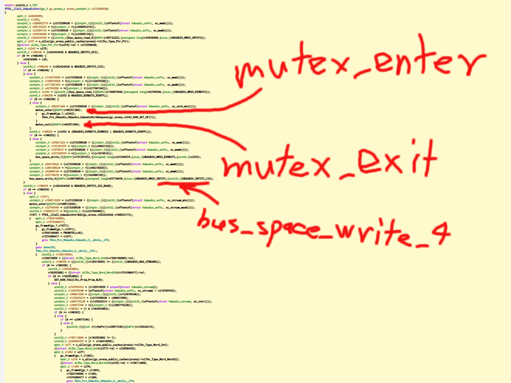

# Metasepi team meeting #13:　NetBSD driver using Haskell

Metasepi Project / Kiwamu Okabe

# Who am I?

* http://www.masterq.net/
* Self employed software engineer
* Founder of Metasepi Project
* A developer of Ajhc Haskell compiler
* A Debian Maintainer
* 10 years' experience in developing OS using NetBSD.

# Agenda

* [1] Demo
* [2] What is Ajhc?
* [3] What is Metasepi?
* [4] What is compiler to build OS
* [5] NetBSD driver using Haskell
* [6] Ajhc is the best?
* [7] From Arafura to Bohai

# [1] Demo

* NetBSD audio driver play sound
* The driver's interrupt handler rewrited by Haskell
* You can watch the movie following

http://bitly.com/netbsdajhc

* The source code at following

github.com/metasepi/netbsd-arafura-s1

# Demo architecture

# [2] What is Ajhc?

http://ajhc.metasepi.org/

* Ajhc := Arafura designed jhc
* jhc := John's Haskell Compiler
* http://repetae.net/computer/jhc/
* Jhc outputs binary that has low-memory-footprint and runs fast.
* Good for embedded software.

# Who is John?

* John Meacham
* http://repetae.net/

# Why need Ajhc?

* GHC is de facto standard on Haskell.
* GHC := Glasgow Haskell Compiler
* http://www.haskell.org/ghc/
* Why need another Haskell compiler?
* To develop kernel named "Metasepi".

# [3] What is Metasepi?

http://metasepi.org/

* Unix-like OS designed by strong type.
* Using ML or more strong type lang.

Haskell http://www.haskell.org/

OCaml http://caml.inria.fr/

MLton http://mlton.org/

. . . and suchlike.

# Why need Metasepi?

* We have already Linux or Windows.
* But the developers are suffering.
* If use the kernel changed by you,
* you will get many runtime error.
* Difficult even to reproduce it.

# Doesn't OSS have good quality?

* "The Cathedral and the Bazaar"
* "Given enough eyeballs, all bugs are shallow."

~~~
http://cruel.org/freeware/cathedral.html
~~~

* But if you develop your own product reusing OSS...

# Low quality out of OSS umbrella

# Type safety

* Less runtime errors.
* "数理科学的バグ撲滅方法論のすすめ"

~~~
http://itpro.nikkeibp.co.jp/article/COLUMN/20060915/248230/
~~~

# Kernel wants type desperately

* Kernels are developed with C lang.
* Error on user space => SEGV
* Error on kernel space => Halt!
* Should design kernel with the greatest care.
* C language is safe?

# [4] What is compiler to build OS

* Need strong type.
* Need flexibility such as C language.
* Create it if there are not!
* From scratch? No thank you...
* Look for our compiler base.

# Want POSIX free compiler

Programs to print "hoge" on terminal.

The lesser depends on POSIX, the smaller values.

# Jhc output has only 20 undef

~~~
$ nm hs.out | grep "U "
                 U _IO_putc@@GLIBC_2.2.5
                 U __libc_start_main@@GLIBC_2.2.5
                 U _setjmp@@GLIBC_2.2.5
                 U abort@@GLIBC_2.2.5
                 U ctime@@GLIBC_2.2.5
                 U exit@@GLIBC_2.2.5
                 U fflush@@GLIBC_2.2.5
                 U fprintf@@GLIBC_2.2.5
                 U fputc@@GLIBC_2.2.5
                 U fputs@@GLIBC_2.2.5
                 U free@@GLIBC_2.2.5
                 U fwrite@@GLIBC_2.2.5
                 U getenv@@GLIBC_2.2.5
                 U malloc@@GLIBC_2.2.5
                 U memset@@GLIBC_2.2.5
                 U posix_memalign@@GLIBC_2.2.5
                 U realloc@@GLIBC_2.2.5
                 U setlocale@@GLIBC_2.2.5
                 U sysconf@@GLIBC_2.2.5
                 U times@@GLIBC_2.2.5
~~~

# Jhc is translator to C language

# Easy to cross build

# Survive burning out

Let's develop with dogfooding style. (The method is called "Snatch".)

# [5] NetBSD driver using Haskell
# [6] Ajhc is the best?

* Umm... No.
* Depended on GC
* Too buggy compiler

https://github.com/ajhc/ajhc/issues

* Can't use MonadTrans
* Debug hard with strong optimization

# Before compiling (Haskell)

~~~ {.haskell}
hdaudioIntr :: Ptr HdaudioSoftc -> IO Int
hdaudioIntr sc = do
  intsts <- hdaRead4 sc e_HDAUDIO_MMIO_INTSTS
  if intsts .&. e_HDAUDIO_INTSTS_GIS /= 0 then hdaudioIntr' sc intsts
    else return 0

hdaudioIntr' :: Ptr HdaudioSoftc -> Word32 -> IO Int
hdaudioIntr' sc intsts = do
  when (intsts .&. e_HDAUDIO_INTSTS_CIS /= 0) $ do
    rirbsts <- hdaRead1 sc e_HDAUDIO_MMIO_RIRBSTS
    when (rirbsts .&. e_HDAUDIO_RIRBSTS_RINTFL /= 0) $ do
      mutexp <- p_HdaudioSoftc_sc_corb_mtx sc
      mutexEnter mutexp
      hdaudioRirbDequeue sc True
      mutexExit mutexp
    when (rirbsts .&. (e_HDAUDIO_RIRBSTS_RIRBOIS .|. e_HDAUDIO_RIRBSTS_RINTFL) /= 0) $
      hdaWrite1 sc e_HDAUDIO_MMIO_RIRBSTS rirbsts
    hdaWrite4 sc e_HDAUDIO_MMIO_INTSTS e_HDAUDIO_INTSTS_CIS
  when (intsts .&. e_HDAUDIO_INTSTS_SIS_MASK /= 0) $ do
    mutexp <- p_HdaudioSoftc_sc_stream_mtx sc
-- snip --
~~~

# After compiling (C language)

# Debug programming in kernel

* Hardware state is sometime buggy
* Not only debug software
* But also hardware!
* Gap between Haskell and C code
* Can't debug Haskell code
* Should debug generated C code
* orz orz orz

# [7] From Arafura to Bohai

# ATS language

http://www.ats-lang.org/

* Has syntax like ML
* Compiled into C
* Dependent type
* Linear type
* Without GC
* Without any runtime

# Japan ATS User Group

http://jats-ug.metasepi.org/

* Translating ATS documents
* ATS propaganda in Japan
* Join us!

# Hongwei said... (cont.)

* Hongwei Xi as ATS author
* Associate Professor
* at Boston University

~~~
Date: Mon Dec 23 11:40 JST 2013

Hi Metasepi-chan,

I spent quite some time today browsing metasepi.org.

I am really interested in your Metasepi project, partly because I myself wanted to implement NetBSD in ATS about 5 years ago. Unfortunately, I never had time to get the project started as I needed to spend so much time on ATS2. By the way, I had planned to use the very same approach which you call "Snatch". I had also considered Minix but I chose NetBSD because it was a real OS.
~~~

# Hongwei said... (cont.)

~~~
I think I know first-handedly the dilemma you are currently in. On one hand, you want to be able to fully focus on writing the kernel. On the other hand, you also need to add features to Ajhc constantly to address all kinds of issues that keep popping up, which undoubtedly makes it very difficult for you to focus.

I would highly recommend that you use ATS to implement NetBSD kernel. Unlike jhc, there is no semantics gap between ATS and C. In particular, they both use the same native unboxed data representation. Once you become familiar with ATS, you can readily visualize the C code that your ATS source is to be compiled into. ATS is truly an ideal language for the kind of "Snatch" approach you want to take to re-write NetBSD. If you take the lead, then I will be happy to "chip in" :)

I also spent some time reading documentation on jhc. Personally, I feel that there is simply too much uncertainty to use it in real kernel implementation. Features like GC could make the kernel highly unpredictable, scaring away potential users.
~~~

# Hongwei said...

~~~
I think that we both believe C is the right language for systems programming. The problem with C is that it is too difficult to write correct C programs. ATS is designed to allow the programmer to correctly write the kind of C programs he or she wanted to write in the first place. While jhc generates C code, the kind of C code it generates may not be suited for kernel. This is what I call a semantics gap.

I write this message in the hope that we could join effort in doing something that has not been done up to now: Writing a real kernel in (largely) functional style that can truly deliever safety-wise as well as performance-wise.

Cheers,

--Hongwei
~~~

