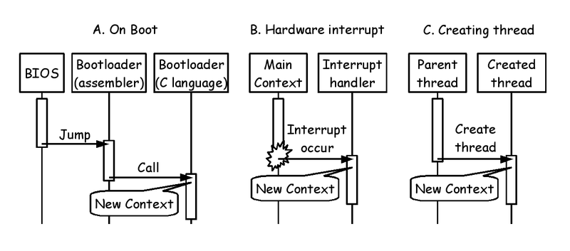
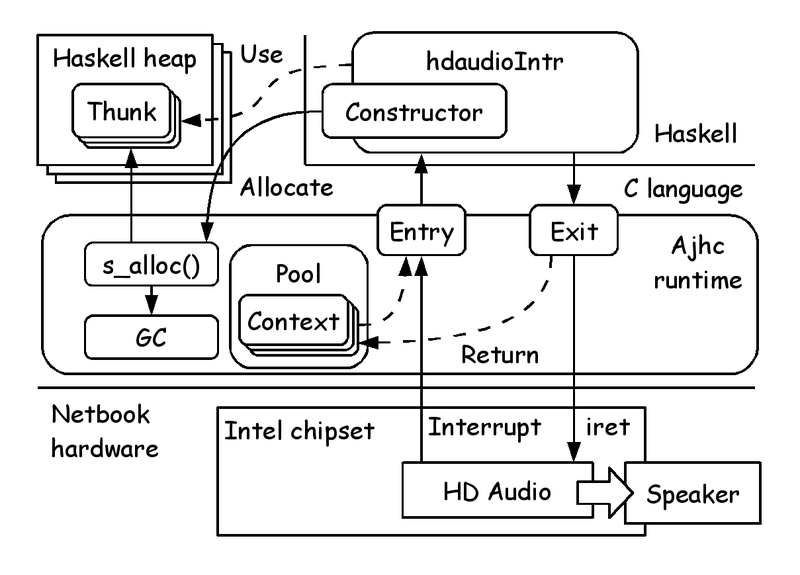

# Ajhc Haskell Compiler with　Reentrant GC

Kiwamu Okabe @ Metasepi Project

# Who am I?

* http://www.masterq.net/
* Self employed software engineer
* Trade name := METASEPI DESIGN
* Founder of Metasepi Project
* A Debian Maintainer
* 10 years' experience in developing OS using NetBSD

# Demo: NetBSD driver in Haskell

* NetBSD audio driver play sound
* The driver's interrupt handler rewrited using Haskell
* Watch the movie at following

~~~
https://www.youtube.com/watch?v=XEYcR5RG5cA
~~~

* Paper for Haskell Symposium 2014

~~~
http://metasepi.org/doc/metasepi-icfp2014.pdf
~~~

# Agenda

* [1] Demo: NetBSD driver in Haskell
* [2] What's Metasepi?
* [3] What's Ajhc compiler?
* [4] Reentrancy and Context
* [5] Context Local Heap (CLHs)
* [6] How to write Haskell driver?
* [7] What's coming next?

# [2] What's Metasepi?

xxx

# [3] What's Ajhc compiler?

xxx

# [4] Reentrancy and Context

* Metasepi needs language implementation supporting reentrancy.

# Why need Reentrancy?

* There are 2 way for multitasking
* [A] Nonpreemptive multitasking
* [B] Preemptive multitasking
* Unix-like OS needs [B]
* [B] needs the hardware interrupts
* Interrupt handler should be reentrant

# What's Reentrancy?

~~~
Reentrant code can be interrupted in the middle of its execution and then safely called again ("re-entered") before its previous invocations complete execution.
~~~

# What's Context on C language?

* A set of registers and call stack

# Where Context come from?

# What's Context switch?

~~~
The process of storing and restoring the state (context) of a process or thread so that execution can be resumed from the same point at a later time.
~~~

# Support reentrancy with GC

* Metasepi uses strongly typed language
* Strongly typed language sometimes needs GC
* Most languages doesn't support reentrancy with GC
* How to support reentrancy with GC?

# Probllem: Interrupt and GC

# [5] Context Local Heap (CLHs)

* Idea: Isolate contexts by local heap

# Let's define "Haskell Context"

# Haskell Context on jhc

# Haskell Context life cycle (jhc)

# Interaction with C on jhc

# Haskell Context on Ajhc

# Haskell Context life cycle (Ajhc)

# Interaction with C on Ajhc

xxx

# [6] How to write Haskell driver?

* Method: Snatch-driven development
* Language: Ajhc Haskell compiler
* Base code: NetBSD kernel

xxx

# Snatch-driven development #1

http://en.wikipedia.org/wiki/Snatcher

# Snatch-driven development #2

# Generate accessor for C struct

https://github.com/ajhc/struct2hs

~~~
$ struct2hs sys/dev/pci/auich_extern_SNATCHED.h | tail
  offsetOf_Pdevinit_pdev_attach :: Int
p_Pdevinit_pdev_attach :: Ptr Pdevinit -> IO (Ptr (Ptr (FunPtr (Int -> IO ()))))
p_Pdevinit_pdev_attach p = return $ plusPtr p $ offsetOf_Pdevinit_pdev_attach
foreign import ccall "dynamic" call_Pdevinit_pdev_attach ::
  FunPtr (Int -> IO ()) -> Int -> IO ()
foreign import primitive "const.offsetof(struct pdevinit, pdev_count)"
  offsetOf_Pdevinit_pdev_count :: Int
p_Pdevinit_pdev_count :: Ptr Pdevinit -> IO (Ptr Int)
p_Pdevinit_pdev_count p = return $ plusPtr p $ offsetOf_Pdevinit_pdev_count
~~~

# AC'97 sound driver

# HD Audio sound driver

# [7] What's coming next?
