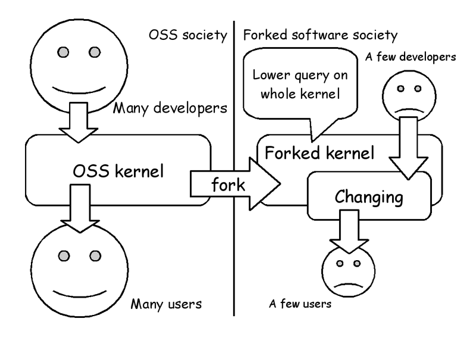
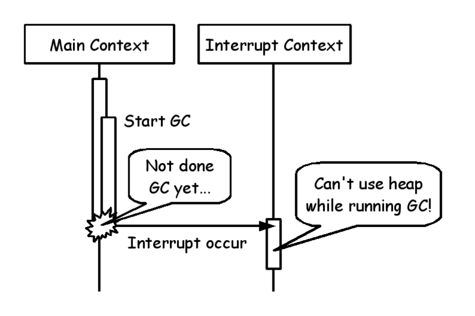
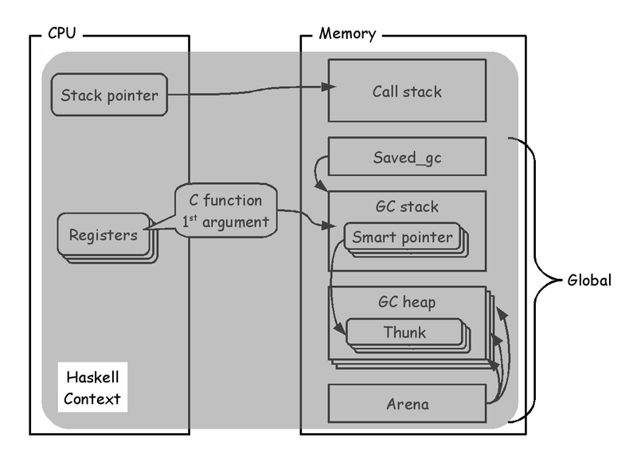
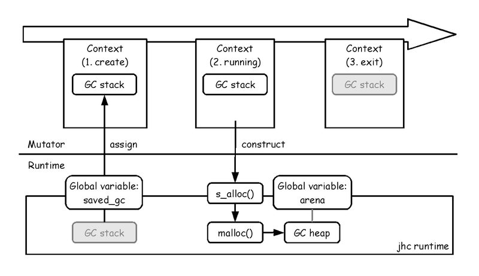
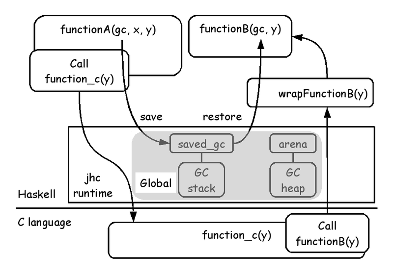
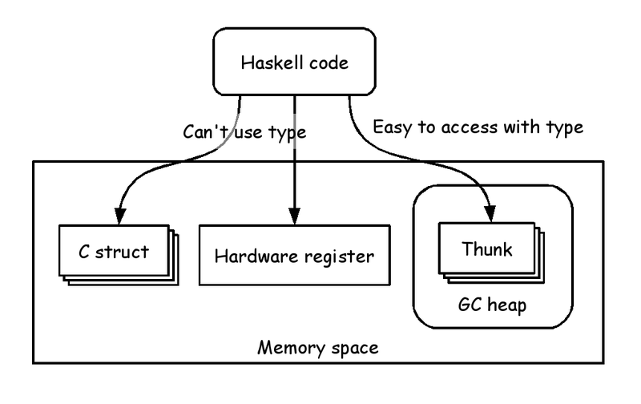
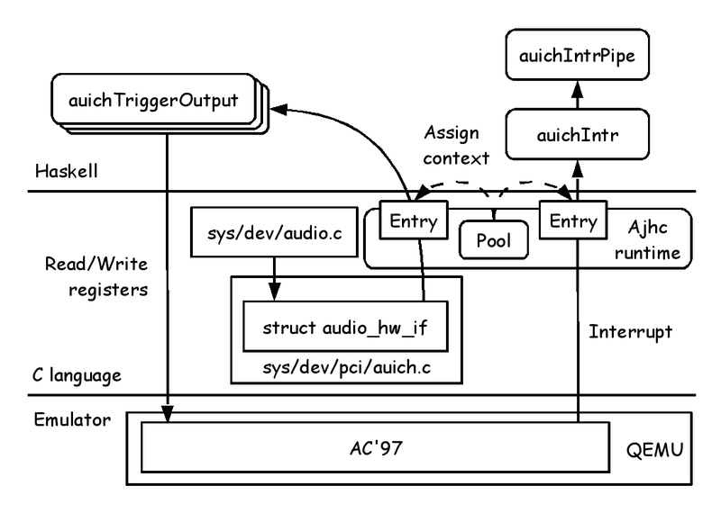
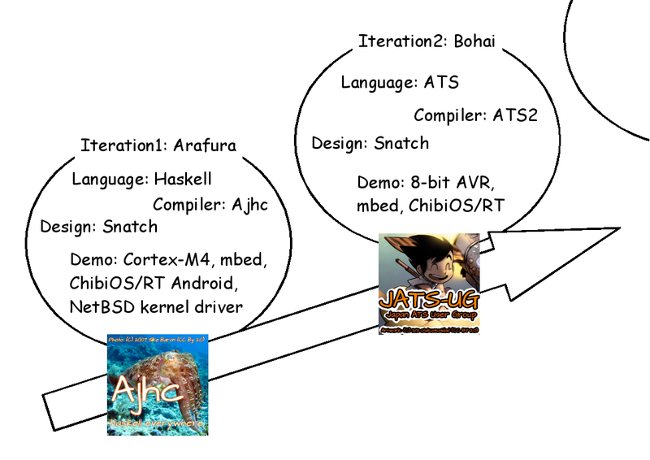

# Ajhc Haskell Compiler with　Reentrant GC


Kiwamu Okabe @ Metasepi Project

# Who am I?


* http://www.masterq.net/
* Self employed software engineer
* Trade name := METASEPI DESIGN
* Founder of Metasepi Project
* A Debian Maintainer
* 10 years' experience in developing OS using NetBSD

# Demo: NetBSD driver in Haskell

* NetBSD audio driver play sound
* The driver's interrupt handler rewrited using Haskell
* GC occurs in interrupt handler
* Watch the movie at following

~~~
https://www.youtube.com/watch?v=XEYcR5RG5cA
~~~

* Paper for Haskell Symposium 2014

~~~
http://metasepi.org/doc/metasepi-icfp2014.pdf
~~~

# Agenda

* [1] Demo: NetBSD driver in Haskell
* [2] What's Metasepi?
* [3] What's Ajhc compiler?
* [4] Reentrancy and Context
* [5] Context Local Heap (CLHs)
* [6] How to write Haskell driver?
* [7] What's coming next?

# [2] What's Metasepi?


http://metasepi.org/

* Unix-like OS designed by strong type.
* Using ML or more strong type lang.

Haskell http://www.haskell.org/

OCaml http://caml.inria.fr/

MLton http://mlton.org/

. . . and suchlike.

# Why need Metasepi?

* We have already Linux or Windows.
* But the developers are suffering.
* If use the kernel changed by you,
* you will get many runtime error.
* Difficult even to reproduce it.

# Doesn't OSS have good quality?

* "The Cathedral and the Bazaar"
* "Given enough eyeballs, all bugs are shallow."

~~~
http://cruel.org/freeware/cathedral.html
~~~

* But if you develop your own product re-using OSS...

# Low quality out of OSS umbrella



# Type safety

* Less runtime errors.
* "数理科学的バグ撲滅方法論のすすめ"

~~~
http://itpro.nikkeibp.co.jp/article/COLUMN/20060915/248230/
~~~


# Kernel wants type desperately

* Kernels are developed with C lang.
* Error on user space => SEGV
* Error on kernel space => Halt!
* Should design kernel with the greatest care.
* C language is safe?

# Remember Heartbleed bug?


Should we use safer language than C?

~~~
== In English ==
"Preventing heartbleed bugs with safe programming languages"
http://bluishcoder.co.nz/2014/04/11/preventing-heartbleed-bugs-with-safe-languages.html

== In Japanease ==
"安全なプログラミング言語を使って heartbleed を防ぐには"
https://github.com/jats-ug/translate/blob/master/Web/bluishcoder.co.nz/2014/04/11/preventing-heartbleed-bugs-with-safe-languages.md
~~~

"A safer systems programming language could have prevented the bug."

# [3] What's Ajhc compiler?


http://ajhc.metasepi.org/

* Ajhc := Arafura designed jhc
* jhc := John's Haskell Compiler
* http://repetae.net/computer/jhc/
* Jhc outputs binary that has low-memory-footprint and runs fast.

# Who is John?


* John Meacham
* http://repetae.net/

# Why choose jhc?

Programs to print "hoge" on terminal. The lesser depends on POSIX, the smaller values.


# Jhc is translator to C language


# [4] Reentrancy and Context

* Metasepi needs language implementation supporting reentrancy.
* Why?

# Why need Reentrancy?

* There are 2 way for multitasking
* [A] Nonpreemptive multitasking
* [B] Preemptive multitasking
* Unix-like OS needs [B]
* [B] needs the hardware interrupts
* Interrupt handler should be reentrant

# What's Reentrancy?

~~~
Reentrant code can be interrupted in the middle of its execution and then safely called again ("re-entered") before its previous invocations complete execution.
~~~


# What's Context on C language?

* A set of registers and call stacks


# Where Context come from?


# What's Context switch?

~~~
The process of storing and restoring the state (context) of a process or thread so that execution can be resumed from the same point at a later time.
~~~


# Support reentrancy with GC

* Metasepi uses strongly typed language
* Strongly typed language sometimes needs GC
* Most languages doesn't support reentrancy with GC
* How to support reentrancy with GC?

# Probllem: Interrupt and GC



# [5] Context Local Heap (CLHs)

* Idea: Isolate contexts by local heap


# Let's define "Haskell Context"


# Haskell Context on jhc



# Haskell Context life cycle (jhc)



# Interaction with C on jhc



# Haskell Context on Ajhc


# Haskell Context life cycle (Ajhc)


# Interaction with C on Ajhc


# [6] How to write Haskell driver?

* Language: Ajhc Haskell compiler
* Base code: NetBSD kernel
* Method: Snatch-driven development

# Snatch-driven development #1

http://en.wikipedia.org/wiki/Snatcher


# Snatch-driven development #2


# To access out of GC heep



# Generate code to access C struct

https://github.com/ajhc/struct2hs

~~~
$ struct2hs sys/dev/pci/auich_extern_SNATCHED.h | tail
~~~

~~~ {.haskell}
  offsetOf_Pdevinit_pdev_attach :: Int
p_Pdevinit_pdev_attach :: Ptr Pdevinit -> IO (Ptr (Ptr (FunPtr (Int -> IO ()))))
p_Pdevinit_pdev_attach p = return $ plusPtr p $ offsetOf_Pdevinit_pdev_attach
foreign import ccall "dynamic" call_Pdevinit_pdev_attach ::
  FunPtr (Int -> IO ()) -> Int -> IO ()
foreign import primitive "const.offsetof(struct pdevinit, pdev_count)"
  offsetOf_Pdevinit_pdev_count :: Int
p_Pdevinit_pdev_count :: Ptr Pdevinit -> IO (Ptr Int)
p_Pdevinit_pdev_count p = return $ plusPtr p $ offsetOf_Pdevinit_pdev_count
~~~

# Access C struct in kernel

``` {.c}
/* C code */
static int
auich_set_port(void *v, mixer_ctrl_t *cp)
{
    struct auich_softc *sc;

    sc = v;
    return sc->codec_if->vtbl->mixer_set_port(sc->codec_if, cp);
}
```

``` {.haskell}
-- Haskell code
foreign export ccall "auichSetPort"
  auichSetPort :: Ptr AuichSoftc -> Ptr MixerCtrl -> IO Int
auichSetPort :: Ptr AuichSoftc -> Ptr MixerCtrl -> IO Int
auichSetPort sc cp = do
  codecif <- peek =<< p_AuichSoftc_codec_if sc
  f <- peek =<< p_Ac97CodecIfVtbl_mixer_set_port =<< peek
         =<< p_Ac97CodecIf_vtbl codecif
  call_Ac97CodecIfVtbl_mixer_set_port f codecif cp
```

# AC'97 sound driver



# HD Audio sound driver


# Benchmark

~~~
(O)  Original NetBSD 6.1.2 kernel
(S)  The kernel includes AC'97 and HD Audio driver snatched by Ajhc
(N)  (S) + using naive GC
(B4) (S) + having GC block 16 Byte
(B5) (S) + having GC block 32 Byte
(B6) (S) + having GC block 64 Byte
~~~


# [7] What's coming next?



# What's ATS language?


http://www.ats-lang.org/

* Syntax like ML
* Dependent types
* Linear types
* Without any runtime
* Optional GC

Good for system programming.

# Follow me!

* http://jats-ug.metasepi.org/
* https://twitter.com/jats_ug


# License of photos used #1

```
* ゴミ収集車 | Flickr - Photo Sharing!
  https://www.flickr.com/photos/shuto/8816770503/
  Copyright: 2013 Shuto Araki / License: CC BY 2.0
* Hooded Cuttlefish | Flickr - Photo Sharing!
  https://www.flickr.com/photos/silkebaron/931247866/
  Copyright: 2007 Silke Baron / License: CC BY 2.0
* Hooded Cuttlefish | Flickr - Photo Sharing!
  https://www.flickr.com/photos/silkebaron/931381358/
  Copyright: 2007 Silke Baron / License: CC BY 2.0
* Javi Recio y David Cabrera | Flickr - Photo Sharing!
  https://www.flickr.com/photos/otakumunidad/5787704531/
  Copyright: 2011 Otakumunidad Damned / License: CC BY 2.0
```
