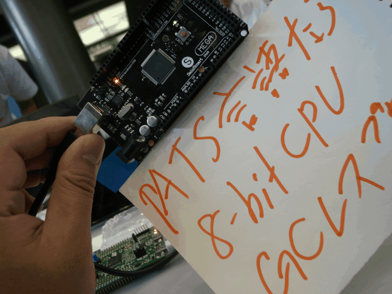
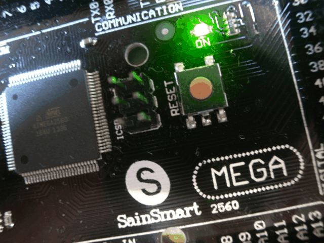
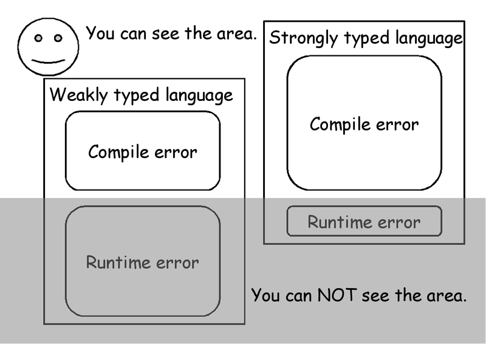
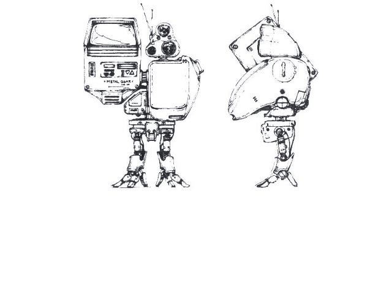
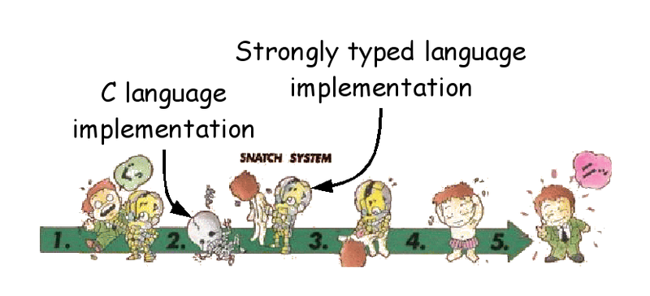
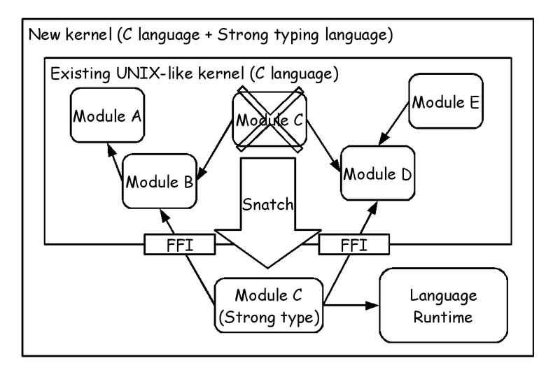
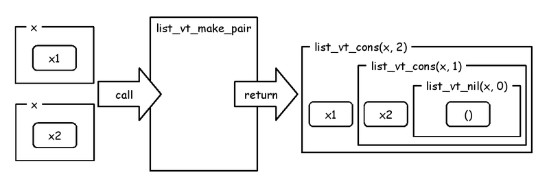
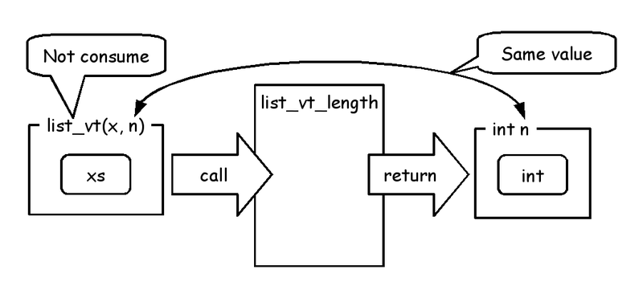
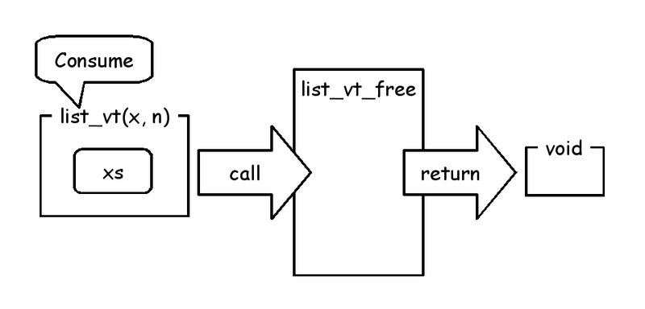

# Metasepi team meeting #16:　Safety on ATS language + MCU

Kiwamu Okabe @ Metasepi Project

# Who am I?

* http://www.masterq.net/
* Self employed software engineer
* Trade name := METASEPI DESIGN
* Founder of Metasepi Project
* A Debian Maintainer
* 10 years' experience in developing OS using NetBSD

# Agenda

* [1] What is Metasepi?
* [2] How to create Metasepi?
* [3] Demo using ATS language
* [4] What is ATS language?
* [5] Why ATS language is safe?
* [6] ATS programming on MCU

# [1] What is Metasepi?

http://metasepi.org/

* Unix-like OS designed by strong type.
* Using ML's or more strong type.

# Why need Metasepi?

* We have already Linux or Windows.
* But the developers are suffering.
* If use the kernel changed by you,
* you will get many runtime error.
* Difficult even to reproduce it.

# Doesn't OSS have good quality?

* "The Cathedral and the Bazaar"
* "Given enough eyeballs, all bugs are shallow."

~~~
http://cruel.org/freeware/cathedral.html
~~~

* But if you develop your own product re-using OSS...

# Low quality out of OSS umbrella

# Type safety

* Less runtime errors
* "数理科学的バグ撲滅方法論のすすめ"

~~~
http://itpro.nikkeibp.co.jp/article/COLUMN/20060915/248230/
~~~

# Kernel wants type desperately

* Kernels are developed with C.
* Error on user space => SEGV
* Error on kernel space => Halt!
* Should design kernel with the greatest care.
* C language is safe?

# Remember Heartbleed bug?

Should we use safer language than C?

~~~
== In English ==
"Preventing heartbleed bugs with safe programming languages"
http://bluishcoder.co.nz/2014/04/11/preventing-heartbleed-bugs-with-safe-languages.html

== In Japanease ==
"安全なプログラミング言語を使って heartbleed を防ぐには"
https://github.com/jats-ug/translate/blob/master/Web/bluishcoder.co.nz/2014/04/11/preventing-heartbleed-bugs-with-safe-languages.md
~~~

"A safer systems programming language could have prevented the bug."

# [2] How to create Metasepi?

* Language: Strongly typed language
* Base code: NetBSD kernel
* Design: Snatch-driven development

# Snatch-driven development #1

http://en.wikipedia.org/wiki/Snatcher

~~~

~~~

# Snatch-driven development #2

# Iterative development

# [3] Demo: ATS on raw Arduino

~~~
https://github.com/fpiot/arduino-mega2560-ats
~~~

# Demo: ATS on mbed platform

~~~
https://github.com/fpiot/mbed-ats
~~~

# [4] What is ATS language?

http://www.ats-lang.org/

* Syntax like ML
* Dependent types
* Linear types
* Without any runtime
* Optional GC

# ATS compile flow

# [5] Why ATS language is safe?

* Line is at between caller and callee
* ATS applies type to the line
* Type can enforce invariant in them

# Usage of Linear List

~~~
$ vi sample_list.dats
#include "share/atspre_staload.hats"
implement main0 () = {
  val l1 = list_vt_make_pair<int> (1, 2)
  val l2 = list_vt_make_pair<int> (3, 4)
  val () = println! ("l1 := [", l1, "] / l2 := [", l2, "]")

  val l3 = list_vt_append (l1, l2)
  val l4 = list_vt_reverse l3
  val () = println! ("l4 := [", l4, "]")
  val () = println! ("length(l4) := ", length l4)
  val () = free l4
}
$ patscc -DATS_MEMALLOC_LIBC -o sample_list sample_list.dats
$ ./sample_list
l1 := [1, 2] / l2 := [3, 4]
l4 := [4, 3, 2, 1]
length(l4) := 4
~~~

# Compile error: without free

~~~
$ vi sample_list.dats
#include "share/atspre_staload.hats"
implement main0 () = {
  val l1 = list_vt_make_pair<int> (1, 2)
  val l2 = list_vt_make_pair<int> (3, 4)
  val () = println! ("l1 := [", l1, "] / l2 := [", l2, "]")

  val l3 = list_vt_append (l1, l2)
  val l4 = list_vt_reverse l3
  val () = println! ("l4 := [", l4, "]")
  val () = println! ("length(l4) := ", length l4)
//  val () = free l4 // <= Changed
}
$ patscc -DATS_MEMALLOC_LIBC -o sample_list sample_list.dats
--snip--
The 2nd translation (binding) of [sample_list.dats] is successfully completed!
/home/kiwamu/tmp/sample_list.dats: 59(line=2, offs=22) -- 396(line=12, offs=2): error(3): the linear dynamic variable [l4$3440(-1)] needs to be consumed but it is preserved with the type [S2Eapp(S2Ecst(list_vt0ype_int_vtype); S2Eapp(S2Ecst(INV); S2EVar(4102)), S2EVar(4103))] instead.
~~~

# Type of Linear List

~~~
(* File: prelude/basics_dyn.sats *)
datavtype
list_vt0ype_int_vtype (a:vt@ype+, int) =
  | {n:int | n >= 0}
    list_vt_cons (a, n+1) of (a, list_vt0ype_int_vtype (a, n))
  | list_vt_nil (a, 0) of ()
stadef list_vt = list_vt0ype_int_vtype
~~~

# make_pair

~~~
(* File: prelude/SATS/list_vt.sats *)
fun{x:vt0p}
list_vt_make_pair (x1: x, x2: x):<!wrt> list_vt (x, 2)
~~~

# length

~~~
(* File: prelude/SATS/list_vt.sats *)
fun{x:vt0p}
list_vt_length{n:int} (xs: !list_vt (INV(x), n)):<> int n
~~~

# append

~~~
(* File: prelude/SATS/list_vt.sats *)
fun{
a:vt0p
} list_vt_append
  {n1,n2:int} (
  xs1: list_vt (INV(a), n1), xs2: list_vt (a, n2)
) :<!wrt> list_vt (a, n1+n2)
~~~

# reverse

~~~
(* File: prelude/SATS/list_vt.sats *)
fun{x:vt0p}
list_vt_reverse{n:int}
  (xs: list_vt (INV(x), n)):<!wrt> list_vt (x, n)
~~~

# free

~~~
(* File: prelude/basics_dyn.sats *)
vtypedef
List_vt (a:vt0p) = [n:int] list_vt (a, n)

(* File: prelude/SATS/list_vt.sats *)
fun{x:t0p}
list_vt_free (xs: List_vt (INV(x))):<!wrt> void
overload free with list_vt_free
~~~

# [6] ATS programming on MCU

You can choose the following 2-way.

On BareMetal hardware

* Arduino (8-bit AVR)
* Cortex-M (32-bit ARM)

On RTOS

* mbed
* ChibiOS/RT

# ATS on BareMetal hardware

Read/write memory using pointer.

# ATS on RTOS

Interaction with C.

# Japan ATS User Group

http://jats-ug.metasepi.org/

* In a parody of http://jaws-ug.jp/
* Translate ATS docs into Japanese
* Push the Facebook like button, now!

# Many translated documents

~~~
* ATSプログラミング入門
  http://jats-ug.metasepi.org/doc/ATS2/INT2PROGINATS/index.html
* ATSプログラミングチュートリアル
  http://jats-ug.metasepi.org/doc/ATS2/ATS2TUTORIAL/index.html
* Effective ATS
  https://github.com/jats-ug/translate/blob/master/Manual/EffectiveATS.md
* MLプログラマ向けATS言語ガイド
  https://github.com/jats-ug/translate/blob/master/Web/cs.likai.org/ats/ml-programmers-guide-to-ats.md
* 安全なプログラミング言語を使って heartbleed を防ぐには
  https://github.com/jats-ug/translate/blob/master/Web/bluishcoder.co.nz/2014/04/11/preventing-heartbleed-bugs-with-safe-languages.md
* 状態を持つ観 (view) を通じてポインタを扱う安全なプログラミング
  https://github.com/jats-ug/translate/blob/master/Paper/SPPSV-padl05/SPPSV-padl05.md
~~~

# Follow me!

https://twitter.com/jats_ug

