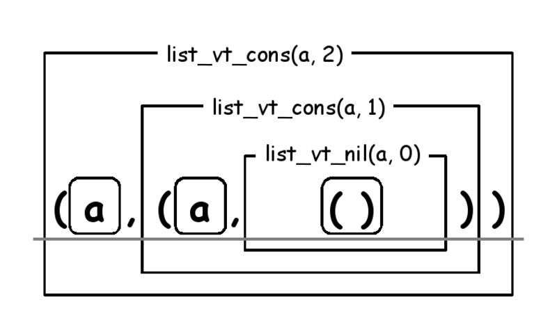
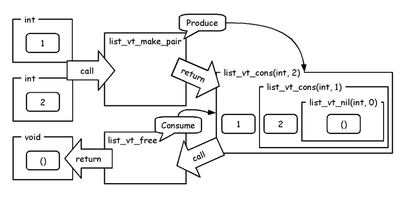

# ATS Programming Tutorial

Kiwamu Okabe @ RIKEN AICS

# Are you ready?

Have you installed ATS2 compiler?
If not, please install the ATS2 into your PC on following manual:

* In English: http://bit.ly/instats
* In Japanese: http://bit.ly/instatsj

Also, you can get a code of this slide at following:

* http://bit.ly/ats20150306

# Install ATS2 into Debian #1

* Get source code of ATS2

~~~
$ wget http://downloads.sourceforge.net/project/ats2-lang/ats2-lang/ats2-postiats-0.1.9/ATS2-Postiats-0.1.9.tgz
$ wget http://downloads.sourceforge.net/project/ats2-lang-contrib/ats2-lang-contrib/ATS2-Postiats-contrib-0.1.6.tgz
~~~

* Install packages needed by ATS2

~~~
$ sudo apt-get install gcc libgc-dev libgmp-dev make
~~~

# Install ATS2 into Debian #2

* Compile ATS2

~~~
$ tar xf ATS2-Postiats-0.1.9.tgz
$ export PATSHOME=`pwd`/ATS2-Postiats-0.1.9
$ export PATH=${PATSHOME}/bin:${PATH}
$ tar xf ATS2-Postiats-contrib-0.1.6.tgz
$ export PATSHOMERELOC=`pwd`/ATS2-Postiats-contrib-0.1.6
$ cd ${PATSHOME}
$ ./configure
$ make
~~~

* Ready to compile ATS code!

~~~
$ patsopt --version
ATS/Postiats version 0.1.9 with Copyright (c) 2011-2015 Hongwei Xi
~~~

# What is ATS?

http://www.ats-lang.org/

* Syntax like ML
* Dependent types
* Linear types
* Optional GC
* Without any runtime
* Successor of Dependent ML

# What can ATS do?

* Proof code using dependent types
* Safely use malloc using linear types
* Safely use pointer using linear types
* Use strong type without any OS
* Write code on bare metal hardware
* Write code in Linux kernel

# The goal of today

ATS has some good documents.

~~~
* Introduction to Programming in ATS
  http://ats-lang.sourceforge.net/DOCUMENT/INT2PROGINATS/HTML/
* A Tutorial on Programming Features in ATS
  http://ats-lang.sourceforge.net/DOCUMENT/ATS2TUTORIAL/HTML/
* Effective ATS
  http://ats-lang.sourceforge.net/EXAMPLE/EFFECTIVATS/
* Wiki for ATS2
  https://github.com/githwxi/ATS-Postiats/wiki
~~~

However they are somtimes hard for beginner.
The goal of today is to learn to read "Introduction to Programming in ATS" by yourself.

# Hello World

~~~
$ vi helloworld.dats
val () = println! "Hello, world!"

implement main0 () = ()
$ patscc helloworld.dats
$ ./a.out
Hello, world!
~~~

You can call println! directly.

~~~
$ vi helloworld2.dats
implement main0 () = () where {
  val () = println! "Hello, world!"
}
~~~

Or more simply...

~~~
$ vi helloworld3.dats
implement main0 () = println! "Hello, world!"
~~~

# Integer

The "share/atspre_staload.hats" is needed by overloaded operators.

~~~
$ vi int_op.dats
#include "share/atspre_staload.hats"

val () = println! (3 + 4 * 2)
val () = println! ((3 + 4) * 2)
val () = println! (2 - 3)
val () = println! (7 / 2)
val () = println! (7 % 2)

implement main0 () = ()
$ patscc int_op.dats
$ ./a.out
11
14
-1
3
1
~~~

# Zero Division

But, zero-division causes compile error!

~~~
$ vi divmod.dats
#include "share/atspre_staload.hats"

val () = println! (7 / (2 - 2))

implement main0 () = ()
$ patscc divmod.dats
/home/kiwamu/tmp/tmp/divmod.dats: 60(line=3, offs=22) -- 61(line=3, offs=23): error(3): unsolved constraint: C3NSTRprop(main; S2Eapp(S2Ecst(!=); S2EVar(4177->S2Eapp(S2Ecst(sub_int_int); S2EVar(4173->S2Eintinf(2)), S2EVar(4174->S2Eintinf(2)))), S2Eintinf(0)))
typechecking has failed: there are some unsolved constraints: please inspect the above reported error message(s) for information.
exit(ATS): uncaught exception: _2home_2kiwamu_2src_2ATS_2dPostiats_2src_2pats_error_2esats__FatalErrorExn(1025)
~~~

... hard to read it ...

# Let's understand internal types

~~~
https://github.com/githwxi/ATS-Postiats/wiki/Internal-types

* S2Eapp - an application term.
* S2Ecst - a type constant (for instance, int, bool, list, etc.)
* S2Eeff - function effects.
* S2Eexi - an existentially quantified type.
* S2Eint - machine precision integer.
* S2Eintinf - infinite precision integer; commonly used for integer sorts in most compiled versions of atsopt (patsopt).
* S2Evar - a (typically universally quantified) variable.
* S2Etop (0; T) means T?
* S2Etop (1; T) means T?!
* S2EVar - an (existentially quantified) unification variable introduced by the typechecker.
~~~

# The zero division error means...

~~~
unsolved constraint: C3NSTRprop(main; S2Eapp(S2Ecst(!=); S2EVar(4177->S2Eapp(S2Ecst(sub_int_int); S2EVar(4173->S2Eintinf(2)), S2EVar(4174->S2Eintinf(2)))), S2Eintinf(0)))
  ↓ meaning
The proposition "2 - 2 != 0" is not solved.
~~~

It's powered by dependent types that are used at ATS language's prelude.

~~~
$ vi ATS-Postiats/prelude/SATS/integer.sats
typedef
g1int_div_type
  (tk:tk) =
  {i,j:int | j != 0}
  (g1int (tk, i), g1int (tk, j)) -<fun0> g1int (tk)
--snip--
fun g1int_div_int : g1int_div_type (intknd) = "mac#%"
fun g1int_div_lint : g1int_div_type (lintknd) = "mac#%"
fun g1int_div_llint : g1int_div_type (llintknd) = "mac#%"
fun g1int_div_ssize : g1int_div_type (ssizeknd) = "mac#%"
~~~

# Real Number

~~~
$ vi double_op.dats
#include "share/atspre_staload.hats"

val () = println! ((3.0 + 5.0) * 8.0 / 3.0)

implement main0 () = ()
$ patscc double_op.dats
$ ./a.out
21.333333
~~~

The operators are overloaded.

~~~
$ vi double_int_op.dats
#include "share/atspre_staload.hats"

val () = println! ((3 + 5.0) * 8 / 3.0)

implement main0 () = ()
$ patscc double_int_op.dats
$ ./a.out
21.333333
~~~

# Boolean value

~~~
$ vi bool_op.dats
#include "share/atspre_staload.hats"

val () = println! (true && false)
val () = println! (not (false || not false && not false))
val () = println! (2 < 3)
val () = println! (2 < 3 && 2.0 >= 3.0)
val () = println! (2 < 3 || 2.0 = 3.0)
val () = println! (not (3 < 2))

implement main0 () = ()
$ patscc bool_op.dats
$ ./a.out
false
false
true
false
true
true
~~~

# Constant definition

~~~
$ vi val_overwrite.dats
#include "share/atspre_staload.hats"

implement main0 () = {
  val a = 1
  val b = a
  val () = println! a
  val () = println! b
  val a = 2
  val () = println! a
  val () = println! b
}
$ patscc val_overwrite.dats
$ ./a.out
1
1
2
1
~~~

# Function definition

~~~
$ vi two_arguments.dats
#include "share/atspre_staload.hats"

fun g (x:int, y:int): int = x * x + y * y - 4

implement main0 () = println! (g (3, 2))
$ patscc two_arguments.dats
$ ./a.out
9
~~~

# Typechecking

~~~
$ vi f_takes_double.dats
#include "share/atspre_staload.hats"

fun f (x:int): int = 3 * x

implement main0 () = {
  val r  = f 4.0
  val () = println! r
}
$ patscc f_takes_double.dats
/home/kiwamu/tmp/tmp/f_takes_double.dats: 103(line=6, offs=14) -- 106(line=6, offs=17): error(3): the dynamic expression cannot be assigned the type [S2Eapp(S2Ecst(g0int_t0ype); S2Ecst(int_kind))].
/home/kiwamu/tmp/tmp/f_takes_double.dats: 103(line=6, offs=14) -- 106(line=6, offs=17): error(3): mismatch of static terms (tyleq):
The actual term is: S2Eapp(S2Ecst(g0float_t0ype); S2Ecst(double_kind))
The needed term is: S2Eapp(S2Ecst(g0int_t0ype); S2Ecst(int_kind))
~~~

Function "f" should take value of int.

# Conditional branch

~~~
$ vi if_then_else.dats
#include "share/atspre_staload.hats"

implement main0 () = {
  val a  = if 1 < 2 then 3 else 4
  val () = println! (a:int)
}
$ patscc if_then_else.dats
$ ./a.out
3
~~~

# Able to drop else clause

~~~
$ vi println_expr.dats
#include "share/atspre_staload.hats"

implement main0 () = if 7 > 5 then println! "It's true."
$ patscc println_expr.dats
$ ./a.out
It's true.
~~~

# Showing types

~~~
$ vi showtype_int.dats
val () = println! 3
val _ = $showtype 3

implement main0 () = ()
$ patscc showtype_int.dats
**SHOWTYPE[UP]**(/home/kiwamu/tmp/tmp/showtype_int.dats: 39(line=2, offs=19) -- 40(line=2, offs=20)): S2Eapp(S2Ecst(g1int_int_t0ype); S2Ecst(int_kind), S2Eintinf(3)): S2RTbas(S2RTBASimp(1; t@ype))
$ ./a.out
3
~~~

"Wiki for ATS2" explains "$showtype".

~~~
"$showtype" prints out the type of a value or variable in ATS's internal type representation. Very helpful for understanding type errors, but the exact meaning of the output can still be cryptic for more complicated cases.
~~~

# Immutable string

~~~
$ vi print_foo.dats
#include "share/atspre_staload.hats"

val () = println! "foo"

implement main0 () = ()
$ patscc print_foo.dats
$ ./a.out
foo
~~~

However, immutable string can't do such like following:

* append
* reverse

# Try to use mutable string

~~~
$ vi try_string_append.dats
#include "share/atspre_staload.hats"

implement main0 () = {
  val s3 = string_append ("Yokohama", "Station")
  val () = println! s3
}
$ patscc try_string_append.dats
/home/kiwamu/tmp/try_string_append.dats: 60(line=3, offs=22) -- 135(line=6, offs=2): error(3): the linear dynamic variable [s3$3509(-1)] needs to be consumed but it is preserved with the type [S2Eapp(S2Ecst(strptr_addr_vtype); S2EVar(4175))] instead.
patsopt(TRANS3): there are [1] errors in total.
exit(ATS): uncaught exception: _2home_2kiwamu_2src_2ATS_2dPostiats_2src_2pats_error_2esats__FatalErrorExn(1025)
~~~

Why does error occur?

# Need to free mutable string

~~~
$ vi string_append.dats
#include "share/atspre_staload.hats"

implement main0 () = {
  val s3 = string_append ("Yokohama", "Station")
  val () = println! s3
  val () = free s3
}
$ patscc string_append.dats -DATS_MEMALLOC_LIBC
$ ./a.out
YokohamaStation
~~~

The "ATS_MEMALLOC_LIBC" flag is needed to use malloc on libc.

How can ATS2 know failure of free?

# Linear type watches resource

# Type of List

# Create list

~~~
$ vi make_pair.dats
#include "share/atspre_staload.hats"

implement main0 () = {
  val l = list_vt_make_pair (1, 2)
  val () = print_list_vt<int> l
  val () = list_vt_free<int> l
}
$ patscc make_pair.dats -DATS_MEMALLOC_LIBC
$ ./a.out
1, 2
~~~

The "\<int\>" is needed to use template function.

# Create list as figure

# Append list

~~~
$ vi append_list.dats
#include "share/atspre_staload.hats"

implement main0 () = {
  val l1 = list_vt_make_pair (1, 2)
  val l2 = list_vt_make_sing 3
  val l3 = list_vt_append (l2, l1)
  val () = print_list_vt<int> l3
  val () = list_vt_free<int> l3
}
$ patscc append_list.dats -DATS_MEMALLOC_LIBC
$ ./a.out
3, 1, 2
~~~

# Append list as figure

# Join "Japan ATS User Group" !

http://jats-ug.metasepi.org/

We translate following ATS documents into Japanese.

~~~
* ATSプログラミング入門
  http://jats-ug.metasepi.org/doc/ATS2/INT2PROGINATS/
* ATSプログラミングチュートリアル
  http://jats-ug.metasepi.org/doc/ATS2/ATS2TUTORIAL/
* Effective ATS
  https://github.com/jats-ug/translate/blob/master/Manual/EffectiveATS.md
~~~

Join us and review it!
