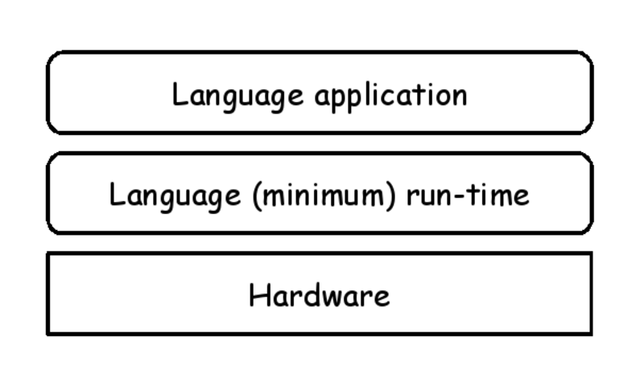
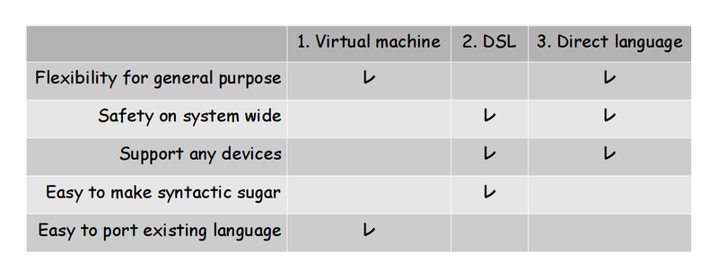

# Arduino programming of ML-style in ATS

Kiwamu Okabe @ METASEPI DESIGN / Hongwei Xi @ Boston University

# Demo: xxx

* http://youtu.be/5uPue0Jo1nc
* LCD sort
* LED fadein

# Demo: Software Architecture

https://github.com/fpiot/arduino-ats


# Arduino Uno hardware

It's poor.

* 8-bit Harvard architecture
* Flash Memory: 32 KB
* SRAM: 2 KB

Many people use C language on the hardware.

# Problem of C language

* Memory/Resource leak
* Out of bounds
* Weak type

We need functional language for embedded system!

# Approach 1: Virtual machine


# Approach 2: DSL


# Approach 3: Direct language



# Comparison of the approaches

We choose the 3rd approach.



# ATS language


* http://www.ats-lang.org/
* Dependent types
* Linear types
* Optional GC
* Optional malloc/free
* Optional run-time

# Demo code: LED fadein

```
#define LED 9
#define DELAY_MS 10.0
typedef analog_w_t = natLt(256)

fun{} int_foreach_clo{n:nat}
(n: int(n), fwork: &natLt(n) -<clo1> void): void =
  loop(0, fwork) where {
  fun loop{i:nat | i <= n} .<n-i>.
    (i: int(i), fwork: &natLt(n) -<clo1> void): void =
    if i < n then (fwork(i); loop (i+1, fwork))
}

implement main () = {
  fun fadein() = let
    var fwork = lam@ (n: analog_w_t) =>
      (analogWrite (LED, n); delay_ms(DELAY_MS))
  in
    int_foreach_clo(256, fwork)
  end // end of [fadein]
  val () = pinMode (LED, OUTPUT)
  val () = (fix f(): void => (fadein(); f()))()
}
```

# Demo code: LCD greeting (cont.)

```
#define MY_DELAY_MS 400.0
#define LCD_WIDTH 16

val g_str_atsrun = "<ATS running!>"
val g_str_message = "...Greeting message..."

implement main () = {
  fun loop {n:int}{i:nat | i < n}
           (lcd: !lcd_t, str: string (n), pos: size_t (i)): void = {
    val () = if pos + i2sz LCD_WIDTH <= length str then {
      val () = lcd_setCursor (lcd, 1, 0)
      val () = lcd_print (lcd, g_str_atsrun, i2sz 0,
                          length g_str_atsrun)
      val () = lcd_setCursor (lcd, 0, 1)
      val () = lcd_print (lcd, str, pos, i2sz LCD_WIDTH)
      val () = delay_ms (MY_DELAY_MS)
      val () = loop (lcd, str, pos + 1)
    }
  }
```

# Demo code: LCD greeting

```
  fun forever {n:int}{i:nat | i < n}
              (lcd: !lcd_t, str: string (n), pos: size_t (i)):
              void = {
    val () = loop (lcd, str, pos)
    val () = forever (lcd, str, pos)
  }
  val lcd = lcd_open (8, 13, 9, 4, 5, 6, 7)
  val () = forever (lcd, g_str_message, i2sz 0)
  val () = lcd_close lcd
}
```

# Functional style programming

* We use functional style programming with ATS on embedded system?
* Yes.
* Let's see some examples.

# Style 1. Envless function

* Environment less function.
* Not closure.
* C language function is an envless function.

```
%{^ // C language code
int cfunc(int a, int b) {
        return (a + b);
}
%}
// ATS language code
extern fun cfunc (a: int, b: int): int = "mac#"

implement main0 () = println! (cfunc (1, 2)) // => 3
```

# Style 2. Unbind closure

xxx

```
implement main0 () = {
  val () = (fix f(): void => (println! "Hello!"; f()))()
}
```

# Style 3. Stack closure

Stack closure is allocated on stack.
It can use free variable.

```
fun run (f: &int -<clo1> int): int = f 1

implement main0 () = {
  val b = 2
  var plus = lam@ (a: int):int => a + b
  val () = println! (run plus) // => 3
}
```

# Style 4. Template function

```
extern fun{} base (): int

fun{} plus (a: int): int = a + base ()

implement main0 () = {
  implement{} base () = 2
  val () = println! (plus 1) // => 3
}
```

# Safety shaped by ATS

* Termination metrics
* At-view
* View
* Dependent types
* Proof

# Binary size efficiency

For examples on "Getting Started with Arduino", ATS has good binary size efficiency as well as C.


# Conclusion
# License of photos used
