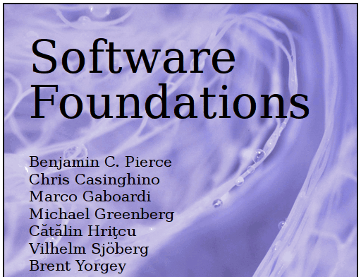
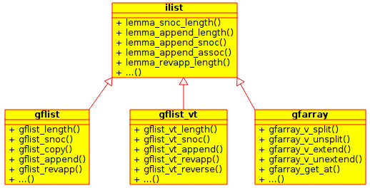
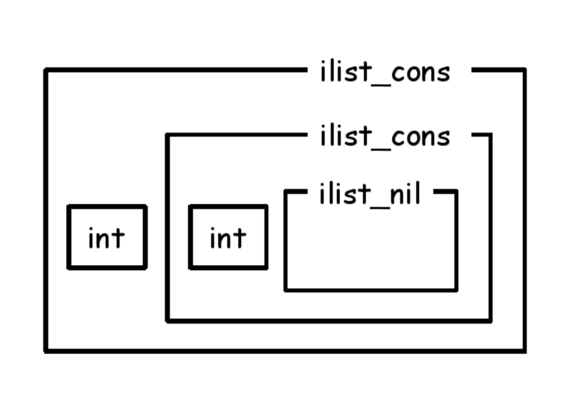

# ATS/LF for Coq users

Kiwamu Okabe

# What is ATS?


* http://www.ats-lang.org/
* DML-style dependent types
* Linear types
* Optional GC
* Optional malloc/free
* Optional run-time

# Author: Hongwei Xi


# What is ATS/LF?

* Subsystem for therorem-proving
* Construct proofs as total functions
* Without tactic
* Can mix proof with implementation
* Programming with Theorem-Proving (PwTP)

# Curry–Howard in ATS

* Type: Function signature introduced by keyword "fun"
* Program: Function body introduced by keyword "implement"
* Proposition: Proof function signature introduced by keyword "prfun"
* Proof: Proof function body introduced by keyword "primplement"

# Style of functions on ATS


# Grammar of function signature


# Application before compiling


# Application after compiling

Proof is erased at compile time.


# Grammar of function body


# Pros of mixed function

You can write following application:

* Program without garbage collection
* Proof to prove the program

Good news for low-level programming!

# Start at "Software Foundations"

```
http://www.cis.upenn.edu/~bcpierce/sf/current/
http://proofcafe.org/sf-beta/
Chapter "Prop: Propositions and Evidence"
```



# Day of week on Coq

```
(* Coq *)
Inductive day : Type :=
  | monday : day
  | tuesday : day
  | wednesday : day
  | thursday : day
  | friday : day
  | saturday : day
  | sunday : day.

Inductive good_day : day -> Prop :=
  | gd_sat : good_day saturday
  | gd_sun : good_day sunday.

Theorem gds : good_day sunday.
Proof. apply gd_sun. Qed.
```

# Day of week on ATS/LF

```
(* ATS/LF *)
datasort Day =
  | Monday
  | Tuesday
  | Wednesday
  | Thursday
  | Friday
  | Saturday
  | Sunday

dataprop Good_Day (Day) =
  | Gd_Sat (Saturday) of ()
  | Gd_Sun (Sunday) of ()

extern prfun gds: Good_Day Sunday
primplement gds = Gd_Sun ()
```

# To typecheck ATS/LF code

```
$ patsopt -tc -d main.dats
```

The command only does type check.
It's useful to check proof.

Also you can use flymake on Emacs.

```
https://github.com/githwxi/ATS-Postiats/blob/master/utils/emacs/ats2-flymake.el
```

# More proof on Coq #1

```
(* Coq *)
Inductive day_before : day -> day -> Prop :=
  | db_tue : day_before tuesday monday
  | db_wed : day_before wednesday tuesday
  | db_thu : day_before thursday wednesday
  | db_fri : day_before friday thursday
  | db_sat : day_before saturday friday
  | db_sun : day_before sunday saturday
  | db_mon : day_before monday sunday.

Inductive ok_day : day -> Prop :=
  | okd_gd : forall d,
      good_day d ->
      ok_day d
  | okd_before : forall d1 d2,
      ok_day d2 ->
      day_before d2 d1 ->
      ok_day d1.
```

# More proof on Coq #2

```
Definition okdw : ok_day wednesday :=
  okd_before wednesday thursday
    (okd_before thursday friday
       (okd_before friday saturday
         (okd_gd saturday gd_sat)
         db_sat)
       db_fri)
    db_thu.
```

# More proof on ATS/LF

```
(* ATS/LF *)
dataprop Day_Before (Day, Day) =
  | DB_Tue (Tuesday, Monday) of ()
  | DB_Wed (Wednesday, Tuesday) of ()
  | DB_Thu (Thursday, Wednesday) of ()
  | DB_Fri (Friday, Thursday) of ()
  | DB_Sat (Saturday, Friday) of ()
  | DB_Sun (Sunday, Saturday) of ()
  | DB_Mon (Monday, Sunday) of ()

dataprop Ok_Day (Day) =
  | {d:Day} Okd_Gd (d) of (Good_Day d)
  | {d1,d2:Day} Okd_Before (d1) of (Ok_Day d2, Day_Before (d2, d1))

prfun okdw: Ok_Day Wednesday = let
  prval okd_sat = Okd_Gd (Gd_Sat ())
  prval okd_fri = Okd_Before (okd_sat, DB_Sat ())
  prval okd_thu = Okd_Before (okd_fri, DB_Fri ())
  prval okd_wed = Okd_Before (okd_thu, DB_Thu ())
in
  okd_wed
end
```

# Proof using recursion

```
(* Coq *)
Inductive ev : nat -> Prop :=
  | ev_0 : ev O
  | ev_SS : forall n:nat, ev n -> ev (S (S n)).

Theorem ev_ev_even : forall n m,
  ev (n+m) -> ev n -> ev m.
Proof.
  (* FILL IN HERE *) Admitted.
```

```
(* ATS/LF *)
dataprop Ev (int) =
  | Ev_0 (0) of ()
  | {n:nat} Ev_SS (n+2) of Ev n

prfun ev_ev_even {n,m:nat} .<n>. (enm: Ev (n+m), en: Ev n): Ev m =
  case+ en of
  | Ev_0 () => enm
  | Ev_SS en' => let
      prval Ev_SS enm' = enm
    in
      ev_ev_even (enm', en')
    end
```

# Proved list



# Abstract list

Defined at libats/SATS/ilist_prf.sats.

```
datasort ilist =
  | ilist_nil of ()
  | ilist_cons of (int, ilist)
```



# Proposition without proof

```
dataprop LENGTH (ilist, int) =
  | LENGTHnil(ilist_nil, 0) of ()
  | {x:int}{xs:ilist}{n:nat}
    LENGTHcons(ilist_cons (x, xs), n+1) of LENGTH (xs, n)

dataprop SNOC (ilist, int, ilist) =
  | {x:int} SNOCnil (ilist_nil, x, ilist_sing (x)) of ()
  | {x0:int}{xs1:ilist}{x:int}{xs2:ilist}
    SNOCcons (ilist_cons (x0, xs1), x, ilist_cons (x0, xs2))
      of SNOC (xs1, x, xs2)

dataprop APPEND (ilist, ilist, ilist) =
  | {ys:ilist} APPENDnil (ilist_nil, ys, ys) of ()
  | {x:int} {xs:ilist} {ys:ilist} {zs:ilist}
    APPENDcons (ilist_cons (x, xs), ys, ilist_cons (x, zs))
      of APPEND (xs, ys, zs)

dataprop ISORD (ilist) =
  | ISORDnil (ilist_nil) of ()
  | {x:int} {xs:ilist}
    ISORDcons (ilist_cons (x, xs)) of (ISORD xs, LTEB (x, xs))
```

# Proposition with proof

```
prfun lemma_snoc_length
  {xs:ilist}{x:int}{xsx:ilist}{n:int}
  (pf1: SNOC (xs, x, xsx), pf2: LENGTH (xs, n)): LENGTH (xsx, n+1)

primplmnt lemma_snoc_length (pf1, pf2) = let
  prfun lemma
    {xs:ilist}{x:int}{xsx:ilist}{n:int} .<xs>.
    (pf1: SNOC (xs, x, xsx), pf2: LENGTH (xs, n)):
    LENGTH (xsx, n+1) = let
  in
    case+ pf1 of
    | SNOCnil () => let
        prval LENGTHnil () = pf2 in LENGTHcons (LENGTHnil ())
      end
    | SNOCcons (pf1) => let
        prval LENGTHcons (pf2) = pf2
      in LENGTHcons (lemma (pf1, pf2))
      end
  end
in
  lemma (pf1, pf2)
end
```

# Concrete list

* libats/SATS/gflist.sats - with GC
* libats/SATS/gflist_vt.sats - without GC, with malloc/free
* libats/SATS/gfarray.sats - without GC and malloc/free

# gflist

```
datatype gflist (a:t@ype+, ilist) =
  | gflist_nil (a, ilist_nil) of ()
  | {x:int} {xs:ilist}
    gflist_cons (a, ilist_cons (x, xs))
      of (stamped_t (a, x), gflist (a, xs))
```


# Write gflist_append_length #1

```
fun{a:t@ype}
gflist_append
  {xs1,xs2:ilist} (
  xs1: gflist (INV(a), xs1), xs2: gflist (a, xs2)
) :<> [res:ilist] (APPEND (xs1, xs2, res) | gflist (a, res))

prfun
lemma_append_length
  {xs1,xs2:ilist}{xs:ilist}{n1,n2:int} (
  pf: APPEND (xs1, xs2, xs), pf1len: LENGTH (xs1, n1),
  pf2len: LENGTH (xs2, n2)
) : LENGTH (xs, n1+n2)
```

# Write gflist_append_length #2

```
extern fun{a:t@ype}
gflist_append_length
  {xs1,xs2:ilist}{n1,n2:int}
  (pf1: LENGTH (xs1, n1), pf2: LENGTH (xs2, n2) |
    xs1: gflist (a, xs1), xs2: gflist (a, xs2)):
  [res:ilist] (LENGTH (res, n1+n2), APPEND (xs1, xs2, res) |
    gflist (a, res))

implement{a}
gflist_append_length (pf1, pf2 | xs1, xs2) = let
  val (pf_append | xs) = gflist_append (xs1, xs2)
  prval pf_len = lemma_append_length (pf_append, pf1, pf2)
in
  (pf_len, pf_append | xs)
end
```

# Use gflist_append_length

```
castfn list2gflist {a:t@ype}{n:int}
  (xs: list(INV(a), n)) :<> [xs:ilist]
    (LENGTH (xs, n) | gflist (a, xs))

implement main0 () = {
  val l1 = $list{int}(1, 2, 3)
  val (pf1 | xs1) = list2gflist l1
  val l2 = $list{int}(4, 3, 2, 1)
  val (pf2 | xs2) = list2gflist l2
  val (pf_len, pf_append | xs3) =
    gflist_append_length (pf1, pf2 | xs1, xs2)
  val (pf3 | l3) = gflist2list xs3
  val () = print_list<int> l3
}
```

# gflist_vt

```
datavtype gflist_vt (a:vt@ype+, ilist) =
  | gflist_vt_nil (a, ilist_nil) of ()
  | {x:int} {xs:ilist}
    gflist_vt_cons (a, ilist_cons (x, xs))
      of (stamped_vt (a, x), gflist_vt (a, xs))
```


# Write gflist_vt_append_length #1

```
fun{a:vt@ype}
gflist_vt_append
  {xs1,xs2:ilist} (
  xs1: gflist_vt (INV(a), xs1), xs2: gflist_vt (a, xs2)
) :<!wrt> [res:ilist] (APPEND (xs1, xs2, res) | gflist_vt (a, res))

prfun
lemma_append_length
  {xs1,xs2:ilist}{xs:ilist}{n1,n2:int} (
  pf: APPEND (xs1, xs2, xs), pf1len: LENGTH (xs1, n1),
  pf2len: LENGTH (xs2, n2)
) : LENGTH (xs, n1+n2)
```

# Write gflist_vt_append_length #2

```
extern fun{a:t@ype}
gflist_vt_append_length
  {xs1,xs2:ilist}{n1,n2:int}
  (pf1: LENGTH (xs1, n1), pf2: LENGTH (xs2, n2) |
    xs1: gflist_vt (a, xs1), xs2: gflist_vt (a, xs2)):
  [res:ilist] (LENGTH (res, n1+n2), APPEND (xs1, xs2, res) |
    gflist_vt (a, res))

implement{a}
gflist_vt_append_length (pf1, pf2 | xs1, xs2) = let
  val (pf_append | xs) = gflist_vt_append (xs1, xs2)
  prval pf_len = lemma_append_length (pf_append, pf1, pf2)
in
  (pf_len, pf_append | xs)
end
```

# Use gflist_vt_append_length

```
implement main0 () = {
  val l1 = $list_vt{int}(1, 2, 3)
  val (pf1 | xs1) = list2gflist_vt l1
  val l2 = $list_vt{int}(4, 3, 2, 1)
  val (pf2 | xs2) = list2gflist_vt l2
  val (pf_len, pf_append | xs3) =
    gflist_vt_append_length (pf1, pf2 | xs1, xs2)
  val (pf3 | l3) = gflist2list_vt xs3
  val () = print_list_vt<int> l3
  val () = free l3
}
```

Function "gflist_append_length" and "gflist_vt_append_length" have same structure, while one of them use GC and another doesn't.

# gfarray

```
dataview gfarray_v (a:vt@ype+, addr, ilist) =
  | {l:addr}
    gfarray_v_nil (a, l, ilist_nil) of ()
  | {x:int}{xs:ilist}{l:addr}
    gfarray_v_cons (a, l, ilist_cons (x, xs)) of
      (stamped_vt (a, x) @ l, gfarray_v (a, l+sizeof(a), xs))
```


# Split gfarray

```
prfun
gfarray_v_split
  {a:vt0p}{l:addr}{xs:ilist}{n:int}{i:nat | i <= n}
(
  pflen: LENGTH (xs, n)
, pfarr: gfarray_v (a, l, xs)
) : [xs1,xs2:ilist]
(
  LENGTH (xs1, i)
, LENGTH (xs2, n-i)
, APPEND (xs1, xs2, xs)
, gfarray_v (a, l, xs1)
, gfarray_v (a, l+i*sizeof(a), xs2)
)
```

# Binary search over gfarray

```
absprop BSEARCH (xs:ilist, x0:int, i:int)

typedef
compare (a:viewt@ype) =
  {x1,x2:int} (&stamped_vt (a, x1), &stamped_vt (a, x2))
    -> int (x1-x2)

extern
fun{a:t@ype}
bsearch
  {l:addr}{xs:ilist}{x0:int}{n:nat} 
(
  pford: ISORD (xs)
, pflen: LENGTH (xs, n)
, pfarr: !gfarray_v (a, l, xs)
| p: ptr l, x0: &stamped_vt (a, x0), n: size_t n, cmp: compare (a)
) : [i:int]
(
  BSEARCH (xs, x0, i) | ptr (l+i*sizeof(a))
)
```

# Prove palindrome

```
dataprop PAL (ilist) =
  | PALnil (ilist_nil) of ()
  | {x:int} PALone (ilist_sing (x)) of ()
  | {x:int}{l,ll:ilist}
    PALcons (ilist_cons (x, ll)) of (PAL (l), SNOC (l, x, ll))
```

xxx Add figure

# Proposition on palindrome

```
dataprop PAPPEND (ilist, ilist, ilist) =
  | {pxs:ilist} PAPPENDnil (pxs, ilist_nil, pxs) of PAL (pxs)
  | {pxs,pxsx,ys,pzs:ilist}{x:int}
    PAPPENDcons (pxs, ilist_cons (x, ys), pzs)
      of (SNOC (pxs, x, pxsx),
        PAPPEND (ilist_cons (x, pxsx), ys, pzs))

prfun pal_app {l,lr,m:ilist}
  (pf1: REVERSE (l, lr), pf2: APPEND (l, lr, m)): PAL (m)
```

# Some lemma

```
extern prfun
lemma2_reverse_scons {x:int}{xs:ilist}{ys1:ilist}
  (REVERSE(ilist_cons(x,xs), ys1)):
  [ys:ilist] (REVERSE(xs, ys), SNOC(ys, x, ys1))

extern prfun
lemma2_append_scons {x:int}{xs,ys:ilist}{ys1,zs1:ilist}
  (APPEND(xs, ys1, zs1), SNOC(ys, x, ys1)):
  [zs:ilist] (APPEND(xs, ys, zs), SNOC(zs, x, zs1))
```

# Prove palindrome append

```
primplement
pal_app {l,lr,m} (pf1, pf2) = let
  prfun lemma  {l,lr,m:ilist} .<l>.
      (pf1: REVERSE (l, lr), pf2: APPEND (l, lr, m)): PAL (m) =
    case+ pf2 of
    | APPENDnil () => let prval REVAPPnil () = pf1 in PALnil () end
    | APPENDcons(pf2) => let
        prval (pfrev, pfsnoc) = lemma2_reverse_scons (pf1)
        prval (pfapp, pfsnoc2) = lemma2_append_scons (pf2, pfsnoc)
        prval pfpal = lemma (pfrev, pfapp)
      in
        PALcons (pfpal, pfsnoc2)
      end
in
  lemma (pf1, pf2)
end
```

# Function signature using PAL

```
fun{a:t@ype} pal_empty
  (): (PAL (ilist_nil) | gflist (a, ilist_nil ()))
fun{a:t@ype} pal_sing
  {x:int} (x: stamped_t (a, x)):
  (PAL (ilist_sing(x)) | gflist (a, ilist_sing(x)))
fun{a:t@ype} pal_pappend
  {pxs,xs:ilist}
  (pf: PAL (pxs) | pxs: gflist (INV(a), pxs), xs: gflist (a, xs)):
  [pxsx:ilist] (PAL (pxsx), PAPPEND (pxs, xs, pxsx) |
    gflist (a, pxsx))
fun{a:t@ype} print_pal
  {xs:ilist} (pf: PAL (xs) | xs: gflist (INV(a), xs)): void
```

# Function body using PAL #1

```
implement{a}
pal_empty () = (PALnil () | gflist_nil ())

implement{a}
pal_sing (x) = (PALone () | gflist_cons (x, gflist_nil))

implement{a}
print_pal (_ | xs) = let
  val (_ | xs) = gflist2list xs
in
  print_list<a> xs
end
```

# Function body using PAL #2

```
implement{a}
pal_pappend (pfpal | pxs, xs) = let
  fun loop {pxs,xs:ilist} .<xs>.
      (pfpal: PAL (pxs) |
       pxs: gflist (a, pxs), xs: gflist (a, xs)):
      [pxsx:ilist] (PAL (pxsx), PAPPEND (pxs, xs, pxsx) |
        gflist (a, pxsx)) =
    case+ xs of
    | gflist_nil () => (pfpal, PAPPENDnil pfpal | pxs)
    | gflist_cons(x, xs1) => let
      val (pfsnoc | pxs) = gflist_snoc (pxs, x)
      val pxs = gflist_vt2t pxs
      val (pfpalx, pfappend | pzs) =
        loop (PALcons (pfpal, pfsnoc) | gflist_cons (x, pxs), xs1)
      prval pfappendx = PAPPENDcons (pfsnoc, pfappend)
    in
      (pfpalx, pfappendx | pzs)
    end
in
  loop (pfpal | pxs, xs)
end
```

# Application using PAL

```
implement main0 () = {
  // Pullup
  val (pfpal | lpal) = pal_empty ()
  val (_ | l) = list2gflist $list{char}('L', 'U', 'P')
  val (pfpal, _ | lpal) = pal_pappend (pfpal | lpal, l)
  val () = print_pal<char> (pfpal | lpal)
  val () = print "\n"
  // Devil never even lived.
  val (pfpal | lpal) = pal_sing<char> (stamp_t 'R')
  val (_ | l) = list2gflist
    $list{char}('E', 'V', 'E', 'N', 'L', 'I', 'V', 'E', 'D')
  val (pfpal, _ | lpal) = pal_pappend (pfpal | lpal, l)
  val () = print_pal<char> (pfpal | lpal)
  val () = print "\n"
}
```

```
$ patscc main.dats -DATS_MEMALLOC_LIBC
$ ./a.out
P, U, L, L, U, P
D, E, V, I, L, N, E, V, E, R, E, V, E, N, L, I, V, E, D
```

# For more detail

Read "Functional Ikamusume" book!

```
http://www.paraiso-lang.org/ikmsm/books/c88.html
```


