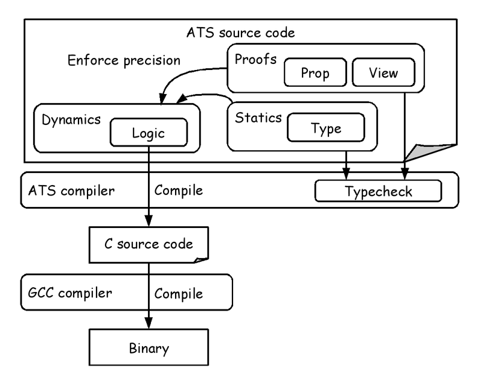
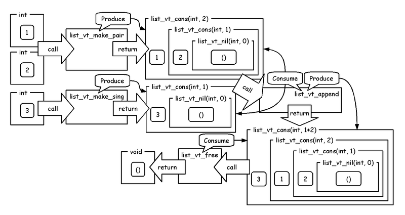

# ATS language overview'


Kiwamu Okabe

# Remember Heartbleed bug?


Should we use safer language than C?

~~~
== In English ==
"Preventing heartbleed bugs with safe programming languages"
http://bluishcoder.co.nz/2014/04/11/preventing-heartbleed-bugs-with-safe-languages.html

== In Japanease ==
"安全なプログラミング言語を使って heartbleed を防ぐには"
https://github.com/jats-ug/translate/blob/master/Web/bluishcoder.co.nz/2014/04/11/preventing-heartbleed-bugs-with-safe-languages.md
~~~

"A safer systems programming language could have prevented the bug."

# What is ATS?


* http://www.ats-lang.org/
* Syntax like ML
* DML-style dependent types
* Linear types
* Optional GC
* Optional malloc/free
* Optional run-time

# How to install ATS compiler

* In English: http://bit.ly/instats
* In Japanese: http://bit.ly/instatsj

# Install ATS compiler into Debian #1


* Get source code of ATS compiler compiler

~~~
$ wget http://downloads.sourceforge.net/project/ats2-lang/ats2-lang/ats2-postiats-0.2.4/ATS2-Postiats-0.2.4.tgz
$ wget http://downloads.sourceforge.net/project/ats2-lang/ats2-lang/ats2-postiats-0.2.4/ATS2-Postiats-contrib-0.2.4.tgz
~~~

* Install packages needed by the ATS compiler

~~~
$ sudo apt-get install gcc libgc-dev libgmp-dev make
~~~

# Install ATS compiler into Debian #2


* Compile the ATS compiler compiler

~~~
$ tar xf ATS2-Postiats-0.2.4.tgz
$ export PATSHOME=`pwd`/ATS2-Postiats-0.2.4
$ export PATH=${PATSHOME}/bin:${PATH}
$ tar xf ATS2-Postiats-contrib-0.2.4.tgz
$ export PATSHOMERELOC=`pwd`/ATS2-Postiats-contrib-0.2.4
$ cd ${PATSHOME}
$ ./configure
$ make
~~~

* Ready to compile ATS code!

~~~
$ patsopt --version
ATS/Postiats version 0.2.4 with Copyright (c) 2011-2015 Hongwei Xi
~~~

# Fizzbuzz on C language


```c
#include <stdio.h>

void print_fb(int i) {
	if (i % 3 == 0 && i % 5 == 0) {
		printf ("FizzBuzz\n");
	} else if (i % 3 == 0) {
		printf ("Fizz\n");
	} else if (i % 5 == 0) {
		printf ("Buzz\n");
	} else {
		printf ("%d\n", i);
	}
}

void fizzbuzz(int n, int j) {
	if (n != j) { print_fb(j); fizzbuzz(n, j+1); }
}

int main(void) {
	fizzbuzz(100, 1);
	return 0;
}
```

# Fizzbuzz on ATS language


```ats
#include "share/atspre_define.hats"
#include "share/atspre_staload.hats"

fun print_fb (i:int): void =
  case+ (i mod 3 = 0, i mod 5 = 0) of
    | (true , true ) => println! "FizzBuzz"
    | (true , false) => println! "Fizz"
    | (false, true ) => println! "Buzz"
    | (false, false) => println! i

fun fizzbuzz (n:int, j:int): void =
  if n != j then (print_fb j; fizzbuzz (n, j+1))

implement main0 () = {
  val () = fizzbuzz (100, 1)
}
```

# How to compile the ATS code


```
$ patscc -o fizzbuzz fizzbuzz.dats
$ ./fizzbuzz | head -20
1
2
Fizz
4
Buzz
Fizz
7
8
Fizz
Buzz
11
Fizz
13
14
FizzBuzz
16
17
Fizz
19
Buzz
```

# ATS binary is portable

* File size is 13 kB

```
$ ls -lh fizzbuzz
-rwxr-xr-x 1 kiwamu kiwamu 13K Nov  6 21:45 fizzbuzz*
```

* Number of undefined symbols is 6

```
$ nm fizzbuzz | grep 'U '
                 U __libc_start_main@@GLIBC_2.2.5
                 U exit@@GLIBC_2.2.5
                 U fflush@@GLIBC_2.2.5
                 U fprintf@@GLIBC_2.2.5
                 U fwrite@@GLIBC_2.2.5
                 U longjmp@@GLIBC_2.2.5
```

* Only depends on three libraries

```
$ ldd fizzbuzz
        linux-vdso.so.1 (0x00007ffe263d9000)
        libc.so.6 => /lib/x86_64-linux-gnu/libc.so.6 (0x00007fc3c363f000)
        /lib64/ld-linux-x86-64.so.2 (0x000055d77ccd1000)
```


# ATS compile flow




# What can ATS do?


* Write code on bare metal hardware
* Write code in Linux kernel
* Use strong type without any OS
* Prove code using dependent types
* Safely use malloc using linear types
* Safely use pointer using linear types

# Demo running on bare metal


http://youtu.be/5uPue0Jo1nc

Arduino Uno hardware:

* 8-bit Harvard architecture
* Flash Memory: 32 KB
* SRAM: 2 KB

# Demo software architecture


https://github.com/fpiot/arduino-ats


# Proof: Curry–Howard in ATS


* Type: Function signature introduced by keyword "fun"
* Program: Function body introduced by keyword "implement"
* Proposition: Proof function signature introduced by keyword "prfun"
* Proof: Proof function body introduced by keyword "primplement"

# Proof: style of functions


# Proof: function signature


# Proof: function body


# Proof: before compiling


# Proof: after compiling


Proof is erased at compile time.


# Proof: pros of mixed function


You can write following application:

* Program without garbage collection
* Proof to prove the program

Good news for low-level programming!

# Linear type: type of list


List defined with linear type.


# Linear type: create list


Compile error occurs, if consuming is forgotten.


# Linear type: append list




# Join "Japan ATS User Group" !


http://jats-ug.metasepi.org/

We translate following ATS documents into Japanese.

~~~
* ATSプログラミング入門
  http://jats-ug.metasepi.org/doc/ATS2/INT2PROGINATS/
* ATSプログラミングチュートリアル
  http://jats-ug.metasepi.org/doc/ATS2/ATS2TUTORIAL/
* Effective ATS
  https://github.com/jats-ug/translate/blob/master/Manual/EffectiveATS.md
~~~

Join us and review it!
