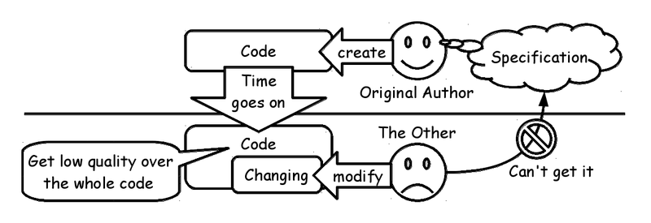
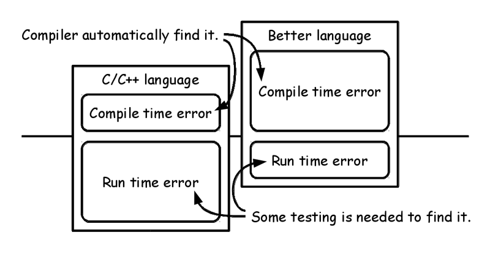

# Functional IoT: Introduction

Kiwamu Okabe

# Who am I?

* http://masterq.metasepi-design.com/
* Name: Kiwamu Okabe
* Software engineer at Centillion
* Part-time researcher at RIKEN AICS
* Self-employed at METASEPI DESIGN
* A Debian Maintainer

# What's IoT?

The Internet of Things (or IoT for short) refers to uniquely identifiable objects and their virtual representations in an Internet-like structure. Imagine IoT devices are:

connected to the internet / developed in a short time / storing personal data / secure / more intelligence / inexpensive.

C language can easily design the IoT devices?

# What's Functional IoT?

* http://fpiot.metasepi.org/
* is a wrestling mat that strongly typed languages fight on, to become the champion of system programming language.
* tries to write demo code running on tiny MCU using the languages.
* summarizes knowledge of the languages as catalog.

# Why do Functional IoT?

* Today, we have many methodologies for system design.
* For example, they are static typing, theorem proving, formal method, design by contract, model checking, static verification, SMT solver, etc.
* However, nobody have the exhaustive catalog of them.
* Let's make the catalog!

# Why need such methodologies?

Many people choose C/C++ languages to design IoT device.
However the languages lack following:

* Avoiding vulnerability
* Specification to be verified
* Keeping good quality
* Getting less man-hour
* Fun

# Avoiding vulnerability

Vulnerability is caused by following errors:

* Array index out of range (Buffer overflow)
* Type range violation
* Division by zero
* Numerical overflow

Some methodologies can avoid these errors.

# Specification to be verified

* Many people maintain specification as natural language.
* Some methodologies can formally maintain specification which is verified in computer.

# Keeping good quality

* Original author can keep quality of the code, however the other is hard to do it by lack of verify-able specification. Sometimes, the original author will become "the other" in future.

# Getting less man-hour

* Easy to estimate compile time error, however hard to do run time error, because finding latter needs some testing.

# Fun

C language can't use following feature:

* Algebraic data type
* Higher-order function
* Namespace
* Pattern matching
* Type inference
* Garbage collection

# How to do Functional IoT?

* Survey existing the methodologies as you like.
* Write some demo code running on tiny MCU.
* Monthly have meetup at Tokyo, Japan.
* Share your knowledge and demo at the meetup.
* Update our exhaustive catalog of the methodologies.

# Let's join the Functional IoT meetup!

https://fpiot.doorkeeper.jp/

