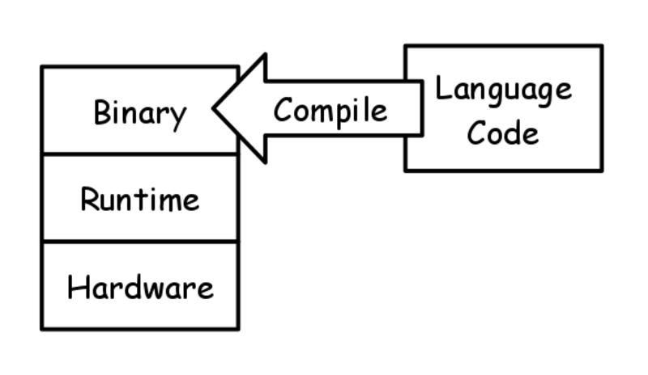
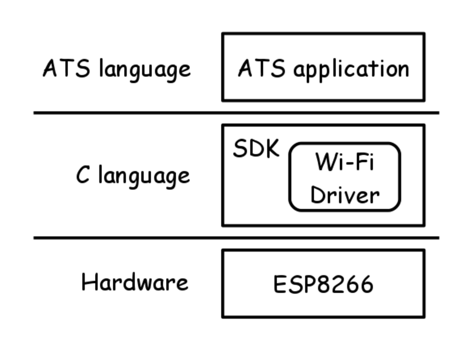
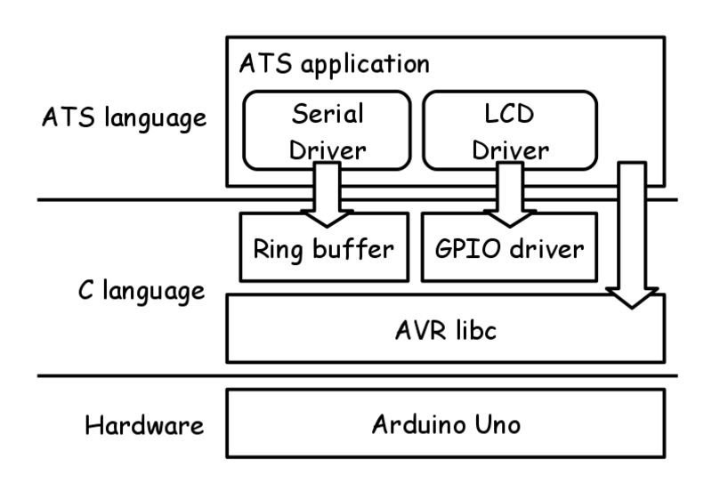
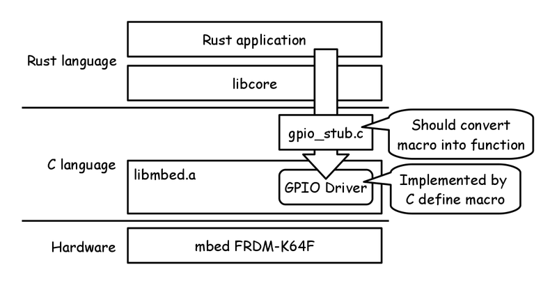

# Functional IoT: Software Stack

Kiwamu Okabe

# We drown in MANY MANY languages!

* There are many many languages in the world.
* Nobody have the exhaustive catalog of them.
* However, let's try to get first overview today.

# What the purpose of language?

I think that there are three major purpose of the languages:

* Implementation
* Verification
* OS

# - Implementation -



# ATS

* http://www.ats-lang.org/
* Without GC / Without runtime
* Theorem proving / Safely use pointer
* Syntax is similar to ML
* Compiled into C language code
* Able to import C define macro

# ATS on ESP8266

* https://github.com/fpiot/esp8266-ats



# What error can be captured by ATS?

```
$ vi user/user_main.dats
 39     val json_open = string0_copy "{\"value1\": \""
 40     val json_close = string0_copy "\" }"
 41     val temp = esp_tostrptr_int rand
 42     val json_head = strptr_append (json_open, temp)
 43     val json_data = strptr_append (json_head, json_close)
 44 //  val () = (free json_open; free json_close; free temp; free json_head)
 45     val () = (free json_open; free json_close; free temp) // Error!
$ make
ATS user/user_main.dats
/home/kiwamu/src/esp8266-ats/ifttt_ats/user/user_main.dats: 985(line=32, offs=43) -- 2237(line=55, offs=4): error(3): the linear dynamic variable [json_head$3823(-1)] nee
ds to be consumed but it is preserved with the type [S2Eapp(S2Ecst(strptr_addr_vtype); S2EVar(4441))] instead.
```

# ATS on Arduino

* https://github.com/fpiot/arduino-ats



# What error can be captured by ATS?

```
$ vi ../../SATS/lcd.sats
 11 fun lcd_print {n:int}{i:nat | i < n}{j:nat | i + j <= n}
 12 (lcd: !lcd_t, str: string (n), start: size_t (i), len: size_t (j)): void
$ vi DATS/main.dats
 14   fun loop {n:int}{i:nat | i < n} .<n-i>.
 15            (lcd: !lcd_t, str: string (n), pos: size_t (i)): void = {
 16 //  val () = if pos + i2sz LCD_WIDTH <= length str then {
 17     val () = if pos + i2sz LCD_WIDTH <= 1 + length str then { // Error!
 --snip--
 19       val () = (lcd_setCursor (lcd, 0, 1);
 20                 lcd_print (lcd, str, pos, i2sz LCD_WIDTH))
 21       val () = loop (lcd, str, pos + 1)
$ patsopt -o DATS/main_dats.c.tmp -d DATS/main.dats |& pats-filter
DATS/main.dats:20:26: unsolved constraint: [1]
[1]: ((S2EVar(1969 -> i) + S2EVar(1970 -> 16)) <= S2EVar(1968 -> n))
```

# Rust

* https://www.rust-lang.org/
* Without GC
* Syntax is similar to C
* Safely use pointer
* Depends on LLVM

# Rust on mbed

* https://github.com/0xc0170/mbed-rust-frdm-k64f-blinky



# Jhc

* http://repetae.net/computer/jhc/
* A Haskell compiler
* With GC
* Only for 32-bit CPU
* Can't use all of Haskell libraries
* Compiled into C language code

# Jhc on mbed

* https://github.com/ajhc/demo-cortex-m3


# Ivory

* http://ivorylang.org/
* EDSL on Haskell
* Without GC
* No NULL pointer
* Compiled into C language code

# Ivory on Arduino

* https://github.com/fpiot/arduino-ivory


# Idris

* http://www.idris-lang.org/
* With GC
* Theorem proving
* Syntax is similar to Haskell
* Compiled into C language code

# Idris on Arduino

* https://github.com/stepcut/idris-blink
* But eat many memory. Following crash.

```
main =
  do pinMode 13 1
     digitalWrite 13 1
     delay 100
     digitalWrite 13 0
     delay 100
     digitalWrite 13 1
     delay 100
     digitalWrite 13 0
     delay 100
     digitalWrite 13 1
     delay 100
```

# Ada

* http://www.adacore.com/
* Without GC
* Verification with SPARK

# Ada on Arduino

* http://playground.arduino.cc/Code/AVR-Ada

# Hexe

* http://haxe.org/
* Can run on bare metal hardware?

# - Verification -

# VeriFast

* http://people.cs.kuleuven.be/~bart.jacobs/verifast/

# VeriFast on Arduino

# VDM
# Z
# Coq
# Isabelle/HOL
# Alloy
# ACSL
# CPAchecker

* http://cpachecker.sosy-lab.org/

# CBMC

* http://www.cprover.org/cbmc/

# - OS -

# seL4 microkernel

* https://sel4.systems/

# eChronos RTOS

* http://ssrg.nicta.com.au/projects/TS/echronos/

# Redox

* http://www.redox-os.org/

# Mirage OS

* http://www.xenproject.org/developers/teams/mirage-os.html

# AOS

* https://github.com/xlq/aos
