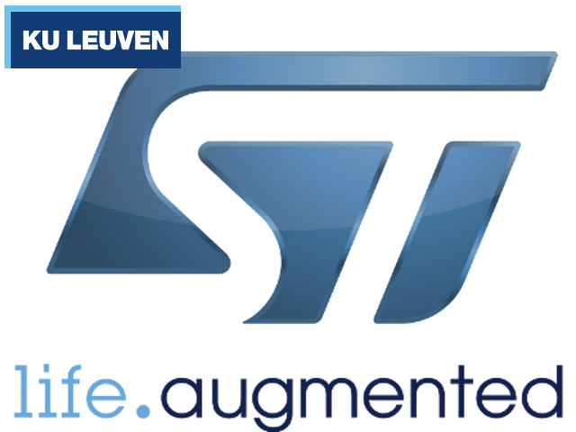
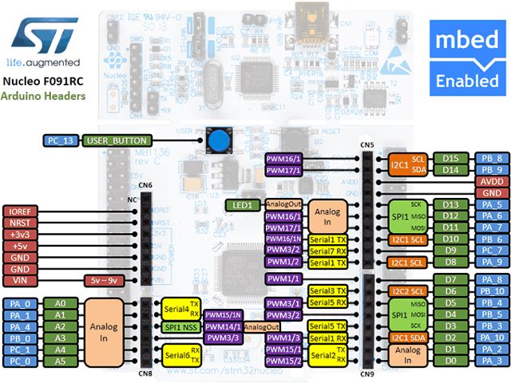
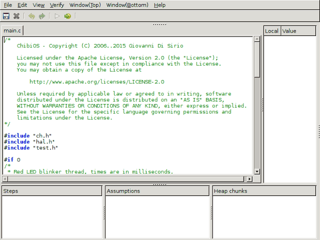
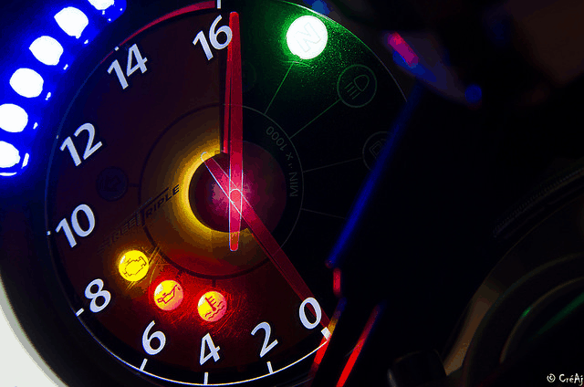
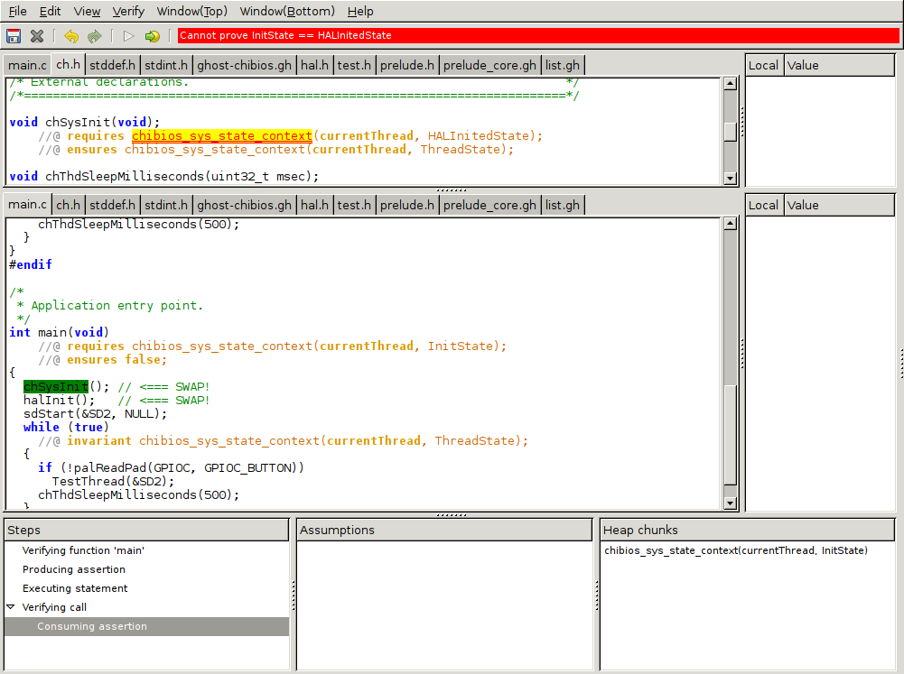

# Hands-on VeriFast with STM32 microcontroller



Kiwamu Okabe

# Table of Contents


* Introduce ChibiOS/RT which is a RTOS
* Get development environment for ChibiOS/RT
* Build sample application on ChibiOS/RT
* Introduce STM32 microcontroller
* Run the application on STM32 board
* Introduce VeriFast
* Verify the application using VeriFast

# What's ChibiOS/RT?


* http://www.chibios.org/
* Simple/Small/Fast/Portable real-time OS
* Run on ARM Cortex-M, Arduino Uno, PowerPC e200
* Context Switch (STM32F4xx): 0.40 µsec
* Kernel Size (STM32F4xx): 6172 byte

# Get the devel-environment #Windows


```
Detail: https://github.com/fpiot/chibios-verifast/blob/master/doc/README.Windows.ja.md
```

* Install following:

```
* https://git-for-windows.github.io/
* https://launchpad.net/gcc-arm-embedded/+download
* https://ttssh2.osdn.jp/index.html.en
* https://cygwin.com/
```

* Install following cygwin packages

```
* cmake
* libusb1.0-devel
```

# Get the devel-environment #Windows


* Open cygwin terminal, and install "stlink":

```
$ git clone https://github.com/texane/stlink.git
$ (cd stlink && make)
$ (cd stlink/build/Release && make install)
```

* Download VeriFast from following URL, unzip it and set PATH to "verifast-XXXXXXX/bin" directory.

```
https://github.com/verifast/verifast#binaries
```

# Get the devel-environment #Windows


* Open cygwin terminal, and checkout custom ChibiOS/RT source code:

```
$ git clone https://github.com/fpiot/chibios-verifast.git
```

# Get the devel-environment #MacOS


```
Detail: https://github.com/fpiot/chibios-verifast/blob/master/doc/README.MacOS.ja.md
```

* Install brew packages:

```
$ brew tap PX4/homebrew-px4
$ brew update
$ brew install wget git gcc-arm-none-eabi cmake picocom libusb
```

* Install "stlink":

```
$ git clone https://github.com/texane/stlink.git
$ (cd stlink && make)
$ (cd stlink/build/Release && sudo make install)
```

# Get the devel-environment #MacOS


* Download VeriFast, unzip it and set PATH:

```
$ wget http://82076e0e62875f063ae8-929808a701855dfb71539d0a4342d4be.r54.cf5.rackcdn.com/verifast-nightly-osx.tar.gz
$ tar xf verifast-nightly-osx.tar.gz
$ mv verifast-*/ verifast
$ export PATH=`pwd`/verifast/bin:$PATH
```

* Checkout custom ChibiOS/RT source code:

```
$ git clone https://github.com/fpiot/chibios-verifast.git
```

# Get the devel-environment #Linux


```
Detail: https://github.com/fpiot/chibios-verifast/blob/master/doc/README.Linux.ja.md
```

* Install deb packages:

```
$ sudo apt-get install wget git libgtk2.0-0 libusb-1.0-0-dev libgtk-3-dev build-essential cmake gcc-arm-none-eabi gdb-arm-none-eabi picocom
```

* Install "stlink":

```
$ git clone https://github.com/texane/stlink.git
$ (cd stlink && make)
$ (cd stlink/build/Release && sudo make install)
$ sudo ldconfig
```

# Get the devel-environment #Linux


* Download VeriFast, unzip it and set PATH:

```
$ wget http://82076e0e62875f063ae8-929808a701855dfb71539d0a4342d4be.r54.cf5.rackcdn.com/verifast-nightly.tar.gz
$ tar xf verifast-nightly.tar.gz
$ mv verifast-*/ verifast
$ export PATH=`pwd`/verifast/bin:$PATH
```

* Checkout custom ChibiOS/RT source code:

```
$ git clone https://github.com/fpiot/chibios-verifast.git
```

# Build a ChibiOS application


* Finally build the code:

```
$ cd chibios-verifast/verifast_demo/STM32/RT-STM32F091RC-NUCLEO
$ make
```

# Coffee break #1


# What's STM32?


```
http://www.st.com/ja/microcontrollers/stm32-32-bit-arm-cortex-mcus.html
```

The STM32 family of 32‑bit Flash microcontrollers based on the ARM Cortex‑M processor is designed to offer new degrees of freedom to MCU users. It offers a 32‑bit product range that combines very high performance, real-time capabilities, digital signal processing, and low‑power, low‑voltage operation, while maintaining full integration and ease of development.

# You can free to get own STM32 board!



```
https://developer.mbed.org/platforms/ST-Nucleo-F091RC/
```

* "NUCLEO-F091RC"
* ARM Cortex-M0 CPU / 256 KB Flash / 32 KB SRAM
* ADC / DAC / RTC / I2C / USART / SPI / CAN / HDMI CEC
* Able to download fiwmware and debug it using GDB
* Thanks a lot, STMicroelectronics!

# How to run application? #Windows


* Connect the board to your PC using USB cable
* Open cygwin terminal, kick "st-util":

```
$ (cd /usr/local/lib && st-util)
```

* Open another cygwin terminal, and dowload application into the board:

```
$ cd chibios-verifast/verifast_demo/STM32/RT-STM32F091RC-NUCLEO
$ make gdbwrite
```

# How to run application? #Windows


* Continue application from GDB prompt:

```
(gdb) c
```

* Open serial console using TeraTerm with baud rate 38400
* Push "USER" button on the board

# How to run application? #MacOS


* Connect the board to your Mac using USB cable
* Kick "st-util":

```
$ st-util
```

* Open another terminal, and download application into the board:

```
$ cd chibios-verifast/verifast_demo/STM32/RT-STM32F091RC-NUCLEO
$ make gdbwrite
```

# How to run application? #MacOS


* Continue application from GDB prompt:

```
(gdb) c
```

* Open another terminal, and open serial console:

```
$ picocom -b 38400 /dev/tty.usbmodem1423
```

* Push "USER" button on the board

# How to run application? #Linux


* Connect the board to your Mac using USB cable
* Kick "st-util":

```
$ sudo st-util
```

* Open another terminal, and download application into the board:

```
$ cd chibios-verifast/verifast_demo/STM32/RT-STM32F091RC-NUCLEO
$ make gdbwrite
```

# How to run application? #Linux


* Continue application from GDB prompt:

```
(gdb) c
```

* Open another terminal, and open serial console:

```
$ picocom -b 38400 /dev/ttyACM0
```

* Push "USER" button on the board

# Do you see test log of ChibiOS?


* You will see following log on serial console:

```
*** ChibiOS/RT test suite
***
*** Kernel:       3.1.5
*** Compiled:     Jan 15 2017 - 20:38:01
*** Compiler:     GCC 4.8.4 20140725 (release) [ARM/embedded-4_8-branch revision 213147]
*** Architecture: ARMv6-M
*** Core Variant: Cortex-M0
*** Port Info:    Preemption through NMI
*** Platform:     STM32F091xC Entry Level Access Line devices
*** Test Board:   STMicroelectronics NUCLEO-F091RC
```

# Coffee break #2


# What's VeriFast?


* https://github.com/verifast/verifast
* A verifier for single-threaded and multithreaded C language programs annotated with preconditions and postconditions written in separation logic.
* VeriFast is easy to use with the graphical IDE.

# How to verify C code using VeriFast?


Please read VeriFast tutorial:

* English:

```
https://people.cs.kuleuven.be/~bart.jacobs/verifast/tutorial.pdf
```

* Japanese:

```
https://github.com/jverifast-ug/translate/blob/master/Manual/Tutorial/Tutorial.md
```

# How to verify application?



Simply kick GNU make on your terminal:

```
$ cd chibios-verifast/verifast_demo/STM32/RT-STM32F091RC-NUCLEO
$ make vfide
```

# What should be verified on ChibiOS?


* ChibiOS has own system states

# The state chart means...



* Application start at "Init" state
* Change into "HALInited" state calling halInit()
* Change into "Thread" state calling chSysInit()
* You can call some ChibiOS API on "Thread" state

But run-time error is caused by violation. We would like to capture it on verification using VeriFast.

# Your code already has assertion


```
$ cat chibios-verifast/verifast_inc/ghost-chibios.gh
--snip--
inductive SystemState =
  | InitState
  | HALInitedState
  | ThreadState
  | IRQSuspendedState
  | IRQDisabledState
  | IRQWaitState
  | ISRState
  | SLockedState
  | ILockedState
  ;
predicate chibios_sys_state_context(int threadId; SystemState state);
```

# ChibiOS API has pre/postcondition


```
$ cat chibios-verifast/verifast_inc/hal.h
--snip--
void halInit(void);
    //@ requires chibios_sys_state_context(currentThread, InitState);
    //@ ensures chibios_sys_state_context(currentThread, HALInitedState);
--snip--
$ cat chibios-verifast/verifast_inc/ch.h
--snip--
void chSysInit(void);
    //@ requires chibios_sys_state_context(currentThread, HALInitedState);
    //@ ensures chibios_sys_state_context(currentThread, ThreadState);

void chThdSleepMilliseconds(uint32_t msec);
    //@ requires chibios_sys_state_context(currentThread, ThreadState);
    //@ ensures chibios_sys_state_context(currentThread, ThreadState);
```

# Let's violate the assertion


```
$ vi chibios-verifast/verifast_demo/STM32/RT-STM32F091RC-NUCLEO/main.c
int main(void)
    //@ requires chibios_sys_state_context(currentThread, InitState);
    //@ ensures false;
{
  chSysInit(); // <=== SWAP!
  halInit();   // <=== SWAP!
  sdStart(&SD2, NULL);
  while (true)
    //@ invariant chibios_sys_state_context(currentThread, ThreadState);
  {
    if (!palReadPad(GPIOC, GPIOC_BUTTON))
      TestThread(&SD2);
    chThdSleepMilliseconds(500);
  }
}
```

# Then you will see error on verification



# Homework


* Verify ChibiOS/RT thread blinking LED
* Verify chEvtBroadcastI() which can be call from I-Locked or S-Locked state

```
http://chibios.sourceforge.net/html/group__events.html#ga0c3fcdef2ba14d8b6b6da5aa4113f18b
```

* Verify following more complex application:

```
chibios-verifast/ChibiOS_16.1.6/demos/STM32/RT-STM32F746G-DISCOVERY-LWIP-FATFS-USB
```

# Special thanks


* STMicroelectronics provides STM32 boards.
* Eiwa System Management, Inc. provides this meeting room.
* \@ruicc supports around MacOS environment.
* \@eldesh supports around Windows environment, and gives advice usage of VeriFast.

# License of photos #1


```
* Creative Commons BBB | Flickr
  https://www.flickr.com/photos/steren/2732488224/
  Copyright: Steren Giannini / License: CC BY 2.0
* Microsoft | Microsoft Store, Connecticut, 12/2014 by Mike Mo… | Flickr
  https://www.flickr.com/photos/jeepersmedia/15966145248/
  Copyright: Mike Mozart / License: CC BY 2.0
* Mac 20th anniversary poster #14: iMac | The last in the seri… | Flickr
  https://www.flickr.com/photos/mwichary/2234474972/
  Copyright: Marcin Wichary / License: CC BY 2.0
* Coffee break | I'm determined to do my own latte art one day… | Flickr
  https://www.flickr.com/photos/kwl/3457656569/
  Copyright: Kenny Louie / License: CC BY 2.0
* Coffee break | Matt Laugier | Flickr
  https://www.flickr.com/photos/110206196@N06/14898090455/
  Copyright: Matt Laugier / License: CC BY 2.0
```

# License of photos #2


```
* WGS7 DeltaIV Liftoff | Shots from the WGS7 DeltaIV rocket la… | Flickr
  https://www.flickr.com/photos/mseeley1/19953519882/
  Copyright: Michael Seeley / License: CC BY 2.0
* Sumo | Better Than Bacon | Flickr
  https://www.flickr.com/photos/slurm/3989895242/
  Copyright: Better Than Bacon / License: CC BY 2.0
* Start | Start up | CréAj | Flickr
  https://www.flickr.com/photos/103939386@N07/15423955496/
  Copyright: CréAj / License: CC BY-ND 2.0
* Homework | ejecutivoagresivo | Flickr
  https://www.flickr.com/photos/ejecutivoagresivo/5872031749/
  Copyright: ejecutivoagresivo / License: CC BY 2.0
* ESAT KULeuven | Pues aquí es donde trabajo durante estos mes… | Flickr
  https://www.flickr.com/photos/juanvvc/4688054880/
  Copyright: Juan V. Vera del Campo / License: CC BY-SA 2.0
```

# License of photos #3


```
* Thank you... | Thank you to everyone on Flickr who comments … | Flickr
  https://www.flickr.com/photos/pearlslaceandruffles/4767722515/
  Copyright: Dee ♥ / License: CC BY-ND 2.0
```
