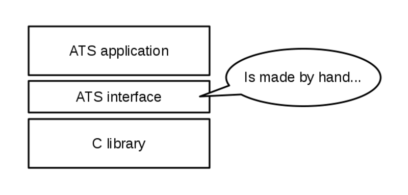
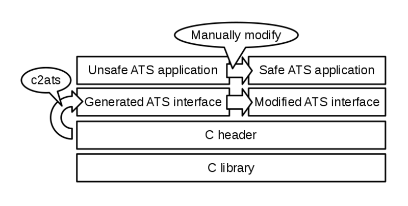
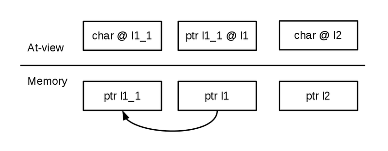
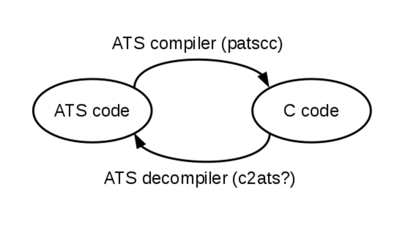

# Generate ATS interface from C code, and introduce linear type

Kiwamu Okabe @ RIKEN AICS

# Today's low level programming

* uses C programming language
* may causes buffer overflow
* may violate invariant in the code
* may violate specification of the design
* These error occurs at run-time

# Why need the other language?

* We want to find these error at compile-time.
* Of course, we can use verification on C language.
* e.g. Coverity, Frama-C, Infer, VeriFast, vcc, etc...
* But also we want to use more rich type system.
* Today is the day to choose the other language for low level programming?

# ATS language

* http://www.ats-lang.org/
* Syntax like ML
* DML-style dependent types
* Linear types
* Optional GC, malloc/free, run-time

# Real of ATS programming

But, there is no paradise. Real ATS programming needs many interfaces imported from C.



# A tool "c2ats" resolves it!

* https://github.com/metasepi/c2ats/
* parse C header and generate ATS interface
* made by Haskell language
* using "language-c" library to parse C code

# We can do using c2ats...



# Rule: Translating primitive types

ATS's unboxed type is one-to-one for C's one.

```
C language        | ATS language
------------------+------------------
bool              | bool
char              | char
signed char       | schar
unsigned char     | uchar
short             | sint
unsigned short    | usint
int               | int
unsigned int      | uint
long int          | lint
unsigned long int | ulint
...               | ...
```

# Rule: Functions

* If you have following C function declaration:

```c
int func_a(int, char);
```

* c2ats generate following ATS interface:

```ats
fun fun_c2ats_func_a: (int, char) -> int = "mac#func_a"
```

# Rule: Struct

```c
// If you have following C structure:
struct t {
  int a;
  struct {int b;} c;
};
```

```ats
// c2ats generate following ATS type definition:
typedef struct_c2ats_anon_10 = $extype_struct"struct { int b; }" of {
  b = int
}
typedef struct_c2ats_t = $extype_struct"struct t" of {
  a = int,
  c = struct_c2ats_anon_10
}
```

# Rule: Pointers and at-view #1

```c
// If you have following C declaration:
int getopt (int ___argc, char **___argv, char *__shortopts);
```

```ats
// c2ats generate following ATS definition:
viewdef ptr_v_1 (a:t@ype, l:addr) = a @ l
dataview ptr_v_2 (a:t@ype+, l0: addr, l1: addr) =
  | ptr_v_2_cons(a, l0, l1) of (ptr l1 @ l0, ptr_v_1 (a, l1))
fun fun_c2ats_getopt: {l1,l1_1,l2:addr} (!ptr_v_2(char, l1, l1_1), !ptr_v_1(char, l2) | int, ptr l1, ptr l2) -> int = "mac#getopt"
```

# Rule: Pointers and at-view #2

Can dereference pointer "ptr l1", "ptr l1_1", "ptr l2" because they has own at-view.



# Rule: Accessor for global variables #1

```c
// If you have following C declaration:
struct foo {int i; char *s;};
extern struct foo g_foo;
```

```ats
// c2ats generate following ATS definition:
typedef struct_c2ats_foo = $extype_struct"struct foo" of {
  i = int,
  s = ptr (* cPtr0(char) *)
}
macdef takeout_c2ats_g_foo = $extval([l1:addr] (ptr_v_1(struct_c2ats_foo, l1) | ptr l1), "&g_foo")
praxi addback_c2ats_g_foo {l1:addr} (ptr_v_1(struct_c2ats_foo, l1) | ptr l1): void
```

# Rule: Accessor for global variables #2

```ats
// You can write following code with the definition:
staload "example.sats"

implement main0 () = {
  // g_foo
  val (pfg_foo | g_foo) = takeout_c2ats_g_foo
  val i = g_foo->i
  val s = $UN.cast{string}(g_foo->s)
  val () = println! ("g_foo = {", i, ", \"", s, "\"}")
  val () = assertloc (i = 1234)
  val () = assertloc (strcmp ("Hello, world!", s) = 0)
  prval () = addback_c2ats_g_foo (pfg_foo | g_foo)
}
```

# Unsafe ATS application on API #1

* First, generate ATS interfaces from C header

```
$ cat example.h
#include <stdio.h>
$ c2ats gen example.h > example.sats
$ cat example.sats
```

```ats
//--snip--
fun fun_c2ats_fread: {l1:addr} (!ptr_v_1(type_c2ats_FILE, l1) | ptr, type_c2ats_size_t, type_c2ats_size_t, ptr l1) -> type_c2ats_size_t = "mac#fread"
fun fun_c2ats_fwrite: {l1:addr} (!ptr_v_1(type_c2ats_FILE, l1) | ptr, type_c2ats_size_t, type_c2ats_size_t, ptr l1) -> type_c2ats_size_t = "mac#fwrite"
fun fun_c2ats_fseek: {l1:addr} (!ptr_v_1(type_c2ats_FILE, l1) | ptr l1, lint, int) -> int = "mac#fseek"
```

# Unsafe ATS application on API #2

* Next, write ATS code with unsafe manner

```
$ vi main.dats
```

```ats
#include "share/atspre_define.hats"
#include "share/atspre_staload.hats"

staload UN = "prelude/SATS/unsafe.sats" // Unsafe!
staload STRING = "libats/libc/SATS/string.sats"
staload "example.sats"

extern praxi __create_view {to:view} ():<prf> to // Unsafe!
extern praxi __consume_view {from:view} (pf: from):<prf> void // Unsafe!
// continue...
```

# Unsafe ATS application on API #3

```ats
fun my_fopen (file: string, mode: string):
    [l:agz] (type_c2ats_FILE@l | ptr(l)) = ret where {
  val pn = string2ptr(file)
  val (pfnat, fpfnat | pn) = $UN.ptr_vtake(pn)
  val pm = string2ptr(mode)
  val (pfmat, fpfmat | pm) = $UN.ptr_vtake(pm)

  val (pffp | fp) = fun_c2ats_fopen(pfnat, pfmat | pn, pm)

  prval () = fpfnat(pfnat)
  prval () = fpfmat(pfmat)
  val () = assertloc(fp > 0)
  val ret = (pffp | fp)
}
// continue...
```

# Unsafe ATS application on API #4

```ats
fun my_fread {l:agz}{n:nat}
    (pffp: !type_c2ats_FILE@l | fp: ptr(l), len: size_t(n)):
    [m:int] (size_t(m), strnptr(m)) = ret where {
  implement{} string_tabulate$fopr(s) = '_'
  val buf_strptr = strnptr2strptr(string_tabulate(len))
  val buf_ptr = strptr2ptr(buf_strptr)
  val _ = $STRING.memset_unsafe(buf_ptr, 0, len)

  val r = fun_c2ats_fread(pffp | buf_ptr, 1UL, $UN.cast2ulint(len), fp)
  val r = $UN.cast(r)
  val buf_strnptr = strptr2strnptr(buf_strptr)
  val ret = (r, buf_strnptr)
}
// continue...
```

# Unsafe ATS application on API #5

```ats
fun my_fclose {l:agz} (pffp: type_c2ats_FILE@l | fp: ptr(l)): int
    = ret where {
  val ret = fun_c2ats_fclose(pffp | fp)
  prval () = __consume_view(pffp)
}

fun readshow {l:agz} (pffp: !type_c2ats_FILE@l | fp: ptr(l)): void = {
  val (r, str) = my_fread(pffp | fp, i2sz(128))
  val str = strnptr2strptr(str)
  val () = print(str)
  val () = free(str)
  val () = if r > 0 then readshow(pffp | fp)
}
// continue...
```

# Unsafe ATS application on API #6

```ats
implement main0 () = {
  val (pffp | fp) = my_fopen("main.dats", "r")
  val () = readshow(pffp | fp)
  val r = my_fclose(pffp | fp)
}
```

# Manually introduce linear type #1

* Original ATS interfaces

```
$ cat example.h
#include <stdio.h>
$ c2ats gen example.h > example.sats
$ cat example.sats
```

```ats
// --snip--
fun fun_c2ats_fclose: {l1:addr} (!ptr_v_1(type_c2ats_FILE, l1) | ptr l1) -> int = "mac#fclose"
fun fun_c2ats_fopen: {l1,l2:addr} (!ptr_v_1(char, l1), !ptr_v_1(char, l2) | ptr l1, ptr l2) -> [l3:addr] (ptr_v_1(type_c2ats_FILE, l3) | ptr l3) = "mac#fopen"
fun fun_c2ats_fread: {l1:addr} (!ptr_v_1(type_c2ats_FILE, l1) | ptr, type_c2ats_size_t, type_c2ats_size_t, ptr l1) -> type_c2ats_size_t = "mac#fread"
```

# Manually introduce linear type #2

* Modify the interfaces

```
$ cp example.sats example_welltyped.sats
$ vi example_welltyped.sats
```

```ats
// --snip--
fun fun_c2ats_fclose: {l1:agz} (ptr_v_1(type_c2ats_FILE, l1) | ptr l1) -> int = "mac#fclose"
fun fun_c2ats_fopen: (string, string) -> [l3:addr] (ptr_v_1(type_c2ats_FILE, l3) | ptr l3) = "mac#fopen"
fun fun_c2ats_fread: {l1:agz}{n,m:nat} (!ptr_v_1(type_c2ats_FILE, l1) | !strnptr(n*m)>>strnptr(o), size_t(n), size_t(m), ptr l1) -> #[o:nat | o <= n*m] size_t(o) = "mac#fread"
```

# Manually introduce linear type #3

* Write safe application

```
$ vi main.dats
```

```ats
#include "share/atspre_define.hats"
#include "share/atspre_staload.hats"
staload STRING = "libats/libc/SATS/string.sats"
staload "example_welltyped.sats"

fun my_fopen (file: string, mode: string):
    [l:agz] (type_c2ats_FILE@l | ptr(l)) = ret where {
  val (pffp | fp) = fun_c2ats_fopen(file, mode)
  val () = assertloc(fp > 0)
  val ret = (pffp | fp)
}
// continue...
```

# Manually introduce linear type #4

```ats
fun my_fread {l:agz}{n:nat}
    (pffp: !type_c2ats_FILE@l | fp: ptr(l), len: size_t(n)):
    [m:nat | m <= n] (size_t(m), strnptr(m)) = ret where {
  implement{} string_tabulate$fopr(s) = '_'
  val buf_strnptr = string_tabulate(len)
  val buf_ptr = strnptr2ptr(buf_strnptr)
  val _ = $STRING.memset_unsafe(buf_ptr, 0, len)

  val r = fun_c2ats_fread(pffp | buf_strnptr, i2sz(1), len, fp)
  val ret = (r, buf_strnptr)
}
// continue...
```

# Manually introduce linear type #5

```ats
fun readshow {l:agz} (pffp: !type_c2ats_FILE@l | fp: ptr(l)): void = {
  val (r, str) = my_fread(pffp | fp, i2sz(128))
  val str = strnptr2strptr(str)
  val () = print(str)
  val () = free(str)
  val () = if r > 0 then readshow(pffp | fp)
}

implement main0 () = {
  val (pffp | fp) = my_fopen("main.dats", "r")
  val () = readshow(pffp | fp)
  val r = fun_c2ats_fclose(pffp | fp)
}
```

# Future plan

* Hongwei, who is author of ATS, said:

```
"Once you become familiar with ATS, you can readily visualize the C code that your ATS source is to be compiled into."
```

* So, we can create decompiler for ATS language?



# Conclusion

* ATS code is more safe than C code.
* The c2ats generates ATS interface from C header.
* Unsafe ATS application can run on the interface.
* Make safety of the application with introducing linear type manually.


