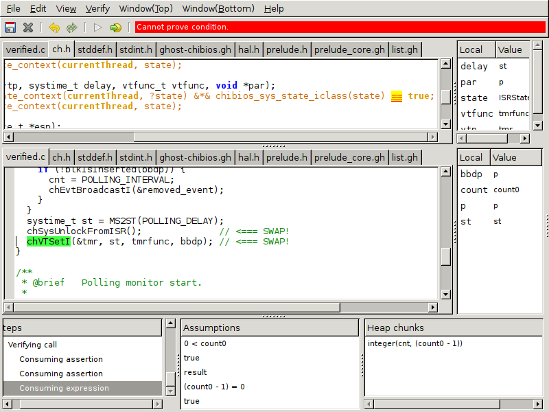

# RTOS application verified by VeriFast, and future plan


Kiwamu Okabe

# What's VeriFast?

* https://github.com/verifast/verifast
* A verifier for single-threaded and multi-threaded C and Java language programs annotated with preconditions and postconditions written in separation logic.
* VeriFast is easy to use with the graphical IDE.

# VeriFasts find bugs on Linux kernel

```
https://people.cs.kuleuven.be/~willem.penninckx/usbkbd/
"Verification of Linux's USB Boot Protocol Keyboard Driver (usbkbd)"
This project verified Linux's USB Boot Protocol Keyboard Driver (usbkbd), shipped with the Linux kernel. As far as we know, prior to this work, no device driver verification has been carried out that successfully combines:

* verifying software not written with verification in mind, and
* using a sound approach (we don't "try to find bugs", but "prove absence of bugs"), and
* not avoiding concurrency (concurrency is common in this driver, and we do prove absence of race conditions), and
* not relying on any bounding (there's an unbounded number of threads, unbounded number of keyboards, unbounded amount of time the driver is running, ...)
```

# How to use VeriFast?

* Manually write pre/postcondition as comments in C language code
* VeriFast statically verifies the assertion
* You may understand this style of verification as "static design by contract"

```
* Design by contract - Wikipedia
* https://en.wikipedia.org/wiki/Design_by_contract
```

# ChibiOS/RT RTOS

* http://www.chibios.org/
* Simple / Small / Fast / Portable real-time OS
* Run on ARM Cortex-M / 8-bit AVR / PowerPC e200
* Context Switch (STM32F4xx): 0.40 µsec
* Kernel Size (STM32F4xx): 6172 byte

# System state on ChibiOS/RT RTOS


# Let's verify RTOS application! #1

```c
static void tmrfunc(void *p)
   /*@
       requires chibios_sys_state_context(currentThread, ISRState) &*&
           integer(&cnt, ?count);
   @*/
   /*@
       ensures chibios_sys_state_context(currentThread, ISRState) &*&
           integer(&cnt, _);
   @*/
{
  BaseBlockDevice *bbdp = p;

  chSysLockFromISR();
  if (cnt > 0) {
    if (blkIsInserted(bbdp)) {
      if (--cnt == 0) {
```

# Let's verify RTOS application! #2

```c
void chSysLock(void);
    //@ requires chibios_sys_state_context(currentThread, ThreadState);
    //@ ensures chibios_sys_state_context(currentThread, SLockedState);
void chSysUnlock(void);
    //@ requires chibios_sys_state_context(currentThread, SLockedState);
    //@ ensures chibios_sys_state_context(currentThread, ThreadState);
void chSysLockFromISR(void);
    //@ requires chibios_sys_state_context(currentThread, ISRState);
    //@ ensures chibios_sys_state_context(currentThread, ILockedState);
void chSysUnlockFromISR(void);
    //@ requires chibios_sys_state_context(currentThread, ILockedState);
    //@ ensures chibios_sys_state_context(currentThread, ISRState);
thread_t *chThdCreateStatic(void *wsp, size_t size,
                            tprio_t prio, tfunc_t pf, void *arg);
    //@ requires chibios_sys_state_context(currentThread, ThreadState);
    //@ ensures chibios_sys_state_context(currentThread, ThreadState);
```

# Demo



# Verification platform for RTOS


# Limitation of VeriFast today

* It need two C language header.
* One is for compiling C code.
* Another is for verifying C code.
* They may have some semantic gap, which cause miss verification.

# We need C99 compatible VeriFast!

* If VeriFast supports C99, pseud C header for verification.
* It means original Linux kernel code can include the verfication.
* Linux kernel quality is shaped by human review, today.
* If there is C99 compat VeriFast, we keep the quality with verification!

# Advice from \@ftake

```
https://twitter.com/ftake/status/872436138308378624
```


# Next action: survey clang parser

* Is following good for the first step?
* Clang UPC2C Translator
* https://clangupc.github.io/clang-upc2c/
* It translates UPC (Unified Parallel C) code into C language code

# AD: C92 Functional Ikamusume


