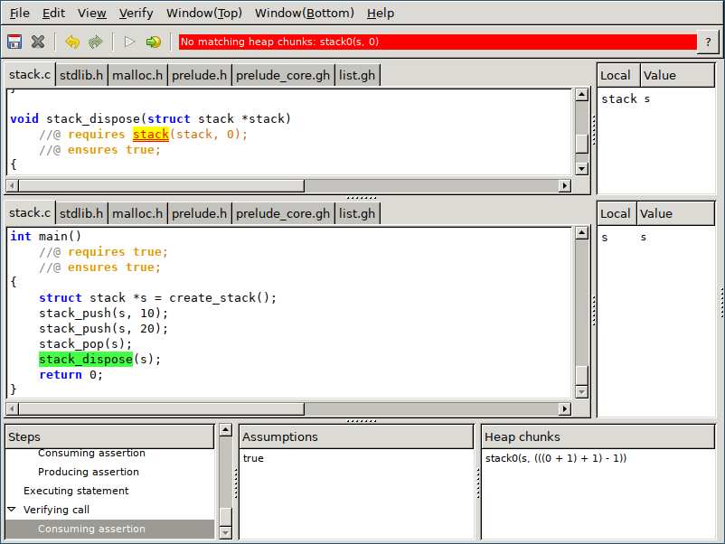
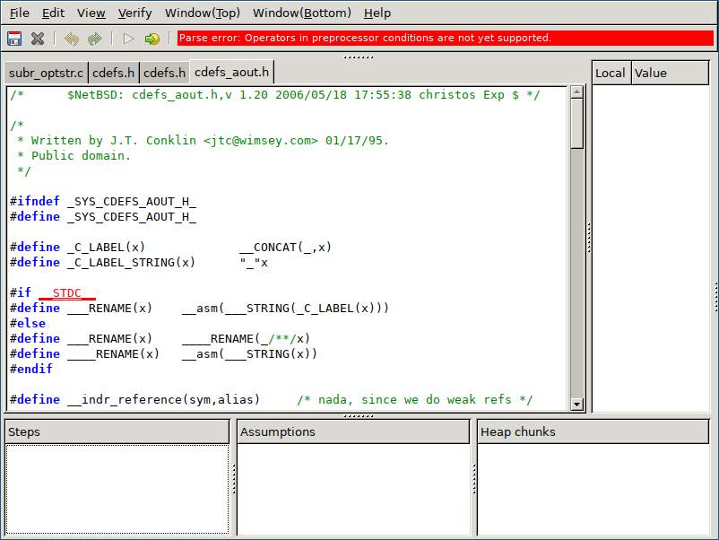
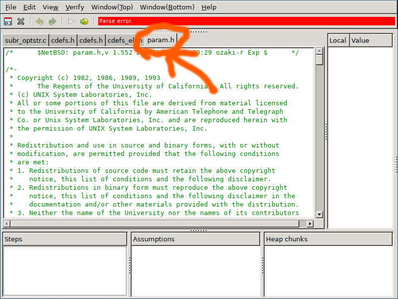

# An OCaml newbie meets Camlp4 parser


Kiwamu Okabe

# Why use Camlp4 parser?


* Why not use the Menhir as parser?
* Because VeriFast verifier uses Camlp4 parser.

# What is VeriFast verifier? #1


* https://github.com/verifast/verifast
* A verifier for single-threaded and multi-threaded C and Java language programs annotated with preconditions and postconditions written in separation logic.
* VeriFast avoids illegal memory accesses such like buffer overflow.
* VeriFast is written by OCaml.

# What is VeriFast verifier? #2


# What is VeriFast verifier? #3




# VeriFast has own C language parser


```ocaml
let rec parse_decls ?inGhostHeader =
  if match inGhostHeader with None -> false | Some b -> b then
    parse_pure_decls
  else
    parse_decls_core
and
  parse_decls_core = parser
  [< '((p1, _), Kwd "/*@"); ds = parse_pure_decls; '((_, p2), Kwd "@*/"); ds' = parse_decls_core >] -> ds @ ds'
| [< _ = opt (parser [< '(_, Kwd "public") >] -> ());
     abstract = (parser [< '(_, Kwd "abstract") >] -> true | [< >] -> false);
     final = (parser [< '(_, Kwd "final") >] -> FinalClass | [< >] -> ExtensibleClass);
     ds = begin parser
```

# Why modify VeriFast parser? #1


# Why modify VeriFast parser? #2


* Real usage needs two C language headers.
* Original C header is for compiling C code.
* Pseud C header is for verifying C code.
* They may have some semantic gaps, which cause miss verification.
* Because VeriFast's parser is a subset of C99 parser.

# What is a near-term goal?


* Getting C99 compatible parser is hard.
* Let's verify "kern/subr_optstr.c" file in NetBSD kernel:

```
$ sh build.sh -U -u -j 4 -T obj/tooldir -m amd64 tools
$ sh build.sh -U -u -j 1 -T obj/tooldir -m amd64 kernel=GENERIC
$ vfide -D __STDC__ -D __GNUC__ -D _KERNEL -D __ELF__ -D NO_KERNEL_RCSIDS -I sys -I sys/arch/amd64/compile/obj/GENERIC sys/kern/subr_optstr.c
```

* The kernel code is found at following:
* https://github.com/IIJ-NetBSD/netbsd-src

# Original verifier




# Modified verifier




# My patches for VeriFast's parser


```
* Parse semicolon without any declarations #121
  https://github.com/verifast/verifast/pull/121
* Allow hardtab in string literals #120
  https://github.com/verifast/verifast/pull/120
* Ignore inline keyword at static function declaration #119
  https://github.com/verifast/verifast/pull/119
* Support operators in macros / Add -D option #116
  https://github.com/verifast/verifast/pull/116
```

# Knowledge to debug parser #1-1


* Don't catch exception to get stack trace.

```
$ git diff
diff --git a/src/vfconsole.ml b/src/vfconsole.ml
index 8846dcb5..9204c2a4 100644
--- a/src/vfconsole.ml
+++ b/src/vfconsole.ml
@@ -23,7 +23,6 @@ let _ =
       Java_frontend_bridge.unload();
     with
       PreprocessorDivergence (l, msg) -> print_msg l msg; exit 1
-    | ParseException (l, msg) -> print_msg l ("Parse error" ^ ...
     | CompilationError(msg) -> print_endline (msg); exit 1
     | StaticError (l, msg, url) -> print_msg l msg; exit 1
     | SymbolicExecutionError (ctxts, l, msg, url) ->
```

# Knowledge to debug parser #1-2


```
$ cat tab_in_printf.c
#include <stdio.h>

int main() {
        printf("Use hard        tab\n");
        return 0;
}
$ OCAMLRUNPARAM=b verifast -c tab_in_printf.c
tab_in_printf.c
Fatal error: exception Lexer.ParseException(_, "")
Raised at file "parser.ml", line 1627, characters 26-61
Called from file "verifast.ml", line 2966, characters 12-185
Called from file "verifast1.ml", line 470, characters 6-13
Called from file "util.ml" (inlined), line 109, characters 15-18
Called from file "verifast.ml", line 2922, characters 17-1023
Called from file "verifast.ml", line 3130, characters 18-460
```

# Knowledge to debug parser #2-1


* Dump "token" using debug functions.

```ocaml
let rec print_tokens_list tokens =
  match tokens with
    [(_, tok)] -> Printf.printf "%s\n" (string_of_token tok)
  | (_, tok) :: xs -> Printf.printf "%s, " (string_of_token tok); print_tokens_list xs
  | [] -> Printf.printf "\n"

let rec print_tokens_stream tokens =
  Printf.printf "[\n";
  Stream.iter (fun (_, tok) -> Printf.printf " %s\n" (string_of_token tok)) tokens;
  Printf.printf "]\n"
```

# Knowledge to debug parser #3-1


* Exception "Stream.Error" has a string parameter specified by "??".

```
$ vi src/parser.ml
```

```ocaml
let parse_c_file = parser
  [< (headers, _) = parse_include_directives ignore_eol verbose
                      enforceAnnotations dataModel;
    ds = parse_decls CLang dataModel enforceAnnotations ~inGhostHeader:false;
    _ = Stream.empty ?? "Stream.empty expected" (* <= *) >]
  -> (headers, [PackageDecl(dummy_loc,"",[],ds)])
in
parse_c_file token_stream
```

# Knowledge to debug parser #3-2


```
$ cat main.c
;
#include <stdio.h>
$ OCAMLRUNPARAM=b verifast -c main.c
main.c
Fatal error: exception Lexer.Stream.Error("Stream.empty expected") # <=
Raised at file "parser.ml", line 1629, characters 6-312
Called from file "parser.ml", line 1634, characters 6-31
Called from file "verifast.ml", line 2966, characters 12-185
Called from file "verifast1.ml", line 470, characters 6-13
Called from file "util.ml" (inlined), line 109, characters 15-18
```

# Ads: 静的コード解析の会 第7回


* The meeting will be held on 2018-05-12.
* https://metasepi.connpass.com/event/77398/
* Discussing about static code analysis such like:

```
ATS, B-Method, CBMC, Coq, Coverity Scan, CSP, Dafny, F*, Frama-C, FreeSafeTy, Infer, Isabelle, SATABS, SPARK, Spin, Uppaal, VDM, VeriFast, Why3, boogie, cogent, corral, seL4, vcc, etc.
```

* We are calling for presentation.

# Ads: Functional Ikamusume book


* You can buy a latest issue from Toranoana.

```
http://www.toranoana.jp/mailorder/article/04/0030/58/73/040030587376.html
```

* Translated VeriFast tutorial appears in it!
* And we are calling for article on Comiket 94.
* The abstract deadline is 2018-06-24.
* Please read following about CFA:
* https://wiki.haskell.org/Books#Joke

# License of photos


```
* Creative Commons BBB | Flickr
  https://www.flickr.com/photos/steren/2732488224/
  Copyright: Steren Giannini / License: CC BY 2.0
* Smiling Camel | John Campbell | Flickr
  https://www.flickr.com/photos/104346167@N06/16765659629/
  Copyright: John Campbell / License: Public domain
* ritchie-thompson | 12 octobre 2011 : Décès de Dennis Ritchie… | Paille | Flickr
  https://www.flickr.com/photos/paille-fr/8070924277/
  Copyright: Paille / License: CC BY-SA 2.0
* Spiral - BlakeWalk | Staircase in the Monument BlakeWalk, 7 … | Flickr
  https://www.flickr.com/photos/joeflintham/4196385813/
  Copyright: Joe Flintham / License: CC BY-SA 2.0
```
